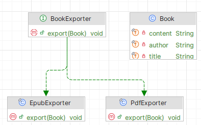

# Single Responsibility Principle

```info
Author      Ter-Petrosyan Hakob
```
---

**Why the Single Responsibility Principle (SRP) matters**

Imagine a restaurant where the chef also waits tables, washes dishes, and handles payments. It works—but if the chef falls ill, 
everything stops. In code, SRP keeps each “chef” focused on one role. That way, your system stays healthy, easier to change, and simpler to test.

## A class with one clear job

A class should have only one reason to change:

- It does just one task.
- All its methods help with that task.
- When a class has only one job, you seldom must change it.
- Keep methods that belong together in the same class.
- If a class does too many things, its parts get tangled and become hard to fix.
- Always ask: “Does each method match the class’s name and purpose?”

If a method does something different, move it to a class where it fits.

### Example: Book class

#### Non-compliant version

Here, the Book class both holds data and exports to `PDF` or `EPUB`. That means it has more than one reason to change, which breaks the 
`Single Responsibility Principle`.

```java
import lombok.Getter;
import lombok.RequiredArgsConstructor;

@Getter
@RequiredArgsConstructor
public class Book {
    private final String title;
    private final String author;
    private final String content;

    public void exportToPdf() {
        // code to create PDF
    }

    public void exportToEpub() {
        // code to create EPUB
    }
}
```

- **Issue:** Changing export code forces you to edit Book.
- **Consequence:** The class is harder to maintain and test.

### Compliant version

We refactor so that Book only stores data. Exporting belongs in separate classes.

**Book holds data only**


```java
import lombok.Getter;
import lombok.RequiredArgsConstructor;

@Getter
@RequiredArgsConstructor
public class Book {
    private final String title;
    private final String author;
    private final String content;
}
```

**Define a generic exporter**

```java
public interface BookExporter {
    void export(Book book);
}
```

**PDF Exporter:**

```java
public final class PdfExporter implements BookExporter {
    @Override
    public void export(Book book) {
        // code to create PDF
    }
}
```

**EPUB exporter**

```java
public final class EpubExporter implements BookExporter {
    @Override
    public void export(Book book) {
        // code to create EPUB
    }
}
```

### Benefits of this design

- **One responsibility per class:** Each class has a single, clear job.
- **Easier to extend:** To add a new format (e.g. HTML), just create another exporter—no changes to Book.
- **Simpler testing:** You can test export logic separately from book data.

With this structure, every class has exactly one reason to change.

<p align="center">
    
</p>

---

## 📌 Explore More

- 🏠 [Home](./../../README.md)
- 🧹 [ Clean Code](./../tutorials.md)