# Template Method

```info
Author      Ter-Petrosyan Hakob
```

---

The **Template Method** pattern is a **behavioral** design pattern that defines the skeleton of an algorithm in a single, 
**final** method, deferring specific steps to subclasses. It ensures the overall sequence remains unchanged while allowing 
subclasses to customize individual steps.

## Example: Beverage Preparation

Consider preparing different caffeine beverages (e.g., tea vs. coffee). The algorithm involves these fixed steps:

<ol>
  <li>Boil water</li>
  <li>Brew the beverage</li>
  <li>Pour into cup</li>
  <li>Add condiments</li>
</ol> 

Because the order cannot change (you must boil water before brewing), we implement a **final** template method that invokes each step in sequence. Subclasses override only the brewing and condiment methods.

```java
public abstract class CaffeineBeverage {

    // The template method defines the fixed algorithm
    public final void prepareRecipe() {
        boilWater();       // common
        brew();            // subclass-specific
        pourInCup();       // common
        addCondiments();   // subclass-specific
    }

    private void boilWater() {
        System.out.println("Boiling water");
    }

    protected abstract void brew();

    private void pourInCup() {
        System.out.println("Pouring into cup");
    }

    protected abstract void addCondiments();
}
```

**Subclasses:**

```java
public class Tea extends CaffeineBeverage {
    @Override
    protected void brew() {
        System.out.println("Steeping the tea");
    }

    @Override
    protected void addCondiments() {
        System.out.println("Adding lemon");
    }
}
```

```java
public class Coffee extends CaffeineBeverage {
    @Override
    protected void brew() {
        System.out.println("Dripping coffee through filter");
    }

    @Override
    protected void addCondiments() {
        System.out.println("Adding sugar and milk");
    }
}
```

**Testing the Pattern:**

```java
public class BeverageTest {
    public static void main(String[] args) {
        CaffeineBeverage tea = new Tea();
        CaffeineBeverage coffee = new Coffee();

        System.out.println("Preparing tea:");
        tea.prepareRecipe();

        System.out.println("\nPreparing coffee:");
        coffee.prepareRecipe();
    }
}
```

**Key Points:**
- The `prepareRecipe()` method is declared **final** to prevent altering the algorithm structure.
- Subclasses implement only the variable steps (`brew()` and `addCondiments()`).
- Common steps (`boilWater()` and `pourInCup()`) reside in the base class.
- This pattern follows the Hollywood Principle: "Don’t call us; we’ll call you."

---

## Class Diagram

<p align="center">
    
</p>

## Template Method in the JDK

- All non-abstract methods in `java.io.InputStream`, `java.io.OutputStream`, `java.io.Reader`, and `java.io.Writer`.
- All non-abstract methods in `java.util.AbstractList`, `java.util.AbstractSet`, and `java.util.AbstractMap`.

## Important Details

- Template methods consist of fixed steps; some steps call subclass implementations.
- Methods in the base class with default behavior are called hooks and can be overridden.
- To protect specific hooks, declare them final.

## Applicability

Use the Template Method pattern when:

- You want to let clients extend only parts of an algorithm, not its overall structure.
- Several classes share a common algorithm with minor variations.
- Pulling up shared code into a superclass eliminates duplication.

## Pros&Cons

Pros:
- Control over algorithm structure; subclasses tweak only allowed steps.
- Centralized common code reduces duplication.

Cons:
- Subclasses are limited by the fixed skeleton.
- Overriding default steps may violate the Liskov Substitution Principle.
- Complex templates with many steps can be harder to maintain.

---

- [Home](./../../README.md)
- [Design Patterns](./../tutorials.md)