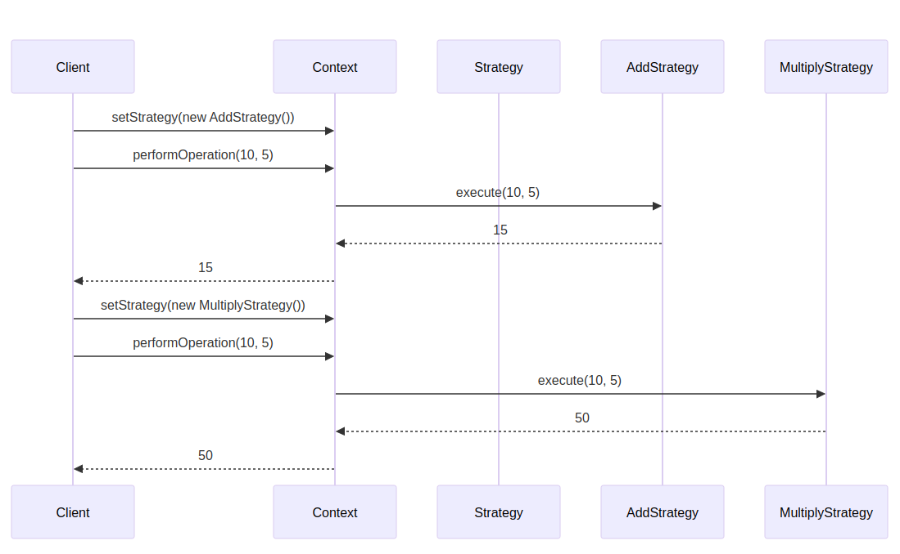

# Strategy

```info
Author      Ter-Petrosyan Hakob
```

---

The **Strategy** pattern is a behavioral design pattern. It helps you choose one of many ways (algorithms) to do a task at runtime. 
This makes your code more flexible and easier to change.

**Strategy** pattern is also known as Policy Pattern. We define multiple algorithms and let the client application pass the algorithm to be used as a parameter. One of the best examples of the **Strategy** pattern is Java’s `Collections.sort()` method, which takes a `Comparator` parameter. Depending on the implementation of `Comparator`, objects are sorted in different ways.

## Simple Example

Imagine a calculator that can add or multiply numbers. We use **Strategy** so the calculator can switch between addition and multiplication.

### Diagram

<p align="center">
    
</p>


### Code

```java
// Strategy interface
public interface Strategy {
    int execute(int a, int b);
}

// Concrete Strategy 1: Addition
public class AddStrategy implements Strategy {
    @Override
    public int execute(int a, int b) {
        return a + b;
    }
}

// Concrete Strategy 2: Multiplication
public class MultiplyStrategy implements Strategy {
    @Override
    public int execute(int a, int b) {
        return a * b;
    }
}

// Context class
public class Context {
    private Strategy strategy;

    // Set the strategy at runtime
    public void setStrategy(Strategy strategy) {
        this.strategy = strategy;
    }

    public int performOperation(int a, int b) {
        if (strategy == null) {
            throw new IllegalStateException("Strategy not set");
        }
        return strategy.execute(a, b);
    }
}

// Client code
public class Main {
    public static void main(String[] args) {
        Context ctx = new Context();

        // Use addition
        ctx.setStrategy(new AddStrategy());
        System.out.println("10 + 5 = " + ctx.performOperation(10, 5));

        // Switch to multiplication
        ctx.setStrategy(new MultiplyStrategy());
        System.out.println("10 × 5 = " + ctx.performOperation(10, 5));
    }
}
```

Output:

```text
10 + 5 = 15
10 × 5 = 50
```

### Sequence Diagram

<p align="center">
    
</p>


### Key Terms

- **Strategy:** An interface that defines a method for the algorithm.
- **Concrete Strategy:** Classes that implement the strategy interface with different algorithms.
- **Context:** A class that uses a Strategy object to run the algorithm.

### When to Use

- **Multiple algorithms:** You have two or more ways to do something.
- **Switch at runtime:** You want to choose the method while the program runs.
- **Clean code:** You want to avoid many `if` statements.

### Pros&Cons

Pros:
- Easy to add new algorithms
- No big `if` or `switch` statements
- Follows Open/Closed Principle (OCP)

Cons:
- More classes in the code
- Client must know all strategy classes
- Can overcomplicate simple tasks


### Related Patterns

- **Factory Method:** Create strategy objects.
- **Template Method:** Define steps in a base class, not with separate objects.
- **State:** Similar structure but changes object state rather than algorithm.

---

-  [Home](./../../README.md)
-  [Design Patterns](./../tutorials.md)