# Factory

The Factory Design Pattern is one of the most popular and useful design patterns in object-oriented programming.
It is used when you have a parent class (also called a superclass) with several subclasses, and you want to decide which subclass to create based on some input.

In simple words, the factory is like a machine that produces objects for you.
Instead of creating objects directly with `new`, you ask the factory to give you the right one.

This makes your code cleaner, more flexible, and easier to maintain.

## Why Use a Factory?

Usually, when we want to create an object, we use something like this:

```java
Car car = new Car();
```

But what if you have different types of cars — for example, `ElectricCar`, `DieselCar`, and `HybridCar` — and you don’t know in advance which one to create?
If you use if or switch everywhere, your code becomes messy.

Instead, you can delegate this decision to a factory class that knows how to create the right type of object.

## Step 1: The Superclass

The superclass can be an `abstract` class, an `interface`, or even a regular `class`.
It defines the structure that all subclasses must follow.

Here’s an example:

```java
public abstract class Vehicle {
    public abstract String getEngineType();
    public abstract int getWheels();
    
    @Override
    public String toString() {
        return "Engine: " + getEngineType() + ", Wheels: " + getWheels();
    }
}
```

## Step 2: Subclasses

Now we create two subclasses — `Car` and `Motorcycle`.

```java
public class Car extends Vehicle {
    private String engineType;
    private int wheels;

    public Car(String engineType) {
        this.engineType = engineType;
        this.wheels = 4;
    }

    @Override
    public String getEngineType() {
        return engineType;
    }

    @Override
    public int getWheels() {
        return wheels;
    }
}
```

```java
public class Motorcycle extends Vehicle {
    private String engineType;
    private int wheels;

    public Motorcycle(String engineType) {
        this.engineType = engineType;
        this.wheels = 2;
    }

    @Override
    public String getEngineType() {
        return engineType;
    }

    @Override
    public int getWheels() {
        return wheels;
    }
}
```

## Step 3: The Factory Class

Now, let’s build the factory that decides which vehicle to create.

```java
public class VehicleFactory {

    public static Vehicle getVehicle(String type, String engineType) {
        if ("car".equalsIgnoreCase(type)) {
            return new Car(engineType);
        } else if ("motorcycle".equalsIgnoreCase(type)) {
            return new Motorcycle(engineType);
        }
        return null;
    }
}
```

Notice how the factory method creates different subclasses depending on the type value.
You no longer need to write `new Car()` or `new Motorcycle()` directly in your code — the factory does it for you.

## Step 4: Using the Factory

```java
public class TestFactory {
    public static void main(String[] args) {
        Vehicle car = VehicleFactory.getVehicle("car", "electric");
        Vehicle moto = VehicleFactory.getVehicle("motorcycle", "petrol");

        System.out.println("Car: " + car);
        System.out.println("Motorcycle: " + moto);
    }
}
```

Output:
```
Car: Engine: electric, Wheels: 4
Motorcycle: Engine: petrol, Wheels: 2
```

## Factory Pattern Structure (Mermaid Diagram)

This diagram shows:
- `Car` and `Motorcycle` inherit from `Vehicle`.
- `VehicleFactory` creates objects of these subclasses.

<p align="center">
    
</p>

## Advantages of the Factory Pattern
- **Encapsulation:** The factory hides object creation logic. You don’t need to know how the object is made.
- **Flexibility:** You can easily add new types (like Truck or Bus) without changing existing code.
- **Clean Code:** Client code focuses on using objects, not creating them.
- **Programming to an interface:** You use the Vehicle type, not the specific implementation.

## Examples in Java

You can find the factory pattern in many places in the Java API. For example:

- `Calendar.getInstance()`
- `NumberFormat.getInstance()`
- `ResourceBundle.getBundle()`
- Wrapper classes like `Integer.valueOf()` and `Boolean.valueOf()`

Think of the factory pattern as a smart constructor —
instead of you deciding how to create an object, you just tell the factory what you need, and it gives you the right one.

---

- [Home](./../../README.md)
- [Design Patterns](./../tutorials.md)
- [Singleton](./0_Singleton.md)
- [Abstract Factory](./2_Abstract_Factory.md)