# Abstract Factory

Of all the `Gang of Four` design patterns, the "`Factory`" patterns are the most well-known. But they are also the most 
commonly confused. While the `Factory Method` gives you a single, specialized tool, the `Abstract Factory` gives you an entire, coordinated toolbox.

## What is the Abstract Factory Pattern?

The `Abstract Factory` pattern is a creational design pattern that provides an interface for creating 
**families of related or  dependent objects** without specifying their concrete classes.

Let's break that down:
- "**Interface for creating**...": This means there's a central "factory" contract (an `interface` or `abstract class`).
- "...**families of related objects**...": This is the most important part. You're not just creating one object. You're creating a set of objects that are designed to work together.
- "...**without specifying their concrete classes**": The client code (the code using the factory) doesn't know or care which specific implementation it gets. It just trusts the factory to provide a set of objects that are all from the same family.

## The Perfect Analogy: A UI Theme

This is the classic example for a reason. Imagine your application needs to support a "`Light Mode`" and a "`Dark Mode`" theme.

- In **Light Mode**, you need a `LightButton`, a `LightCheckbox`, and a `LightTextBox`.
- In **Dark Mode**, you need a `DarkButton`, a `DarkCheckbox`, and a `DarkTextBox`.


The "family" is {`Button`, `Checkbox`, `TextBox`}. <br>
The "concrete families" are {`LightButton`, `LightCheckbox`, `LightTextBox`} and {`DarkButton`, `DarkCheckbox`, `DarkTextBox`}.

The problem is ensuring you never accidentally mix them. You never want a `LightButton` to appear on a screen with a `DarkCheckbox`.

The `Abstract Factory` solves this. You create a `GUIFactory` interface with methods like `createButton()`, `createCheckbox()`, and `createTextBox()`.

- You then implement `LightThemeFactory`. When you ask it for a button, it always gives you a `LightButton`.
- You also implement `DarkThemeFactory`. When you ask it for a button, it always gives you a `DarkButton`.

Your application code just gets one of these factories at startup and builds the entire UI from it, guaranteeing the theme is 100% consistent.

## Abstract Factory vs. Factory Method: The Critical Distinction
This is where your original post stumbled, and it's the most important concept to grasp.

- `Factory Method` is a single method used to create one type of product. The subclasses decide which concrete object to instantiate. 
(e.g., a `ComputerFactory` with a createComputer() method that can return either a `PC` or a `Server`).
- `Abstract Factory` is an interface with multiple methods used to create a family of different products. (e.g., a `GUIFactory` with `createButton()` and `createCheckbox()` methods).

|Feature|Factory Method|Abstract Factory|
|:------|:-------------|:---------------|
|Purpose|Creates one product.|Creates a family of related products.|
|Implementation|Implemented as a single method.|Implemented as an interface with multiple methods.|
|Focus|Inheritance. Subclasses override the method.|Composition. The client is given a factory.|
|Analogy|A single specialized workshop (e.m., a "PC Workshop").|A factory complex (e.g., a "Theme Factory") with multiple workshops (a "Button" shop, a "Checkbox" shop) that all follow the same theme.|

## A Correct Code Example: Building a Computer

Let's fix our "`Computer`" example. The factories shouldn't create the final `Computer`. Instead, they should create the families of related parts (CPU, RAM, HDD). The `Computer` class will be a client that uses one of these factories to assemble itself.

#### Step 1: Define the Abstract Products (The "Family" Contracts)

These are the interfaces for each part in our "family."

```java
// Abstract Product A
public interface CPU {
    String getSpec();
}

// Abstract Product B
public interface RAM {
    String getSpec();
}

// Abstract Product C
public interface HDD {
    String getSpec();
}
```

#### Step 2: Create Concrete Products (The "Family" Members)

Now we create the concrete implementations for each family. We'll have a "`PC`" family of parts and a "`Server`" family.

**PC Family:**
```java
public class PCCpu implements CPU {
    @Override
    public String getSpec() { return "2.8 GHz"; }
}

public class PCRam implements RAM {
    @Override
    public String getSpec() { return "8 GB"; }
}

public class PCHdd implements HDD {
    @Override
    public String getSpec() { return "1 TB"; }
}
```

**Server Family:**
```java
public class ServerCpu implements CPU {
    @Override
    public String getSpec() { return "3.5 GHz"; }
}

public class ServerRam implements RAM {
    @Override
    public String getSpec() { return "32 GB"; }
}

public class ServerHdd implements HDD {
    @Override
    public String getSpec() { return "4 TB"; }
}
```

#### Step 3: The Abstract Factory Interface (The "Family" Blueprint)
This is the core of the pattern. Notice it has a method for each product in the family.

```java
public interface ComputerPartsFactory {
    CPU createCPU();
    RAM createRAM();
    HDD createHDD();
}
```

#### Step 4: The Concrete Factories (The "Family" Builders)

We create one concrete factory for each family. Each factory knows how to create the matched set of parts for its family, guaranteeing compatibility.

```java
// Concrete Factory for the "PC" family
public class PCPartsFactory implements ComputerPartsFactory {
    @Override
    public CPU createCPU() {
        return new PCCpu();
    }

    @Override
    public RAM createRAM() {
        return new PCRam();
    }

    @Override
    public HDD createHDD() {
        return new PCHdd();
    }
}

// Concrete Factory for the "Server" family
public class ServerPartsFactory implements ComputerPartsFactory {
    @Override
    public CPU createCPU() {
        return new ServerCpu();
    }

    @Override
    public RAM createRAM() {
        return new ServerRam();
    }

    @Override
    public HDD createHDD() {
        return new ServerHdd();
    }
}
```

#### Step 5: The Client (The Computer Class)

The `Computer` class is now a client of the abstract factory. It is composed of the abstract parts. It doesn't know (or care) which concrete parts it's given; it just knows they are compatible because they came from the same factor

```java
public class Computer {
    private CPU cpu;
    private RAM ram;
    private HDD hdd;
    private String type;

    // The computer is built using a factory
    public Computer(String type, ComputerPartsFactory factory) {
        this.type = type;
        // The factory creates the entire family of parts
        this.cpu = factory.createCPU();
        this.ram = factory.createRAM();
        this.hdd = factory.createHDD();
    }

    @Override
    public String toString() {
        return type + " Configuration: RAM = " + ram.getSpec() + 
               ", HDD = " + hdd.getSpec() + 
               ", CPU = " + cpu.getSpec();
    }
}
```

#### Step 6: Testing the Abstract Factory
The test code now decides which family to build by choosing which factory to instantiate and pass to the client.

```java
public class TestDesignPatterns {
    public static void main(String[] args) {
        
        // The client code can decide which factory to use at runtime
        ComputerPartsFactory pcFactory = new PCPartsFactory();
        Computer pc = new Computer("PC", pcFactory);

        ComputerPartsFactory serverFactory = new ServerPartsFactory();
        Computer server = new Computer("Server", serverFactory);

        System.out.println(pc);
        System.out.println(server);
    }
}
```

Output:
```
PC Configuration: RAM = 8 GB, HDD = 1 TB, CPU = 2.8 GHz
Server Configuration: RAM = 32 GB, HDD = 4 TB, CPU = 3.5 GHz
```
## Visualized: The Pattern's Structure

This diagram shows how the client (Computer) is decoupled from the concrete products. It only knows about the abstract interfaces.

<p align="center">
    
</p>

## Benefits and Drawbacks

No pattern is a silver bullet. A "deep" post means knowing when not to use it.

**Benefits:**

- **Guarantees Compatibility:** This is the #1 benefit. Products from a single factory are guaranteed to work together. You'll never get a `ServerCpu` with a `PCRam`.
- **Promotes Loose Coupling:** The client code is completely decoupled from the concrete products. The `Computer` class has no 
    idea that `PCCpu` or `ServerRam` even exist. It only depends on the `CPU` and `RAM` interfaces.
- **Single Responsibility & Open/Closed Principles:**    
    - **Single Responsibility:** You isolate the creation of each product family into its own factory.
    - **Open/Closed:** You can introduce new families (like a `LaptopPartsFactory`) without touching any existing client code (`Computer`) or other factories.

**Drawbacks:**    

- **Complexity:** This is the big one. Look at how many classes and interfaces we created! For a simple case, 
    this is massive overkill. Don't use this pattern if you only have one family of products or if your products aren't related.
- **Rigid Families:** The pattern makes it easy to add new families (like `LaptopPartsFactory`), but it makes it very 
    difficult to add new products (like a `GPU` interface). If you add `createGPU()` to the `ComputerPartsFactory` 
    interface, you are forced to update every single concrete factory (`PCPartsFactory`, `ServerPartsFactory`, etc.) to implement it.    

## Real-World Examples in Java

Your original examples were spot-on:
- `javax.xml.parsers.DocumentBuilderFactory`: This is a perfect example. You call `DocumentBuilderFactory.newInstance()` to get a concrete factory. 
    You then use that factory to create `DocumentBuilder` objects. You don't know if you're getting the default Java parser or another one like Xerces, 
    but you know the objects it creates will work.
- `java.sql.Connection`: A Connection object acts as an abstract factory. A `MySQLConnection` object will create `MySQLStatement` 
    objects, while a `PostgreSQLConnection` will create `PostgreSQLStatement` objects.    

## Conclusion

The `Abstract Factory` pattern is a powerful tool for enforcing consistency.

Use it when you need to create families of related objects and guarantee they are compatible. If you find yourself writing `if (theme == "dark")` to create a `DarkButton`, but `if (theme == "light")` to create a `LightButton`, you should probably be using an `Abstract Factory`.

Just remember: don't confuse it with the `Factory Method`, which is for creating a single polymorphic object. The `Abstract Factory` is all about the family.

---

- [Home](./../../README.md)
- [Design Patterns](./../tutorials.md)
- [Factory](./1_Factory.md)