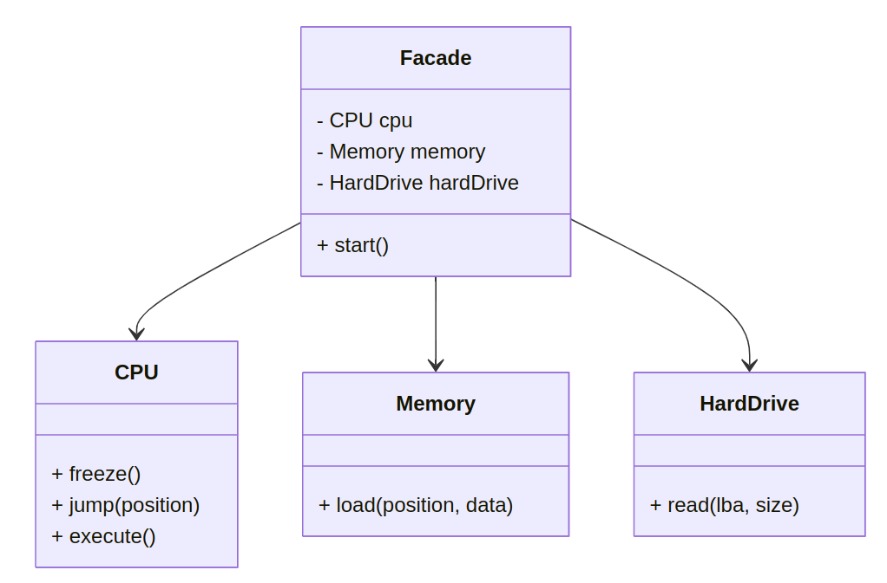
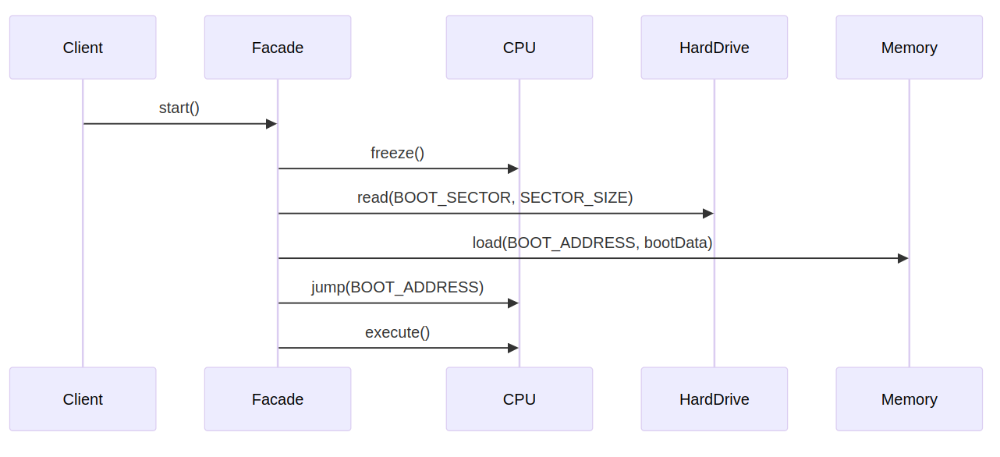

# Facade

```info
Author      Ter-Petrosyan Hakob
```

---

The **Facade** pattern is a structural design pattern that provides a simplified interface to a set of complex subsystems. 
It makes the system easier to use by hiding internal complexity behind a single entry point. While similar to the 
Adapter and Decorator patterns, the primary goal of a facade is to offer one clear interface to multiple features.

## Motivation

As software grows in complexity, clients may need to interact with many classes or subsystems in a specific sequence. 
Without a facade, clients must know the subsystem APIs and the order of calls, leading to tight coupling and fragile code. 
A facade decouples clients from subsystem classes and reduces the number of dependencies.


## Structure

<p align="center">
    
</p>

## Example: Starting a Computer

Here is a Java implementation demonstrating the facade:

```java
// Subsystem 1
class CPU {
    public void freeze()         { /* ... */ }
    public void jump(long pos)   { /* ... */ }
    public void execute()        { /* ... */ }
}

// Subsystem 2
class Memory {
    public void load(long pos, byte[] data) { /* ... */ }
}

// Subsystem 3
class HardDrive {
    public byte[] read(long lba, int size)  { /* ... */ return new byte[size]; }
}

// Facade
public class ComputerFacade {
    private final CPU cpu = new CPU();
    private final Memory memory = new Memory();
    private final HardDrive hardDrive = new HardDrive();
    private static final long BOOT_ADDRESS = 0x00;
    private static final long BOOT_SECTOR  = 0x10;
    private static final int SECTOR_SIZE   = 512;

    public void start() {
        cpu.freeze();
        byte[] bootData = hardDrive.read(BOOT_SECTOR, SECTOR_SIZE);
        memory.load(BOOT_ADDRESS, bootData);
        cpu.jump(BOOT_ADDRESS);
        cpu.execute();
    }
}

// Client
public class Main {
    public static void main(String[] args) {
        new ComputerFacade().start();
    }
}
```

## Sequence Diagram

<p align="center">
    
</p>

## When to Use

- **Complex subsystems:** When clients need many calls to work with a subsystem.
- **Reduce dependencies:** To decouple clients from subsystem classes.
- **Improve readability:** To present a clear API for common tasks.

## Pros&Cons

Pros:
- Simplifies client code
- Promotes loose coupling
- Makes the system easier to test (mock the facade)

Cons: 
- Can become a god object if overused
- May hide subsystem capabilities that clients need in special cases
- Adds an extra layer of indirection

## Implementation Tips

- Keep facades skinny: only include common methods for clients.
- Do not let subsystems reference the facade.
- Combine with the Factory pattern to control facade creation.
- Consider versioning your facade if subsystems evolve.

---

- [Home](./../../README.md)
- [Design Patterns](./../tutorials.md)