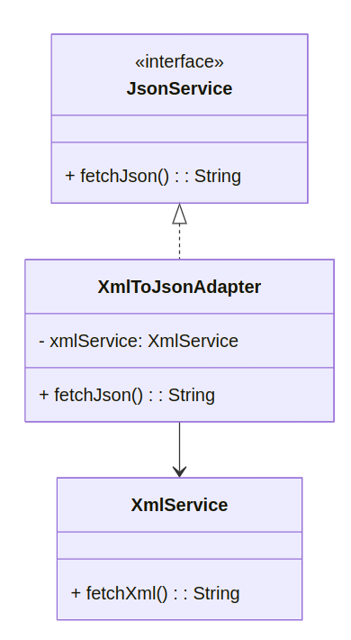
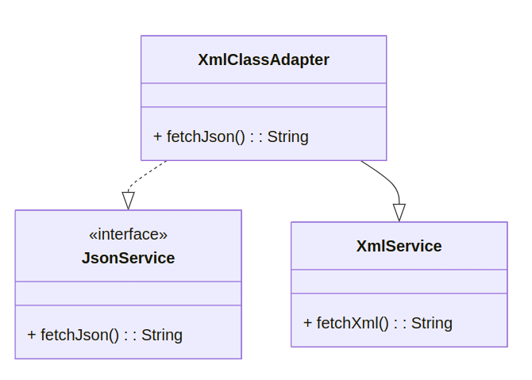
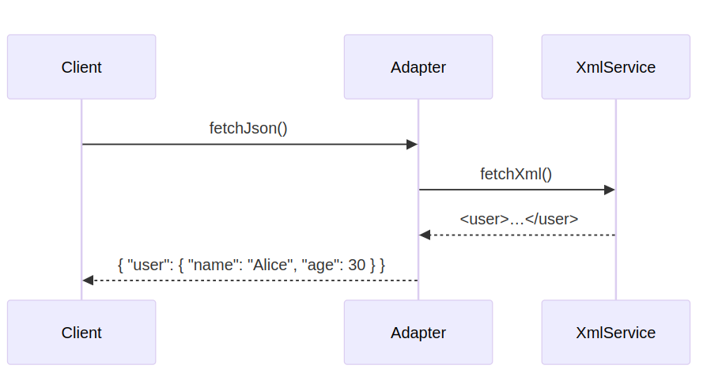

# Adapter

```info
Author      Ter-Petrosyan Hakob
```

---

The **Adapter** pattern is a structural design pattern. It lets two incompatible interfaces work together by providing an adapter object that converts calls from one interface into calls to the other.


## Real‑World Example: API Format Adapter

Two services must communicate: one sends data as `JSON`, the other expects `XML`. An adapter converts the format 
so both services work without changing their code.

## Adapter Variants

There are two main approaches to implement the Adapter pattern:

- **Class Adapter:** Uses inheritance. The adapter extends the adaptee class and implements the target interface.
- **Object Adapter:** Uses composition. The adapter holds a reference to the adaptee object and implements the target interface by delegating calls.

### Example: JSON/XML Format Adapter

This example shows both Object Adapter and Class Adapter implementations for converting XML data into JSON format.

#### Object Adapter Example

The Object Adapter wraps an `XmlService` instance and implements the `JsonService` interface.

**Class Diagram:**

<p align="center">
    
</p>


**Code:**
```java
// Target interface for JSON clients
public interface JsonService {
    String fetchJson();
}

// Adaptee: existing XML service
public class XmlService {
    public String fetchXml() {
        // returns data in XML format
        return "<user><name>Alice</name><age>30</age></user>";
    }
}

// Object Adapter converting XML to JSON
public class XmlToJsonAdapter implements JsonService {
    private XmlService xmlService;

    public XmlToJsonAdapter(XmlService xmlService) {
        this.xmlService = xmlService;
    }

    @Override
    public String fetchJson() {
        String xml = xmlService.fetchXml();
        // simple conversion logic (illustration)
        return xml
            .replace("<user>", "{ \"user\": ")
            .replace("<name>", "\"name\": \"")
            .replace("</name>", "\" , ")
            .replace("<age>", "\"age\": ")
            .replace("</age>", " }")
            .replace("</user>", " }");
    }
}

// Client using Object Adapter
public class ClientApp {
    public static void main(String[] args) {
        XmlService xmlService = new XmlService();
        JsonService jsonAdapter = new XmlToJsonAdapter(xmlService);
        System.out.println(jsonAdapter.fetchJson());
    }
}
```

### Class Adapter Example

The Class Adapter extends `XmlService` and implements `JsonService` directly.

**Class Diagram:**

<p align="center">
    
</p>


**Code:**

```java
// Class Adapter converting XML to JSON
public class XmlClassAdapter extends XmlService implements JsonService {
    @Override
    public String fetchJson() {
        String xml = super.fetchXml();
        // convert xml to json (same logic)
        return xml
            .replace("<user>", "{ \"user\": ")
            .replace("<name>", "\"name\": \"")
            .replace("</name>", "\" , ")
            .replace("<age>", "\"age\": ")
            .replace("</age>", " }")
            .replace("</user>", " }");
    }
}

// Client using Class Adapter
public class ClientAppClass {
    public static void main(String[] args) {
        JsonService adapter = new XmlClassAdapter();
        System.out.println(adapter.fetchJson());
    }
}
```

**Sequence Diagram:**

<p align="center">
    
</p>

## When to Use

- You have a class with an interface that does not match what your code needs.
- You want to reuse existing classes without changing them.
- You need a middle layer to translate one interface into another.

## Pros&Cons

Pros:
- Separates interface conversion from business logic
- Follows Single Responsibility Principle
- Allows reuse of legacy or 3rd‑party code

Cons:
- More classes and interfaces to maintain
- Can add complexity if adapter is trivial
- Clients must know about adapter types

## Related Patterns

- **Decorator:** Keeps the same interface but adds behavior.
- **Facade:** Provides a simplified interface to many classes.
- **Bridge:** Decouples implementation from interface at design time.

---

- [Home](./../../README.md)
- [Design Patterns](./../tutorials.md)