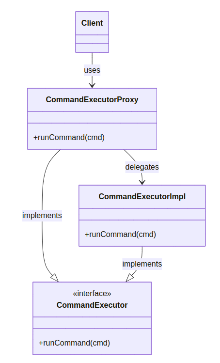
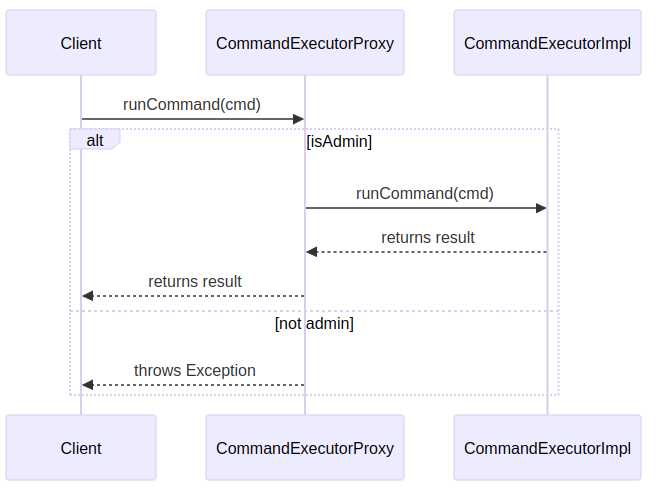

# Proxy
```info
Author      Ter-Petrosyan Hakob
```

---

The Proxy design pattern is a structural pattern. It is one of the simplest patterns to understand and use.

The Gang of Four defines the proxy pattern as:

> Provide a surrogate or placeholder for another object to control access to it.

In other words, a proxy acts as a gatekeeper. It sits between a client and a real object. The proxy can:

- Check permissions before operations
- Log or monitor requests
- Limit or modify access
- Cache results or delay object creation

This helps you protect sensitive actions or manage resource use without changing the real object or the client code.

**Class Diagram:**
<p align="center">
    
</p>


This class diagram illustrates the structure of the Proxy pattern:

- `CommandExecutor` is an interface defining `runCommand(cmd)`.
- `CommandExecutorImpl` is the real object that implements `CommandExecutor`.
- `CommandExecutorProxy` also implements `CommandExecutor` and controls access before delegating to the real implementation.
- The Client uses the proxy rather than the real object directly, ensuring safe access.

## Example: Command Executor

Imagine a class that runs system commands. If you give it directly to a client, they could run dangerous commands like `rm -rf /`. 
We can use a proxy to prevent that.

**CommandExecutor Interface:**
```java
public interface CommandExecutor {
    void runCommand(String cmd) throws Exception;
}
```

**Real Command Executor:**
```java
public class CommandExecutorImpl implements CommandExecutor {
    @Override
    public void runCommand(String cmd) throws UnauthorizedException, CommandExecutionException {
        // Execute the system command
        Runtime.getRuntime().exec(cmd);
        System.out.println("Executed: '" + cmd + "'");
    }
}
```

**Proxy Class:**
```java
public class CommandExecutorProxy implements CommandExecutor {
    private static final String ADMIN_USER = "Gurgen";
    private static final String ADMIN_PWD = "J@urnalD$v";

    private final CommandExecutor executor;
    private final boolean isAdmin;

     public CommandExecutorProxy(String user, String pwd) {
        Objects.requireNonNull(user, "user cannot be null");
        Objects.requireNonNull(pwd,  "pwd cannot be null");

        this.executor = new CommandExecutorImpl();
        this.isAdmin  = ADMIN_USER.equals(user) && ADMIN_PWD.equals(pwd);
    }

    @Override
    public void runCommand(String cmd) throws UnauthorizedException, CommandExecutionException {
        Objects.requireNonNull(cmd, "cmd cannot be null");
        String trimmed = cmd.trim();

        if (!isAdmin && trimmed.startsWith("rm")) {
            throw new UnauthorizedException("Permission denied: non‑admin users cannot execute 'rm' commands.");
        }

        try {
            executor.runCommand(cmd);
        } catch (Exception e) {
            throw new CommandExecutionException("Error executing command: " + trimmed, e);
        }
    }
}
```

**Client Code:**
```java
public class ProxyPatternTest {
    public static void main(String[] args) {
        CommandExecutor executor = new CommandExecutorProxy("Gurgen", "wrong_pwd");
        try {
            executor.runCommand("ls -ltr");
            executor.runCommand("rm -rf abc.pdf");
        } catch (Exception e) {
            System.out.println("Error: " + e.getMessage());
        }
    }
}
```

In this example:
- The client uses `CommandExecutorProxy` instead of `CommandExecutorImpl`.
- The proxy allows safe commands for all users.
- It blocks dangerous commands for non-admin users.

**Sequence Diagram**

<p align="center">
    
</p>

This sequence diagram shows how the Proxy handles a client request:

- The Client calls `runCommand(cmd)` on the `CommandExecutorProxy`.
- The Proxy checks if the user is an admin:
    - If `admin`, it delegates the call to `CommandExecutorImpl` and returns the result.
    - If not `admin`, it throws an exception for disallowed commands.


## Common Uses of Proxy Pattern

- **Virtual Proxy (Lazy Initialization):** Delay creating a heavy object until it is really needed.
- **Protection Proxy (Access Control):** Allow only certain clients to use the object.
- **Remote Proxy (Remote Service):** Handle network communication to a remote object.
- **Logging Proxy:** Log each request before passing it to the real object.
- **Caching Proxy:** Cache results of expensive operations and reuse them.
- **Smart Reference:** Track and manage the lifecycle of a service object, freeing resources when no one uses it.

## Pros&Cons

Pros:
- Control access without changing the original object.
- Add features (logging, caching, security) transparently.
- Delay object creation and save resources.
- Follow the Open/Closed Principle: you can add new proxies without changing existing code.

Cons:
- More classes to manage, which can lead to complexity.
- Extra layer may add some performance overhead.

## Relation to Other Patterns

- Adapter provides a different interface to an object. Proxy uses the same interface.
- Decorator adds responsibilities to an object. Proxy controls or manages access to the object.
- Facade simplifies access to a group of objects. Proxy controls access to a single object.

---

- [Home](./../../README.md)
- [Design Patterns](./../tutorials.md)