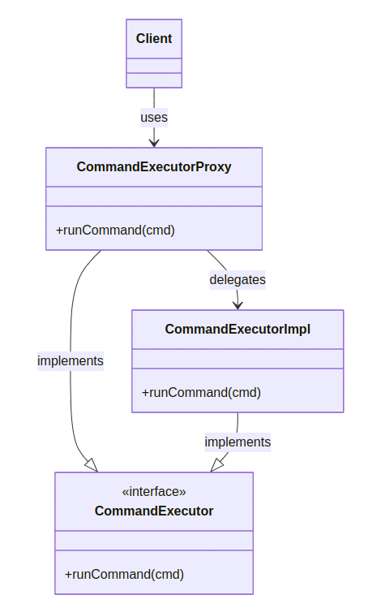
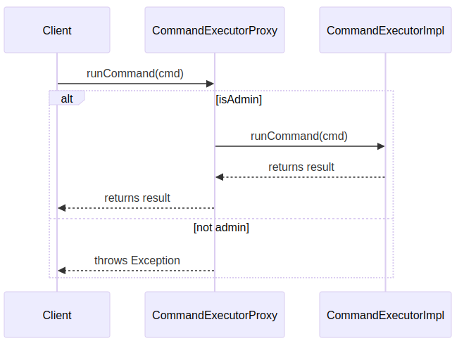

# Proxy
```info
Author      Ter-Petrosyan Hakob
```

---

The Proxy design pattern is a structural pattern. It is one of the simplest patterns to understand and use.

The Gang of Four defines the proxy pattern as:

> Provide a surrogate or placeholder for another object to control access to it.

In other words, a proxy acts as a gatekeeper. It sits between a client and a real object. The proxy can:

- Check permissions before operations
- Log or monitor requests
- Limit or modify access
- Cache results or delay object creation

This helps you protect sensitive actions or manage resource use without changing the real object or the client code.

**Class Diagram:**
<p align="center">
    
</p>


This class diagram illustrates the structure of the Proxy pattern:

- CommandExecutor is an interface defining runCommand(cmd).
- CommandExecutorImpl is the real object that implements CommandExecutor.
- CommandExecutorProxy also implements CommandExecutor and controls access before delegating to the real implementation.
- The Client uses the proxy rather than the real object directly, ensuring safe access.

## Example: Command Executor

Imagine a class that runs system commands. If you give it directly to a client, they could run dangerous commands like `rm -rf /`. 
We can use a proxy to prevent that.

**CommandExecutor Interface:**
```java
public interface CommandExecutor {
    void runCommand(String cmd) throws Exception;
}
```

**Real Command Executor:**
```java
public class CommandExecutorImpl implements CommandExecutor {
    @Override
    public void runCommand(String cmd) throws IOException {
        // Execute the system command
        Runtime.getRuntime().exec(cmd);
        System.out.println("Executed: '" + cmd + "'");
    }
}
```

**Proxy Class:**
```java
public class CommandExecutorProxy implements CommandExecutor {
    private boolean isAdmin;
    private CommandExecutor executor;

    public CommandExecutorProxy(String user, String pwd) {
        // Simple check: only user "Pankaj" with correct password is admin
        if ("Pankaj".equals(user) && "J@urnalD$v".equals(pwd)) {
            isAdmin = true;
        }
        executor = new CommandExecutorImpl();
    }

    @Override
    public void runCommand(String cmd) throws Exception {
        if (isAdmin) {
            executor.runCommand(cmd);
        } else {
            // Block dangerous commands for non-admin users
            if (cmd.trim().startsWith("rm")) {
                throw new Exception("'rm' is not allowed for non-admin users.");
            }
            executor.runCommand(cmd);
        }
    }
}
```

**Client Code:**
```java
public class ProxyPatternTest {
    public static void main(String[] args) {
        CommandExecutor executor =
            new CommandExecutorProxy("Pankaj", "wrong_pwd");
        try {
            executor.runCommand("ls -ltr");
            executor.runCommand("rm -rf abc.pdf");
        } catch (Exception e) {
            System.out.println("Error: " + e.getMessage());
        }
    }
}
```

In this example:
- The client uses CommandExecutorProxy instead of CommandExecutorImpl.
- The proxy allows safe commands for all users.
- It blocks dangerous commands for non-admin users.

**Sequence Diagram**

<p align="center">
    
</p>

This sequence diagram shows how the Proxy handles a client request:

1) The Client calls `runCommand(cmd)` on the `CommandExecutorProxy`.
2) The Proxy checks if the user is an admin:
    - If `admin`, it delegates the call to `CommandExecutorImpl` and returns the result.
    - If not `admin`, it throws an exception for disallowed commands.

---

## 📌 Explore More

- 🏠 [Home](./../../README.md)
- 🎨 [ Design Patterns](./../tutorials.md)