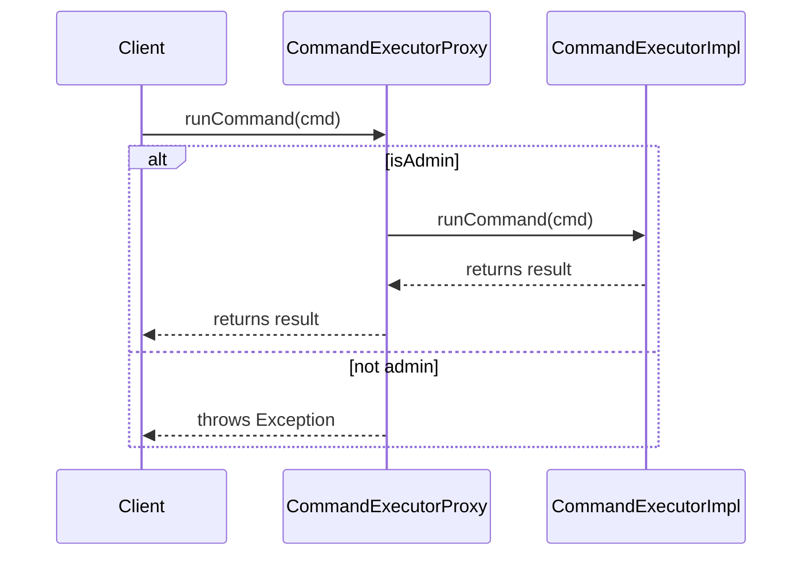

# Proxy
```info
Author      Ter-Petrosyan Hakob
```

---

The Proxy design pattern is a structural pattern. It is one of the simplest patterns to understand and use.

The Gang of Four defines the proxy pattern as:

> Provide a surrogate or placeholder for another object to control access to it.

In other words, a proxy acts as a gatekeeper. It sits between a client and a real object. The proxy can:

- Check permissions before operations
- Log or monitor requests
- Limit or modify access
- Cache results or delay object creation

This helps you protect sensitive actions or manage resource use without changing the real object or the client code.

## Implementation Diagram


```mermaid
sequenceDiagram
    participant Client
    participant Proxy as CommandExecutorProxy
    participant Real as CommandExecutorImpl

    Client->>Proxy: runCommand(cmd)
    alt isAdmin
        Proxy->>Real: runCommand(cmd)
        Real-->>Proxy: returns result
        Proxy-->>Client: returns result
    else not admin
        Proxy-->>Client: throws Exception
    end
```    

---

## 📌 Explore More

- 🏠 [Home](./../../README.md)
- 🎨 [ Design Patterns](./../tutorials.md)