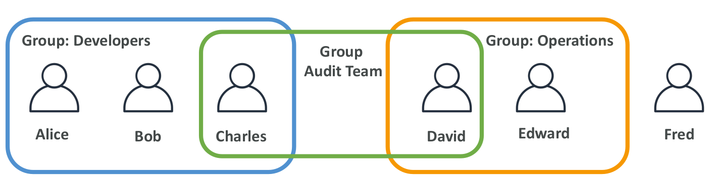
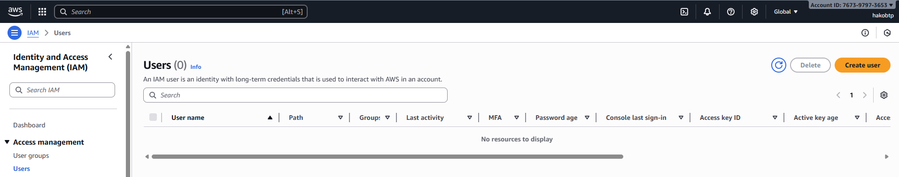

# IAM: Users & Groups

So, **IAM** stands for Identity and Access Management. It is a global service because in IAM we create users and put them into groups.

- IAM means Identity and Access Management.
- IAM is a global service. This means users and groups work in all regions, not just one.
- The root account is made when you create your AWS account. Do not use it for daily work and do not share it.
- Users are people or apps in your organization. You can put users into groups.
- Groups can only have users. They cannot have other groups.
- A user does not need to be in a group, and a user can be in many groups.

<p align="center">
    
</p>

## IAM: Permissions

- Users or groups can have policies. Policies are JSON documents.
- Policies define what a user can do in AWS.
- AWS uses the least privilege principle: give users only the permissions they need, not more.

**Example JSON policy:**

```json
{
  "Version": "2012-10-17",
  "Statement": [
    {
      "Effect": "Allow",
      "Action": "ec2:Describe*",
      "Resource": "*"
    },
    {
      "Effect": "Allow",
      "Action": "elasticloadbalancing:Describe*",
      "Resource": "*"
    },
    {
      "Effect": "Allow",
      "Action": [
        "cloudwatch:ListMetrics",
        "cloudwatch:GetMetricStatistics",
        "cloudwatch:Describe*"
      ],
      "Resource": "*"
    }
  ]
}
```

- `"Version": "2012-10-17"` **-** This is the policy language version. It tells AWS which version of JSON rules we are using.
- `"Statement"` **-** This is a list of rules. Each rule says what actions are allowed or denied.
- `"Effect": "Allow"` **-** This means the rule allows the action. It could also be `"Deny"` to block something.
- `"Action"` **-** This is what the user can do.
    - `"ec2:Describe*"` **-**  Can see EC2 information (all `“Describe”` actions).
    - `"elasticloadbalancing:Describe*"` **-** Can see load balancer information.
    - CloudWatch actions **-** Can list metrics, get statistics, and describe resources.
- `"Resource": "*"` **-** This means the rule applies to all resources.

**In short:** This policy gives read-only access to EC2, Load Balancer, and CloudWatch services.

## Create Users in AWS

Let’s practice creating users in AWS using the IAM service.

1. In the AWS search bar, type IAM and open the IAM console.
2. On the IAM Dashboard, you may see some security recommendations. We don’t need to worry about them for now.
3. On the left side, click Users. This is where we can create new IAM users.

<p align="center">
    
</p>

Important note:

- In the top right corner, click Global. You will see that the region selection is not active.
- This shows that IAM is a global service, not tied to any specific region.
- Users you create in IAM are available everywhere. Some other AWS services you’ll see in this course are region-specific.

Why do we create users?

- Right now, you are using the root account, which shows your account ID.
    - Only the AWS account itself has an account ID.
    - IAM users do not get a new account ID. They belong to the same AWS account.
    - Each IAM user has a username and credentials (like a password or access keys) but shares the account ID with the root account.
- Using the root account for daily work is not safe and not best practice.
- Instead, we create IAM users, such as admin users, so that we can use the account more safely.


Now, let’s go ahead and create a user.


---

- [HOME](./../../../README.md)
- [DevOps](./../../tutorials.md)
- [Understanding AWS Regions and Availability Zones](./1_Understanding_AWS_Regions_and_Availability_Zones.md)