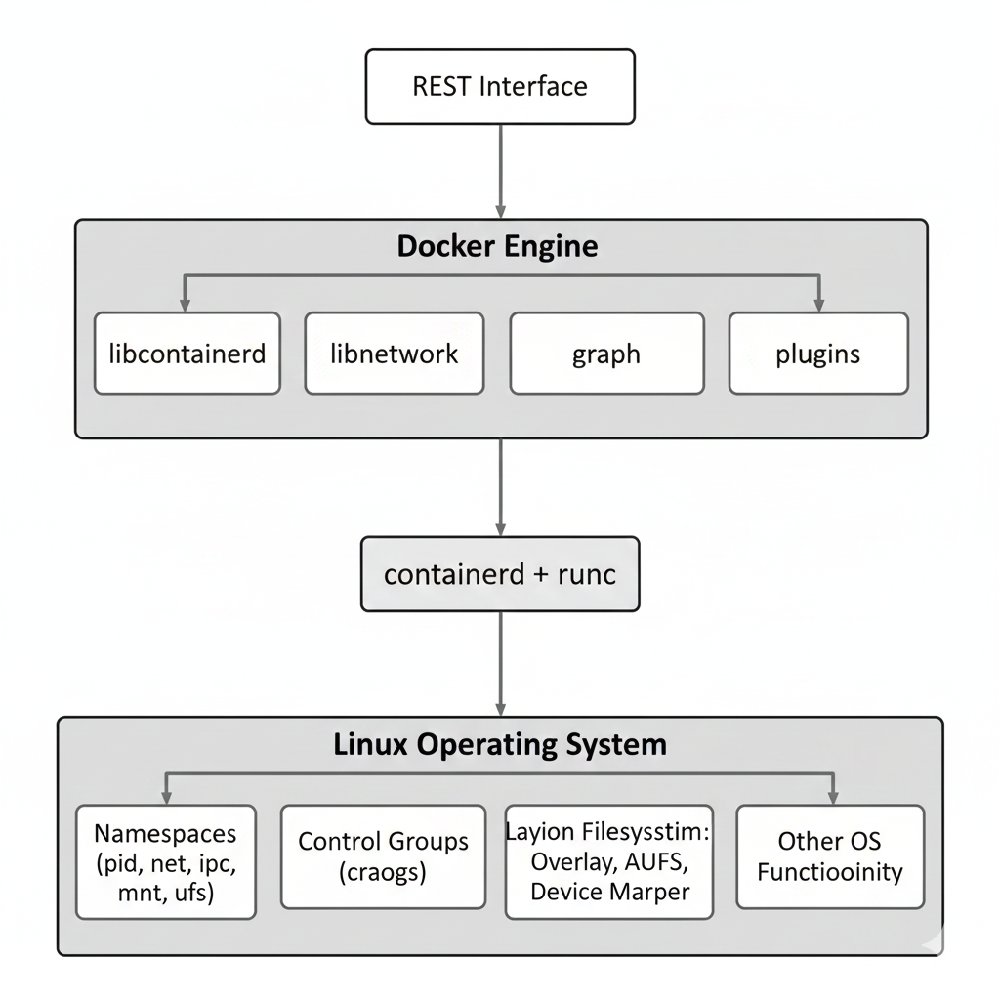

# Container architecture

Now let’s look at how a system that runs Docker containers is designed at a high level.
The diagram below shows what a computer with Docker installed (a Docker host) looks like:

    

A Docker host is usually built from three main parts:

- The Linux operating system at the bottom
- The container runtime in the middle
- The Docker engine at the top

Docker containers work because the Linux operating system provides special features that make process isolation possible. 
These include **namespaces**, **control groups (cgroups)**, and **layering capabilities**. The container runtime and the Docker 
engine use these features together to create secure, lightweight containers.

Linux namespaces—such as PID namespaces (for process IDs) and network namespaces—separate a container’s processes and network from the rest of the system. This makes each container feel like its own small computer.

Control groups protect the system from “noisy neighbors.” This is a situation where one container uses too many resources and slows down everything else. With cgroups, Docker can limit how much CPU, memory, or other resources each container can use.

## The Container Runtime

A Docker host uses two main tools for the container runtime: `containerd` and `runc`.

- `runc` is the low-level tool. It actually creates and runs containers using Linux features.
- `containerd` builds on top of `runc` and adds higher-level operations such as image management, container lifecycle control, and storage handling.

Both tools are open source and are now part of the CNCF (Cloud Native Computing Foundation).

The container runtime is responsible for the entire life cycle of a container. It can:
- Pull an image from a registry
- Create a container from that image
- Start and run the container
- Stop and delete the container when it’s no longer needed

For example, if you run `docker run ubuntu`, the runtime fetches the Ubuntu image (if needed), 
creates a container, and starts it with the default command.

## The Docker Engine

The Docker engine sits above the container runtime and provides extra features that make Docker easier to use. It includes:

- Networking libraries
- Storage drivers
- Plugin support
- A REST API used for automation

The Docker command-line interface (CLI) communicates with this REST API. When you type a command like `docker ps`, the CLI sends a request to the Docker engine, and the engine responds with the container information.

---

- [HOME](./../../../README.md)
- [DevOps](./../../tutorials.md)