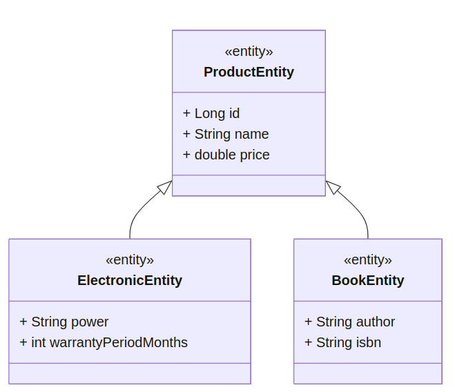
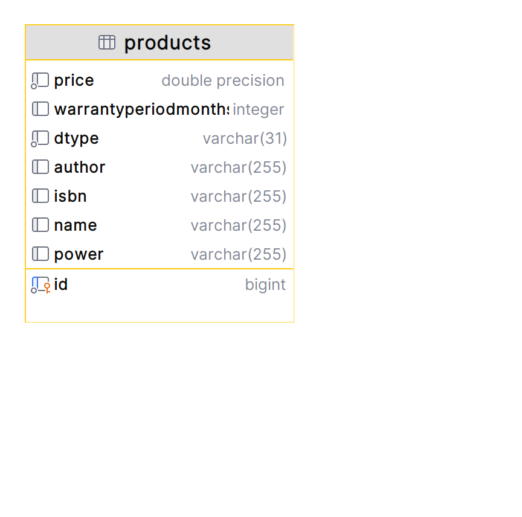

# 🌳 Inheritance

```info
Author      Ter-Petrosyan Hakob
```
---

Since the first object‑oriented languages appeared, programmers have used inheritance to share code. With inheritance, one class (the child) takes properties and behavior from another class (the parent). While it’s easy to map simple object relationships to database tables, inheritance does not match directly to a flat, relational design.

When you save an inheritance hierarchy in a relational database, you must choose how to organise your tables. JPA offers three strategies:

- **SINGLE_TABLE:** All classes share a single table. That table has columns for every 
    field in every class. (This is JPA’s default strategy.)
- **JOINED:** Each class—parent and child—gets its own table. Child tables link back to their parent table with a foreign key.
- **TABLE_PER_CLASS:** Only concrete (non‑abstract) classes get tables. Each table has columns for its own fields plus all inherited fields.

> **Tip:** The `“TABLE_PER_CLASS”` strategy is optional in JPA 2.2. To keep your application portable, it’s safer to stick with either the single‑table or joined‑tables strategies.


Every inheritance setup in JPA starts with a root entity. This root class tells JPA which strategy to use. You do this by adding the 
`@Inheritance` annotation and setting its strategy value to one of the options in `javax.persistence.InheritanceType`. If you skip this step, 
JPA will choose the `InheritanceType.SINGLE_TABLE` hierarchy by default.

To see how each strategy works, we’ll map two child entities—`Electronic` and `Book`—both of which extend the `Product` entity.

<p align="center">
    
</p>

## SINGLE_TABLE

JPA uses the `SINGLE_TABLE` strategy by default. With this approach, every class in the inheritance hierarchy is stored in the same database table. 
Because it’s the default, you don’t need to add the `@Inheritance` annotation on the root entity—JPA will pick `SINGLE_TABLE` automatically.

```java
@Entity
@Getter
@Setter
@ToString
@Accessors(chain = true)
@Table(name = "products")
public class ProductEntity {
    @Id
    @GeneratedValue
    private Long id;
    private String name;
    private double price;
}
```

```java
@Entity
@Getter
@Setter
@ToString
@Accessors(chain = true)
@Table(name = "books")
public class BookEntity extends ProductEntity {
    private String author;
    private String isbn;
}
```

```java
@Entity
@Getter
@Setter
@ToString
@Accessors(chain = true)
@Table(name = "electronics")
public class ElectronicEntity extends ProductEntity {
    private String power;
    @Column(name = "warranty_period_months")
    private int warrantyPeriodMonths;
}
```

<p align="center">
    
</p>

In the `SINGLE_TABLE` strategy, JPA stores every class in one table—here, the `products` table. This table has:

- All fields from `ProductEntity`, `ElectronicEntity`, and `BookEntity`
- An extra column, called the discriminator column (`dtype`), which does not match any field in your Java classes

When you save data, each row in `products` represents either a general product, an electronic item, or a book. The dtype column holds a simple label (for example, Product, Electronic, or Book) so that when JPA reads a row, it knows which Java class to create.

Here is a fragment of the `products` table. Notice that for simple `products` (first three rows), only `name` and `price` are filled; the other columns remain empty.

| id  | name             | price   | power | warranty_period_months | author     | isbn          | dtype      |
|-----|------------------|---------|-------|----------------------|------------|---------------|------------|
| 1   | Basic Product    | 10.00   |       |                      |            |               | ProductEntity    |
| 2   | Standard Item    | 20.50   |       |                      |            |               | ProductEntity    |
| 3   | Sample Product   | 15.75   |       |                      |            |               | ProductEntity    |
| 4   | Gaming Laptop    | 1200.00 | 150W  | 24                   |            |               | ElectronicEntity |
| 5   | Java Programming | 35.00   |       |                      | Jane Smith | 978-1234567890| Book       |


- **Rows 1–3:** `dtype = ProductEntity` so only `name` and `price` are used.
- **Row 4:** `dtype = ElectronicEntity` fills `power` and `warranty_period_months`.
- **Row 5:** `dtype = BookEntity` fills `author` and `isbn`.

You can see the `“holes”` where columns are unused for a given entity type.


## JOINED
## TABLE_PER_CLASS

---

## 📌 Explore More

- 🏠 [Home](./../../README.md)
- 🔄 [Understanding Transactions in JPA and Hibernate](./2_Understanding_Transactions_in_JPA_and_Hibernate.md)