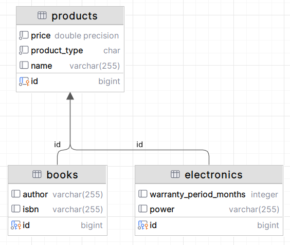

# Inheritance

```info
Author      Ter-Petrosyan Hakob
```
---

Since the first object‑oriented languages appeared, programmers have used inheritance to share code. With inheritance, one class (the child) takes properties and behavior from another class (the parent). While it’s easy to map simple object relationships to database tables, inheritance does not match directly to a flat, relational design.

When you save an inheritance hierarchy in a relational database, you must choose how to organise your tables. JPA offers three strategies:

- **SINGLE_TABLE:** All classes share a single table. That table has columns for every 
    field in every class. (This is JPA’s default strategy.)
- **JOINED:** Each class—parent and child—gets its own table. Child tables link back to their parent table with a foreign key.
- **TABLE_PER_CLASS:** Only concrete (non‑abstract) classes get tables. Each table has columns for its own fields plus all inherited fields.

> **Tip:** The `“TABLE_PER_CLASS”` strategy is optional in JPA 2.2. To keep your application portable, it’s safer to stick with either the `SINGLE_TABLE` or `JOINED` strategies.


Every inheritance setup in JPA starts with a root entity. This root class tells JPA which strategy to use. You do this by adding the 
`@Inheritance` annotation and setting its strategy value to one of the options in `javax.persistence.InheritanceType`. If you skip this step, 
JPA will choose the `InheritanceType.SINGLE_TABLE` hierarchy by default.

To see how each strategy works, we’ll map two child entities—`Electronic` and `Book`—both of which extend the `Product` entity.

<p align="center">
    
</p>

## SINGLE_TABLE

JPA uses the `SINGLE_TABLE` strategy by default. With this approach, every class in the inheritance hierarchy is stored in the same database table. 
Because it’s the default, you don’t need to add the `@Inheritance` annotation on the root entity—JPA will pick `SINGLE_TABLE` automatically.

```java
@Getter
@Setter
@ToString
@Accessors(chain = true)

@Entity
@Table(name = "products")
public class ProductEntity {
    @Id
    @GeneratedValue
    private Long id;
    private String name;
    private double price;
}
```

```java
@Getter
@Setter
@ToString
@Accessors(chain = true)

@Entity
@Table(name = "books")
public class BookEntity extends ProductEntity {
    private String author;
    private String isbn;
}
```

```java
@Getter
@Setter
@ToString
@Accessors(chain = true)

@Entity
@Table(name = "electronics")
public class ElectronicEntity extends ProductEntity {
    private String power;
    @Column(name = "warranty_period_months")
    private int warrantyPeriodMonths;
}
```

<p align="center">
    
</p>

In the `SINGLE_TABLE` strategy, JPA stores every class in one table—here, the `products` table. This table has:

- All fields from `ProductEntity`, `ElectronicEntity`, and `BookEntity`
- An extra column, called the discriminator column (`dtype`), which does not match any field in your Java classes

When you save data, each row in `products` represents either a general product, an electronic, or a book. The dtype column holds a simple label (for example, Product, Electronic, or Book) so that when JPA reads a row, it knows which Java class to create.

Here is a fragment of the `products` table. Notice that for simple `products` (first three rows), only `name` and `price` are filled; the other columns remain empty.


| id  | name             | price   | power | warranty_period_months | author     | isbn          | dtype      |
|-----|------------------|---------|-------|----------------------|------------|---------------|------------|
| 1   | Basic Product    | 10.00   |       |                      |            |               | ProductEntity    |
| 2   | Standard Item    | 20.50   |       |                      |            |               | ProductEntity    |
| 3   | Sample Product   | 15.75   |       |                      |            |               | ProductEntity    |
| 4   | Gaming Laptop    | 1200.00 | 150W  | 24                   |            |               | ElectronicEntity |
| 5   | Java Programming | 35.00   |       |                      | Jane Smith | 978-1234567890| Book       |


- **Rows 1–3:** `dtype = ProductEntity` so only `name` and `price` are used.
- **Row 4:** `dtype = ElectronicEntity` fills `power` and `warranty_period_months`.
- **Row 5:** `dtype = BookEntity` fills `author` and `isbn`.

You can see the `“holes”` where columns are unused for a given entity type.


By default, JPA adds a column named `DTYPE`. This column is a `VARCHAR` and holds the name of each entity for every row. If you want a different column name or data type, put `@DiscriminatorColumn` on the root entity. With this annotation you can set a new column name (for example, `product_type`) and choose a type like `CHAR`. Normally, JPA writes the Java class name in that column, but you can change it with `@DiscriminatorValue` on each subclass. In the code example below, we:

- Rename the column to `product_type`
- Change its data type to `CHAR`
- Use `P` for `ProductEntity`, `B` for `BookEntity`, and `E` for `ElectronicEntity`

```java
@Getter
@Setter
@ToString
@Accessors(chain = true)

@Entity
@Table(name = "products")
@DiscriminatorValue("P")
@DiscriminatorColumn(name = "product_type", discriminatorType = DiscriminatorType.CHAR)
@Inheritance(strategy = InheritanceType.SINGLE_TABLE)
public class ProductEntity {
    @Id
    @GeneratedValue
    private Long id;
    private String name;
    private double price;
}
```

```java

@Getter
@Setter
@ToString
@Accessors(chain = true)

@Entity
@Table(name = "books")
@DiscriminatorValue("B")
public class BookEntity extends ProductEntity {
    private String author;
    private String isbn;
}

```

```java
@Getter
@Setter
@ToString
@Accessors(chain = true)

@Entity
@Table(name = "electronics")
@DiscriminatorValue("E")
public class ElectronicEntity extends ProductEntity {
    private String power;
    @Column(name = "warranty_period_months")
    private int warrantyPeriodMonths;
}
```

By default, JPA uses the `SINGLE_TABLE` strategy. In this strategy, all classes in the inheritance hierarchy share one table. It is easy to understand and works well when your class hierarchy is small and does not change often.

However, there are some drawbacks:

- **Adding new classes or fields is hard:** To add a new entity or a new attribute, you must add a new column to the table, move existing data into the new format, and update any indexes.
- **Many empty columns:** Every child‑class column must allow `null` values. For example, if the Book entity has a non‑null isbn column, you cannot insert an Electronic row—because Electronic has no isbn, and that column cannot be empty.

## JOINED

With the `JOINED` strategy, each class in your inheritance hierarchy gets its own database table:

- Parent table (products)
    - Has the common columns (like id, name, price)
    - Includes the discriminator column (for example, dtype) to show which entity each row is

- Child tables (electronics, books)
    - Have only their own fields (like power for electronics, isbn for books)
    - Use the same id value as the parent table (so they join back on id)
    - Do not have a discriminator column

To enable this strategy, add the annotation to your root entity:

```java
@Getter
@Setter
@ToString
@Accessors(chain = true)

@Entity
@Table(name = "products")
@DiscriminatorValue("P")
@DiscriminatorColumn(name = "product_type", discriminatorType = DiscriminatorType.CHAR)
@Inheritance(strategy = InheritanceType.JOINED)
public class ProductEntity {
    @Id
    @GeneratedValue
    private Long id;
    private String name;
    private double price;
}
```

You do not need to change `ElectronicEntity` or `BookEntity`—they remain exactly as before.

<p align="center">
    
</p>


Below is the SQL code that Hibernate generated for the three tables using the `JOINED` strategy:


```sql
create table products
(
    id           bigint           not null primary key,
    price        double precision not null,
    product_type char             not null,
    name         varchar(255)
);

create table books
(
    id     bigint not null primary key constraint fk9j4... references products,
    author varchar(255),
    isbn   varchar(255)
);

create table electronics
(
    warranty_period_months integer,
    id                     bigint not null primary key constraint fk9ap... references products,
    power                  varchar(255)
);
```

You can still use `@DiscriminatorColumn` and `@DiscriminatorValue` on the root entity to change the name and values of the discriminator column. 
The `JOINED` strategy feels natural because each class has its own table, just like in your code.

However, this strategy can slow down queries:
- To load a subclass (for example, an electronics), JPA must join the subclass table with the root (products) table.
- The deeper your class hierarchy, the more joins you need to assemble one object.
- More joins mean slower performance, especially if you have many levels or you query across the whole hierarchy.

While `JOINED` works well for polymorphism, be aware of its impact on query speed when your hierarchy grows.

## TABLE_PER_CLASS

With the `TABLE_PER_CLASS` strategy, each class has its own table—just like in the `JOINED` strategy. 
But here, every child table also includes all the columns of the parent class. In other words:

- **No shared table:** Each entity (parent or child) has its own table.
- **No discriminator column:** There is nothing to tell which table holds which type.
- **Data repetition:** Parent fields appear again in each child table. This breaks normalisation because you copy the same columns into every table.

To use this strategy, put the annotation on your root entity:

```java
@Getter
@Setter
@ToString
@Accessors(chain = true)

@Entity
@Table(name = "products")
@DiscriminatorValue("P")
@DiscriminatorColumn(name = "product_type", discriminatorType = DiscriminatorType.CHAR)
@Inheritance(strategy = InheritanceType.TABLE_PER_CLASS)
public class ProductEntity {
    @Id
    @GeneratedValue
    private Long id;
    private String name;
    private double price;
}
```

Now, `BookEntity` and `ElectronicEntity` each get a separate table. Those tables include their own fields plus all fields from `ProductEntity`.

<p align="center">
    
</p>

With the `TABLE_PER_CLASS` strategy:

- **Good for single‑entity queries:** Each class has its own table. If you only need one entity type (for example, only books), 
    JPA queries just that table. This is fast and easy.
- **Slower for all‑entity queries:** To get every kind of `product` (`book`, `electrony`), JPA must run a query on each table and combine the results with a `UNION`. When you have lots of data, using `UNION` across many tables can be slow.
- **Optional in JPA 2.2.:** Not every JPA provider must support this strategy. If you want your app to work everywhere, be careful using it.

---

- [Home](./../../README.md)
- [Hibernate Tutorials](./../tutorials.md)
- [Understanding Transactions in JPA and Hibernate](./2_Understanding_Transactions_in_JPA_and_Hibernate.md)
- [Secondary Table](./4_SecondaryTable.md)