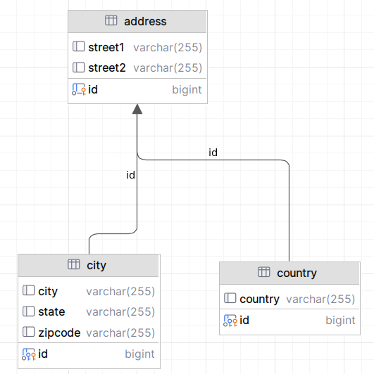

# Secondary Table

```info
Author      Ter-Petrosyan Hakob
```
---

So far, we have always mapped one entity to a single table, called the primary table. But sometimes your existing database has data split across several tables. In that case, you can use the `@SecondaryTable` annotation to link extra tables to the same entity.

Here’s how it works:

- **Define secondary tables:** Use `@SecondaryTable` (or `@SecondaryTables`) on your entity class to list the extra tables.
- **Assign each field:** For every attribute in the class, add `@Column(table = "table_name")` to tell JPA which table column should hold that data.

In the example below, an Address entity stores some data in the primary table and other data in two secondary tables.

```java
@Getter
@Setter

@Entity
@SecondaryTable(name = "city")
@SecondaryTable(name = "country")
public class Address {

    @Id
    private Long id;
    private String street1;
    private String street2;
    @Column(table = "city")
    private String city;
    @Column(table = "city")
    private String state;
    @Column(table = "city")
    private String zipcode;
    @Column(table = "country")
    private String country;
}
```

By default, an entity’s fields go into its primary table—here, named `address`. To spread data across extra tables, you add `@SecondaryTable` 
for each one (for example, `city` and `country`). Then, on each field, you use `@Column(table="city")` or `@Column(table="country")` to tell JPA where to store it.

Each table holds different columns, but they all share the same primary key so JPA can join them into one `Address` object.

<p align="center">
    
</p>

Using secondary tables can slow down your queries. When you load an entity, JPA must read from each table and then join the data together. However, secondary tables are useful when your entity has large fields—like images or files stored as BLOBs. By keeping those big attributes in a separate table, you only load them when you really need them, which can save time and resources.

> You can annotate the attribute with `@Basic(fetch = FetchType.LAZY)` so the data will be retrieved from the database 
> lazily (only when you access the attribute using its getter).
>   ```java
>    @Lob
>    @Basic(fetch = FetchType.LAZY)
>    private byte[] wav;
>   ```
> Note that the `wav` attribute of type `byte[]` is also annotated with `@Lob` to store the value as a large object (LOB). 
> Database columns that can store these types of large objects require special JDBC calls to be accessed from Java. 
> To inform the provider, an additional `@Lob` annotation must be added to the basic mapping.


---

- [Home](./../../README.md)
- [Hibernate Tutorials](./../tutorials.md)
- [Inheritance](./3_Inheritance.md)
- [Primary Key](./5_Primary_Key.md)