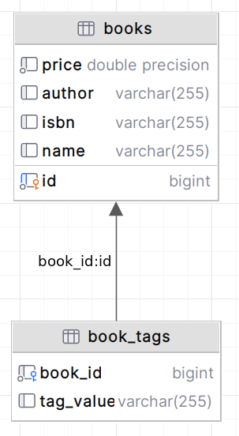
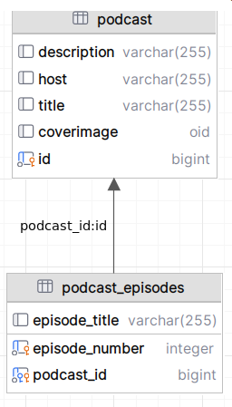

# Map and Collection of Basic Types

```info
Author      Ter-Petrosyan Hakob
```
---


When your entity needs to store multiple simple values (like Strings or numbers), JPA provides the `@ElementCollection` annotation. 
This tells the persistence provider that a field holds basic data rather than references to other entities. You can use it on fields of these types:

- **`Collection<T>`:** The generic root interface for collections.
- **`Set<T>`:** A collection that prevents duplicate entries.
- **`List<T>`:** A collection that preserves insertion order.

To control where these values are stored, use `@CollectionTable`. If you skip it, JPA creates a table named by joining the entity name and the field name with an underscore.


## Example 1: Adding Tags to a Book

Imagine you have a Book entity and want to let readers add many tags (keywords) to each book. You can store each tag as a String. Here is a simple setup:

```java
@Entity
@Table(name = "books")
public class Book {
    @Id
    @GeneratedValue
    private Long id;
    private String author;
    private String isbn;

    @ElementCollection(fetch = FetchType.LAZY)
    @CollectionTable(name = "book_tags")
    @Column(name = "tag_value")
    private List<String> tags = new ArrayList<>();

    // Getters and setters...
}
```

- `@ElementCollection(fetch = FetchType.LAZY)` marks tags as a list of simple values and loads them only when needed.
- `@CollectionTable(name = "book_tags")` sets the table name for storing tags. Without it, the default table would be `Book_tags`.
- `@Column(name = "tag_value")` renames the column holding each tag. Otherwise, it uses the field name `tags`.


<p align="center">
    
</p>

**Generated SQL for book and tags:**

```sql

create table books
(
    id     bigint           not null primary key,
    price  double precision not null,
    author varchar(255),
    isbn   varchar(255),
    name   varchar(255)
);


create table book_tags (
    book_id   bigint not null constraint fki... references books,
    tag_value varchar(255)
);
```

> **Note:** In JPA 1.0, you could save a list as a BLOB because `ArrayList` implements `Serializable`. 
> But this prevents queries on individual tags and only works in Java. `@ElementCollection` gives you a clear, queryable table of values.

## Example 2: Storing a Map of Basic Types

You can also use `@ElementCollection` with a `Map` of simple keys and values. For instance, a `Podcast` entity might keep episode numbers and `titles`:

```java
@Entity
public class Podcast {
    @Id
    @GeneratedValue
    private Long id;
    private String title;
    private String host;
    private String description;
    @Lob
    private byte[] coverImage;

    @ElementCollection
    @CollectionTable(name = "podcast_episodes")
    @MapKeyColumn(name = "episode_number")
    @Column(name = "episode_title")
    private Map<Integer, String> episodes = new HashMap<>();

    // Constructors, getters, setters...
}
```

<p align="center">
    
</p>

**Generated SQL for podcast and episodes:**

```sql
create table podcast
(
    id          bigint not null primary key,
    description varchar(255),
    host        varchar(255),
    title       varchar(255),
    coverimage  oid
);

create table podcast_episodes
(
    podcast_id     bigint  not null constraint fkt... references podcast,
    episode_number integer not null,
    episode_title  varchar(255),
    primary key (episode_number, podcast_id)
);
```


- `@MapKeyColumn(name = "episode_number")` names the column for map keys (episode numbers). Without it, JPA would use `episodes_KEY`.
- `@Column(name = "episode_title")` names the column for map values (episode titles).

---

- [Home](./../../README.md)
- [Hibernate Tutorials](./../tutorials.md)
- [Primary Key](./5_Primary_Key.md)
- [LazyInitializationException](./7_LazyInitializationException.md)