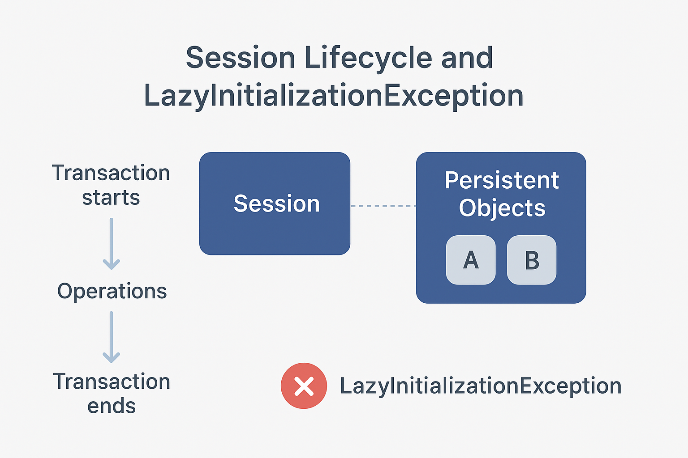

# LazyInitializationException

```info
Author      Ter-Petrosyan Hakob
```
---

If you work with Hibernate, you have probably seen the `LazyInitializationException` at least once. It is one of the most common errors when working with databases in Java. Fixing it seems easy, but there is a lot of bad advice online. Some suggested solutions can hide new problems that cause performance issues or wrong data in your application.

In this article, we will cover:

- When Hibernate throws a `LazyInitializationException`
- What not to do to fix it
- Safe ways to fix the exception


## When Does Hibernate Throw a LazyInitializationException?

Hibernate uses a technique called lazy loading. This means it does not load all related data immediately. It waits until you actually need it.

A `LazyInitializationException` happens when Hibernate tries to load related data (like a list of books for an author) outside an active session. This often occurs in the web layer of your application after the transaction has already finished.


<p align="center">  </p>

For example:

```java
EntityManager em = emf.createEntityManager();
em.getTransaction().begin();

TypedQuery<Writer> query = em.createQuery("SELECT w FROM Writer w", Writer.class);
List<Writer> writers = query.getResultList();

em.getTransaction().commit();
em.close();

for (Writer w : writers) {
    List<Article> articles = w.getArticles();
    System.out.println("Trying to count articles...");
    articles.size(); // This will throw LazyInitializationException
}
```

Here, `Writer` has a lazy-loaded association with `Article`. After we close the session, Hibernate cannot fetch the articles, so it throws an exception.

## What NOT to Do to Fix LazyInitializationException

1. Don’t Use `FetchType.EAGER` Everywhere <br>
    Some developers suggest changing the lazy association to `EAGER`. This tells Hibernate to always load the related data immediately. It seems to solve the problem, but:
    - It can slow down your app because Hibernate fetches data you may not need.
    - It may trigger the `n+1` select problem, which happens when Hibernate runs one query for the main entity and then one query for each related entity.

    **Better:** Keep FetchType.LAZY and fetch associations only when needed.

2. Avoid Open Session in View<br>
    The `Open Session in View` pattern keeps the session open until the web layer renders data. This allows lazy loading in the view. Sounds good? Not really:
    - Each query in the view creates a new database transaction, adding unnecessary load.
    - It can cause inconsistent results, because the service layer may have already committed a transaction with different data.<br>
    In Spring Boot, Open Session in View is enabled by default. You can disable it:
    ```        
    spring.jpa.open-in-view=false
    ```        

3. Don’t Enable `hibernate.enable_lazy_load_no_trans`<br>
    Setting `hibernate.enable_lazy_load_no_trans=true` might seem like a quick fix. It allows Hibernate to open a temporary session automatically. But it:
    - Uses more database connections
    - Increases transaction load
    - Can make your application slower under heavy use


## How to Fix LazyInitializationException

The safest way is to fetch all needed associations before closing the session. There are several approaches:

### LEFT JOIN FETCH

You can tell Hibernate to fetch related data with your main query using `LEFT JOIN FETCH`.

Example:

```java
EntityManager em = emf.createEntityManager();
em.getTransaction().begin();

TypedQuery<Writer> query = em.createQuery("SELECT w FROM Writer w LEFT JOIN FETCH w.articles", Writer.class);
List<Writer> writers = query.getResultList();

em.getTransaction().commit();
em.close();

for (Writer w : writers) {
    System.out.println(w.getName() + " wrote articles: " +
        w.getArticles().stream()
         .map(a -> a.getTitle())
         .collect(Collectors.joining(", "))
    );
}
```

Here, `LEFT JOIN FETCH` ensures Hibernate loads articles together with writers in one query, avoiding `LazyInitializationException`.

### Using @NamedEntityGraph

A `NamedEntityGraph` lets you define which associations Hibernate should fetch independently of the query. This can be reused across different queries.

Example:

```java
@NamedEntityGraph(
    name = "graph.writerArticles",
    attributeNodes = @NamedAttributeNode("articles")
)
@Entity
public class Writer { ... }
```

Then, use it in a query:

```java
EntityGraph<?> graph = em.createEntityGraph("graph.writerArticles");
TypedQuery<Writer> query = em.createQuery("SELECT w FROM Writer w", Writer.class)
                             .setHint("javax.persistence.fetchgraph", graph);
List<Writer> writers = query.getResultList();
```

Hibernate fetches the articles just like with `LEFT JOIN FETCH`.

### Using the EntityGraph API

You can also define an `EntityGraph` dynamically in Java without annotations. This is useful when you want to decide which associations to fetch at runtime.

```java
EntityGraph<Writer> graph = em.createEntityGraph(Writer.class);
graph.addAttributeNodes("articles");

TypedQuery<Writer> query = em.createQuery("SELECT w FROM Writer w", Writer.class)
                             .setHint("javax.persistence.fetchgraph", graph);
List<Writer> writers = query.getResultList();
```

The query generated is almost identical to `LEFT JOIN FETCH` or `@NamedEntityGraph`.


### Using @EntityGraph in Spring Boot

If you are using Spring Boot with Spring Data JPA, you don’t always need to manually create an EntityGraph with EntityManager. Spring Data JPA supports @EntityGraph annotations on repository methods, which makes fetching lazy associations much easier.

```java
public interface WriterRepository extends JpaRepository<Writer, Long> {

    @EntityGraph(attributePaths = {"articles"})
    @Query("SELECT w FROM Writer w")
    List<Writer> findAllWithArticles();
}
```

- `@EntityGraph(attributePaths = {"articles"})` tells Spring Data JPA to fetch the articles list together with each Writer.
- This avoids `LazyInitializationException`, because the articles association is loaded while the session is still active.
- It’s a clean and safe way to initialize associations without manually using `EntityManager` and `setHint()`.

Usage in a service layer:

```java
@Autowired
private WriterRepository writerRepository;

public void printWriters() {
    List<Writer> writers = writerRepository.findAllWithArticles();
    writers.forEach(w -> {
        System.out.println(w.getName() + " wrote: " +
            w.getArticles().stream()
             .map(Article::getTitle)
             .collect(Collectors.joining(", "))
        );
    });
}
```

Use `@EntityGraph` for read-only queries or whenever you know which associations should always be fetched. 
For dynamic cases, you can still use `EntityManager + setHint()`.

###  Using DTO Projections

DTOs (Data Transfer Objects) are better for read-only operations. You can select only the fields you need, which improves performance.

Example:

```java
TypedQuery<WriterDto> query = em.createQuery(
    "SELECT new com.example.WriterDto(w.name, a.title) FROM Writer w JOIN w.articles a", WriterDto.class);
List<WriterDto> results = query.getResultList();

for (WriterDto dto : results) {
    System.out.println(dto.getName() + " wrote " + dto.getArticleTitle());
}
```


Hibernate only fetches the columns you need, which is faster and avoids lazy-loading problems.

## Conclusion

LazyInitializationException is very common in Hibernate, but most quick fixes are harmful. To solve it safely:

1. Fetch associations in the service layer using `LEFT JOIN FETCH` or an `EntityGraph`.
2. Use DTO projections for read-only queries.

Both approaches ensure that all data is loaded while the session is active, keeping your application fast, reliable, and consistent.

---

- [Home](./../../README.md)
- [Hibernate Tutorials](./../tutorials.md)
- [Map and Collection of Basic Types](./6_Map_and_Collection_of_Basic_Types.md)

