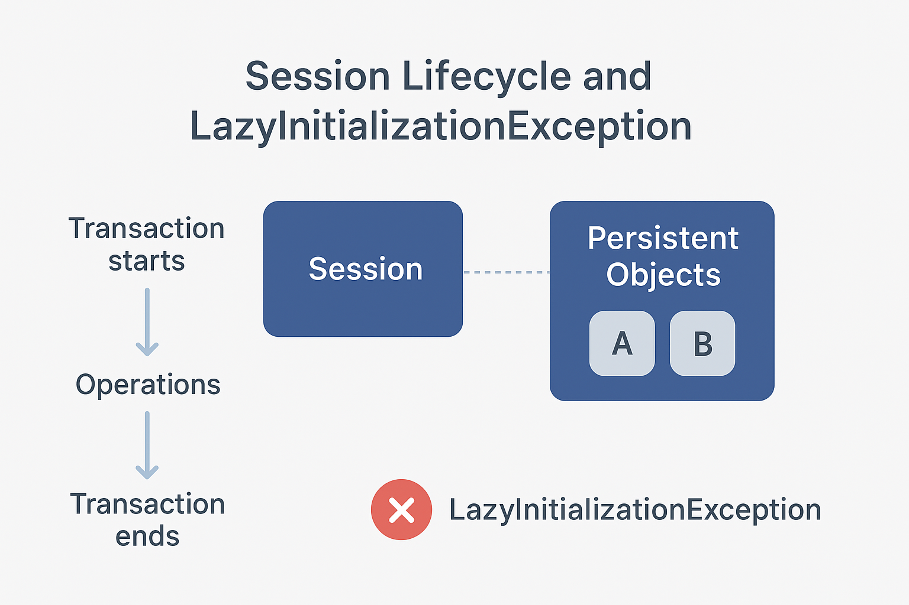

# LazyInitializationException

```info
Author      Ter-Petrosyan Hakob
```
---

If you work with Hibernate, you have probably seen the `LazyInitializationException` at least once. It is one of the most common errors when working with databases in Java. Fixing it seems easy, but there is a lot of bad advice online. Some suggested solutions can hide new problems that cause performance issues or wrong data in your application.

In this article, we will cover:

- When Hibernate throws a `LazyInitializationException`
- What not to do to fix it
- Safe ways to fix the exception


## When Does Hibernate Throw a LazyInitializationException?

Hibernate uses a technique called lazy loading. This means it does not load all related data immediately. It waits until you actually need it.

A `LazyInitializationException` happens when Hibernate tries to load related data (like a list of books for an author) outside an active session. This often occurs in the web layer of your application after the transaction has already finished.


<p align="center">  </p>

For example:

```java
EntityManager em = emf.createEntityManager();
em.getTransaction().begin();

TypedQuery<Writer> query = em.createQuery("SELECT w FROM Writer w", Writer.class);
List<Writer> writers = query.getResultList();

em.getTransaction().commit();
em.close();

for (Writer w : writers) {
    List<Article> articles = w.getArticles();
    System.out.println("Trying to count articles...");
    articles.size(); // This will throw LazyInitializationException
}
```

Here, `Writer` has a lazy-loaded association with `Article`. After we close the session, Hibernate cannot fetch the articles, so it throws an exception.

## What NOT to Do to Fix LazyInitializationException

1. Don’t Use `FetchType.EAGER` Everywhere <br>
    Some developers suggest changing the lazy association to `EAGER`. This tells Hibernate to always load the related data immediately. It seems to solve the problem, but:
    - It can slow down your app because Hibernate fetches data you may not need.
    - It may trigger the `n+1` select problem, which happens when Hibernate runs one query for the main entity and then one query for each related entity.

    **Better:** Keep FetchType.LAZY and fetch associations only when needed.

<br>

2. Avoid Open Session in View<br>
    The `Open Session in View` pattern keeps the session open until the web layer renders data. This allows lazy loading in the view. Sounds good? Not really:
    - Each query in the view creates a new database transaction, adding unnecessary load.
    - It can cause inconsistent results, because the service layer may have already committed a transaction with different data.
    In Spring Boot, Open Session in View is enabled by default. You can disable it:
    ```        
    spring.jpa.open-in-view=false
    ```        

<br>

3. Don’t Enable `hibernate.enable_lazy_load_no_trans`<br>
    Setting `hibernate.enable_lazy_load_no_trans=true` might seem like a quick fix. It allows Hibernate to open a temporary session automatically. But it:
    - Uses more database connections
    - Increases transaction load
    - Can make your application slower under heavy use

---

- [Home](./../../README.md)
- [Hibernate Tutorials](./../tutorials.md)
- [Map and Collection of Basic Types](./6_Map_and_Collection_of_Basic_Types.md)

