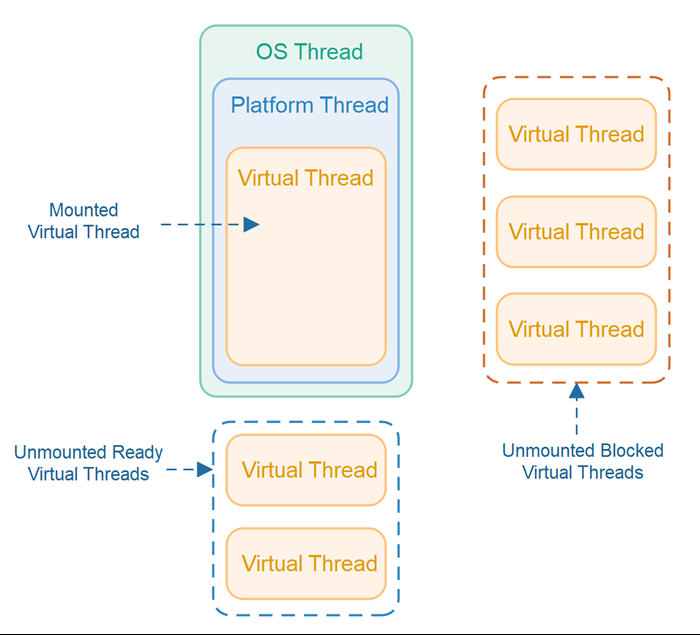

# Virtual Threads

```
Author: Ter-Petrosyan Hakob
```

---

Java’s virtual threads (from `Project Loom`) are a game-changer for high-concurrency applications. 
They let us create millions of threads without blowing up memory or overwhelming the OS. 
In this post, we’ll explore how virtual threads work under the hood in simple terms, 
and how they differ from traditional platform threads (the normal Java threads backed by OS threads). 
We’ll look at how the JVM schedules virtual threads, what mounting and unmounting mean, how stack memory is handled, 
what continuations are, how virtual threads behave during blocking calls and synchronized blocks, and some limitations 
(like pinning) and best practices to get the most out of this new feature.

## What Are Virtual Threads (vs Platform Threads)?

**Platform threads** (the regular threads we’ve always used in Java) are essentially a one-to-one wrapper 
around an OS thread. Each platform thread is managed by the operating system, has a relatively large fixed stack 
(often around 1MB by default), and context-switching between them is handled by the OS. Because they’re heavy, 
creating thousands of platform threads can exhaust system resources.

**Virtual threads** introduced as a preview in JDK 19 and finalized in JDK 21, are 
lightweight threads managed by the JVM rather than the OS. A virtual thread is not tied one-to-one to a native thread. 
Instead, many virtual threads can share a few OS threads under the hood. Key differences between virtual and platform threads include:

- **Mapping:** A platform thread is a 1:1 mapping to an OS thread. A virtual thread is scheduled onto an 
    OS thread only when it’s doing work. Think of virtual threads as tasks that run on a pool of OS threads (often called carrier threads).
- **Memory footprint:** Platform threads carry a large memory stack (megabytes) allocated from the OS. Virtual threads start with a small stack 
    (just a few hundred bytes) and their stack frames are stored on the Java heap. This makes virtual threads cheaper in terms of memory.
- **Scalability:** Because of their low cost, you can create hundreds of thousands or even millions of virtual threads in an application 
    without running out of memory. They are designed to enable a thread-per-task programming style for high-throughput servers, 
    where each concurrent task (like a user request) gets its own thread.
- **Scheduling:** Platform threads are scheduled preemptively by the OS kernel (the OS decides when to context-switch between threads). 
    Virtual threads, on the other hand, are scheduled by the JVM at runtime and use a form of cooperative scheduling – 
    they run until they reach a point where they voluntarily yield (usually by blocking or waiting). We’ll explain this more shortly.    
- **CPU utilization:** Virtual threads don’t magically give you more CPU than you have cores. If you run CPU-intensive work on many virtual threads, 
    it behaves similar to many platform threads – the OS will time-slice across the available carrier threads. The big win is with I/O or other blocking operations, where virtual threads that are waiting don’t consume any OS thread or CPU time.    

In short, a virtual thread is a lightweight, managed thread that the JVM can park and resume efficiently. 
This lets us write code in the simple thread-per-request style and still handle huge concurrency.

## How the JVM Schedules Virtual Threads

Scheduling virtual threads is the job of the JVM (Java Virtual Machine) rather than the OS. 
The JVM uses a scheduler (executor) internally to manage virtual threads. By default, it uses a fork-join pool (similar to the common pool) 
as a carrier thread pool. Carrier threads are the actual OS threads that carry out the work of virtual threads. By default, the number of carrier threads is equal to the number of CPU cores on your machine (this can be tuned via the JVM property `-Djdk.virtualThreadScheduler.parallelism`).

Here’s how scheduling works step by step:

- When you start a new virtual thread, the JVM picks an available carrier thread (an OS thread) from its pool and 
    mounts the virtual thread on it. Mounting means the virtual thread’s execution begins on that carrier. 
    The OS thread now runs the virtual thread’s code.

- The virtual thread runs on the carrier until it can’t make progress, usually when it hits a blocking operation 
    (like waiting for I/O, sleeping, parking, etc.). Virtual threads use cooperative scheduling: they continue to run and are not preempted by the JVM unless they hit a blocking call or explicitly yield. There is no time-slicing of virtual threads as with OS threads – a carrier thread will not switch between different virtual threads in the middle of a compute task just to balance CPU time. As long as a virtual thread is actively running Java code (not blocking), it stays mounted on the carrier thread.

- If the virtual thread performs a blocking operation (for example, calls `Thread.sleep()` or does a blocking I/O read), the JVM suspends that virtual thread and unmounts it from the carrier. At this point, the carrier OS thread is free to run another virtual thread. The suspended virtual thread is parked, waiting for its blocking operation to complete (or for a wake-up signal).

- The JVM scheduler then picks another virtual thread that is ready to run (if any) and mounts it on the freed carrier thread. 
In essence, the JVM is multiplexing many virtual threads onto a fixed small pool of carrier (OS) threads, keeping those carriers busy with work only when there is work to do.

<p align="center">
    
</p>

Virtual threads (orange) are executed on platform threads (blue), which run on OS threads (green). A virtual thread currently running is “mounted” to a platform thread (solid boxes). Virtual threads that are ready but not yet running remain unmounted and waiting (blue dashed box: “Unmounted Ready” threads). Virtual threads that are blocked (e.g. waiting on I/O) are unmounted and parked (orange dashed box: “Unmounted Blocked” threads). The JVM’s scheduler keeps carrier threads busy by mounting different virtual threads when others are blocked.


Because of this scheduling model, blocking a virtual thread doesn’t block a carrier OS thread in many cases. 
The OS thread simply moves on to run other virtual threads. This is how we can have thousands of concurrent tasks without tying up thousands of OS threads.


### Cooperative vs Preemptive Scheduling 

It’s important to realize that the JVM scheduling is cooperative. A virtual thread will run uninterrupted on a carrier 
until it voluntarily yields (for example, by hitting a blocking call). The JVM won’t preempt (stop) a running virtual 
thread just to schedule another one, except at these safepoints. This means if you have a long CPU-bound calculation in 
a single virtual thread, it will not automatically switch out to let others run on that same carrier thread. 

If you have as many carrier threads as CPU cores, CPU-bound tasks on different carriers can run in parallel, but if you artificially limit the carrier thread pool (e.g. to 1 thread) and run a never-blocking loop on one virtual thread, it could starve others from running on that single carrier. In practice, the default carrier pool is sized to CPUs, so compute-bound tasks will use all cores, similar to platform threads. But virtual threads truly shine for I/O-bound and high-concurrency workloads where threads spend a lot of time waiting.

**Example:** 

Suppose you have a server with 4 CPU cores and thus ~4 carrier threads by default. 
If you create 1000 virtual threads that each handle a network request, the JVM will schedule at most 4 of them to run 
at once (one per carrier). Whenever any of those threads hits an I/O wait (e.g., waiting for a database response), 
that thread is unmounted and another pending virtual thread is mounted on that carrier thread. In this way, the carriers are always kept busy doing real work, and none are stuck waiting on I/O. The result is high throughput with a small number of actual OS threads. The JVM’s goal is to keep the carrier threads busy but not blocked.


---

## 📌 Explore More

- 🏠 [Home](./../../README.md)
- ☕ [Java Tutorials](./../tutorials.md)

---