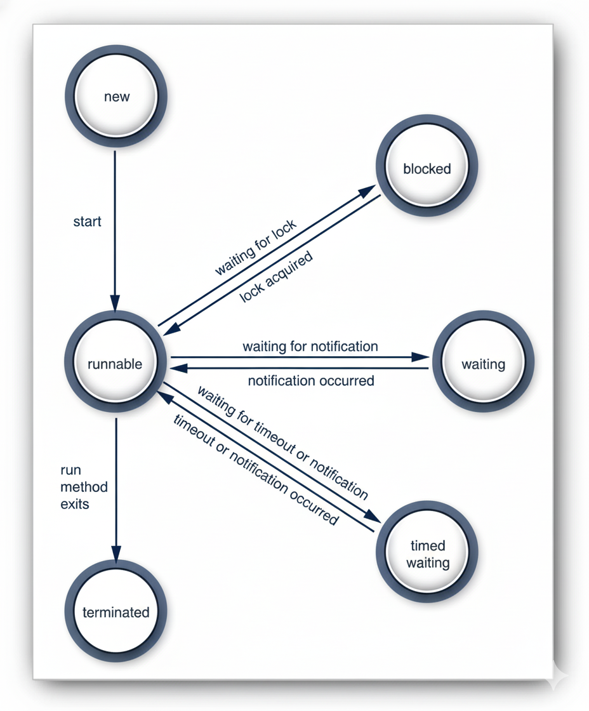

# Thread States

```
Author: Ter-Petrosyan Hakob
```

---

In Java, a thread can be in six different states at any moment:

- New
- Runnable
- Blocked
- Waiting
- Timed Waiting
- Terminated

Each state shows what a thread is doing or waiting for. You can check a thread’s current state using the `getState()` method.

When you create a thread using the `new` keyword, for example:

```java
Thread myThread = new Thread(() -> System.out.println("Hello!"));
```

the thread does not start immediately. It is in the `New` state. This means it exists in memory, but the program has not yet started running any code inside it.

Think of it like planning a new trip: you have packed your bag and booked tickets, but you haven’t left your house yet. Before a thread can run, the system must perform some preparation work, such as allocating memory and setting up internal structures.

```java
Thread backgroundTask = new Thread(() -> System.out.println("Processing data..."));
System.out.println(backgroundTask.getState()); // Output: NEW
```

At this point, the thread is created but not started, so its state is `NEW`. To start it, you would call:

```java
backgroundTask.start();
```

## Runnable Threads

After you call the `start()` method on a thread, it enters the `Runnable` state.

Being in the `Runnable` state does not mean the thread is running immediately. Instead, it means the thread is ready to run, and it is waiting for the `CPU` (processor) to give it time. Java does not treat "running" as a separate state—when a thread is actively running, it is still considered `Runnable`.

Think of it like waiting in line for a ride at an amusement park. You are ready and standing in line, but you can only ride when it’s your turn.


### How Threads Share CPU Time

A running thread does not keep running forever. Threads take turns, allowing other threads to run. The way threads are scheduled depends 
on the operating system and the type of thread.

Starting from Java 21, there are two types of threads:
- **Platform Threads** – These are managed directly by the operating system. Each processor can run one platform thread at a time. 
    On machines with multiple processors, several threads can run in parallel. If there are more threads than processors, some 
    threads wait their turn. Platform threads use preemptive scheduling, which means each thread is given a time slice. When its time is up, 
    the CPU moves to another thread. The system may also consider thread priorities when choosing which thread to run next.

- **Virtual Threads** – These are lightweight threads managed by the Java runtime, running on top of platform threads. Virtual threads use 
    cooperative scheduling. This means a virtual thread runs until it either asks to pause using `yield()` or cannot continue because it is 
    blocked (for example, waiting for input).

```java
class MyTask extends Thread {
    public void run() {
        for (int i = 1; i <= 3; i++) {
            System.out.println(getName() + " is running: " + i);
            Thread.yield(); // Suggests to the scheduler to let another thread run
        }
    }
}

public class RunnableExample {
    public static void main(String[] args) {
        Thread t1 = new MyTask();
        Thread t2 = new MyTask();

        t1.start();
        t2.start();
    }
}
```

In this example:

- Both threads are `Runnable` after `start()` is called.
- The `yield()` method hints to the system that the thread is willing to pause, giving the other thread a chance to run.
- The actual order of execution depends on the scheduler and thread priorities.

---

- `java.lang.Thread` 
    - `static void yield()` 
        - The method hints to the thread scheduler that the current thread is willing to pause and let other threads run.
        - The scheduler may or may not act on this hint—it is not guaranteed.

Think of it like saying, “I’m ready to wait; maybe someone else can go first,” but the system might ignore you.

- **Purpose:** `yield()` can help balance CPU use between threads, especially if one thread tends to dominate the processor.
- **Limitations:** It does not always work as expected, so you need profiling and testing to see its real effect.
- **Typical use cases:**
    - Debugging race conditions.
    - Testing multithreaded code.
    - Implementing advanced thread tools (like classes in `java.util.concurrent.locks`).
- **Note:** Most applications do not need to call `yield()`. It is mostly for special cases or experimental purposes.

## Blocked and Waiting

When a thread is blocked or waiting, it becomes inactive for a short time. It doesn’t run any 
code and uses very few resources. The thread scheduler decides when to make it active again. 
The exact process depends on why the thread became inactive.

- When a thread tries to get an intrinsic object lock (not a Lock from the `java.util.concurrent library`) that 
    another thread is already holding, it becomes blocked. The thread becomes unblocked when the other threads release the lock, 
    and the thread scheduler lets this thread take it.
- When the thread waits for another thread to notify the scheduler of a condition, it enters the waiting state. 
    This happens by calling the `Object.wait` or `Thread.join` methods, or by waiting for a `Lock` or `Condition` in the `java.util.concurrent` library.    
- Several methods have a timeout parameter. Calling them causes the thread to enter the timed waiting state. This state persists 
    either until the timeout expires or the appropriate notification has been received. Methods with timeout include `Thread.sleep` 
    and the timed versions of `Object.wait`, `Thread.join`, `Lock.tryLock`, and `Condition.await`.

In practice, the difference between the blocked and waiting states is not usually significant. We will often say that a thread is blocked when it is in the blocked, waiting, or timed waiting state. When a thread is blocked or waiting (or, of course, when it terminates), another thread will be scheduled to run.

When a thread is reactivated (for example, because its timeout has expired or it has succeeded in acquiring a lock), it becomes runnable and is eligible for being scheduled.

<p align="center">
    
</p>

## Terminated Threads

A thread stops running (is terminated) for two reasons:

1. It finishes normally when the `run` method ends.
2. It stops suddenly when an uncaught exception ends the run method.

- **java.lang.Thread**
    - `void join()` Waits for the specified thread to terminate. If the thread has already finished, it returns immediately.
    - `void join(long millis)` Waits at most the specified number of milliseconds for the thread to terminate.
    - `void join(long millis, int nanos)` Waits at most the specified number of milliseconds plus nanoseconds for the thread to terminate.
    - `void join(Duration duration)` Waits up to the specified duration for the thread to terminate. Returns true if the thread terminated during that time, otherwise false. (Added in Java 19)
    - `Thread.State getState()` Returns the current state of the thread: `NEW`, `RUNNABLE`, `BLOCKED`, `WAITING`, `TIMED_WAITING`, or `TERMINATED`.
    - `void stop()`  Deprecated for removal and, as of Java 21, throw an `UnsupportedOperationException` if called.
    - `void suspend()` Deprecated for removal and, as of Java 21, throw an `UnsupportedOperationException` if called.
    - `void resume()`  Deprecated for removal and, as of Java 21, throw an `UnsupportedOperationException` if called.
   
---

- [Home](./../../README.md)
- [Java Tutorials](./../tutorials.md)
- [Thread](./1_Thread.md)
- [Virtual Thread Part 1](./3_Virtual_Thread_Part1.md)