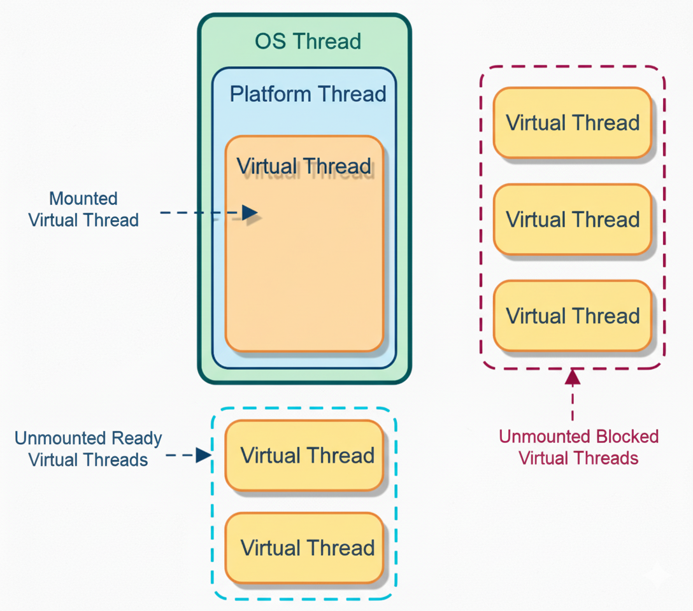

# Virtual Thread Part 2

```
Author: Ter-Petrosyan Hakob
```

---

Java’s virtual threads (from `Project Loom`) are a game-changer for high-concurrency applications. 
They let us create millions of threads without blowing up memory or overwhelming the OS. 
In this post, we’ll explore how virtual threads work under the hood in simple terms, 
and how they differ from traditional platform threads (the normal Java threads backed by OS threads). 
We’ll look at how the JVM schedules virtual threads, what mounting and unmounting mean, how stack memory is handled, 
what continuations are, how virtual threads behave during blocking calls and synchronized blocks, and some limitations 
(like pinning) and best practices to get the most out of this new feature.

## What Are Virtual Threads (vs Platform Threads)?

**Platform threads** (the regular threads we’ve always used in Java) are essentially a one-to-one wrapper 
around an OS thread. Each platform thread is managed by the operating system, has a relatively large fixed stack 
(often around 1MB by default), and context-switching between them is handled by the OS. Because they’re heavy, 
creating thousands of platform threads can exhaust system resources.

**Virtual threads** introduced as a preview in JDK 19 and finalized in JDK 21, are 
lightweight threads managed by the JVM rather than the OS. A virtual thread is not tied one-to-one to a native thread. 
Instead, many virtual threads can share a few OS threads under the hood. Key differences between virtual and platform threads include:

- **Mapping:** A platform thread is a 1:1 mapping to an OS thread. A virtual thread is scheduled onto an 
    OS thread only when it’s doing work. Think of virtual threads as tasks that run on a pool of OS threads (often called carrier threads).
- **Memory footprint:** Platform threads carry a large memory stack (megabytes) allocated from the OS. Virtual threads start with a small stack 
    (just a few hundred bytes) and their stack frames are stored on the Java heap. This makes virtual threads cheaper in terms of memory.
- **Scalability:** Because of their low cost, you can create hundreds of thousands or even millions of virtual threads in an application 
    without running out of memory. They are designed to enable a thread-per-task programming style for high-throughput servers, 
    where each concurrent task (like a user request) gets its own thread.
- **Scheduling:** Platform threads are scheduled preemptively by the OS kernel (the OS decides when to context-switch between threads). 
    Virtual threads, on the other hand, are scheduled by the JVM at runtime and use a form of cooperative scheduling – 
    they run until they reach a point where they voluntarily yield (usually by blocking or waiting). We’ll explain this more shortly.    
- **CPU utilization:** Virtual threads don’t magically give you more CPU than you have cores. If you run CPU-intensive work on many virtual threads, 
    it behaves similar to many platform threads – the OS will time-slice across the available carrier threads. The big win is with I/O or other blocking operations, where virtual threads that are waiting don’t consume any OS thread or CPU time.    

In short, a virtual thread is a lightweight, managed thread that the JVM can park and resume efficiently. 
This lets us write code in the simple thread-per-request style and still handle huge concurrency.

## How the JVM Schedules Virtual Threads

Scheduling virtual threads is the job of the JVM (Java Virtual Machine) rather than the OS. 
The JVM uses a scheduler (executor) internally to manage virtual threads. By default, it uses a fork-join pool (similar to the common pool) 
as a carrier thread pool. Carrier threads are the actual OS threads that carry out the work of virtual threads. By default, the number of carrier threads is equal to the number of CPU cores on your machine (this can be tuned via the JVM property `-Djdk.virtualThreadScheduler.parallelism`).

Here’s how scheduling works step by step:

- When you start a new virtual thread, the JVM picks an available carrier thread (an OS thread) from its pool and 
    mounts the virtual thread on it. Mounting means the virtual thread’s execution begins on that carrier. 
    The OS thread now runs the virtual thread’s code.

- The virtual thread runs on the carrier until it can’t make progress, usually when it hits a blocking operation 
    (like waiting for I/O, sleeping, parking, etc.). Virtual threads use cooperative scheduling: they continue to run and are not preempted by the JVM unless they hit a blocking call or explicitly yield. There is no time-slicing of virtual threads as with OS threads – a carrier thread will not switch between different virtual threads in the middle of a compute task just to balance CPU time. As long as a virtual thread is actively running Java code (not blocking), it stays mounted on the carrier thread.

- If the virtual thread performs a blocking operation (for example, calls `Thread.sleep()` or does a blocking I/O read), the JVM suspends that virtual thread and unmounts it from the carrier. At this point, the carrier OS thread is free to run another virtual thread. The suspended virtual thread is parked, waiting for its blocking operation to complete (or for a wake-up signal).

- The JVM scheduler then picks another virtual thread that is ready to run (if any) and mounts it on the freed carrier thread. 
In essence, the JVM is multiplexing many virtual threads onto a fixed small pool of carrier (OS) threads, keeping those carriers busy with work only when there is work to do.

<p align="center">
    
</p>

Virtual threads (orange) are executed on platform threads (blue), which run on OS threads (green). 
A virtual thread currently running is **mounted** to a platform thread (solid boxes). Virtual threads that are ready 
but not yet running remain **unmounted** and waiting (blue dashed box: **Unmounted Ready** threads). Virtual threads that are blocked (e.g. waiting on I/O) are **unmounted** and parked (orange dashed box: **Unmounted Blocked** threads). The JVM’s scheduler keeps carrier threads busy by mounting different virtual threads when others are blocked.


Because of this scheduling model, blocking a virtual thread doesn’t block a carrier OS thread in many cases. 
The OS thread simply moves on to run other virtual threads. This is how we can have thousands of concurrent tasks without tying up thousands of OS threads.


### Cooperative vs Preemptive Scheduling 

It’s important to realize that the JVM scheduling is cooperative. A virtual thread will run uninterrupted on a carrier 
until it voluntarily yields (for example, by hitting a blocking call). The JVM won’t preempt (stop) a running virtual 
thread just to schedule another one, except at these safepoints. This means if you have a long CPU-bound calculation in 
a single virtual thread, it will not automatically switch out to let others run on that same carrier thread. 

If you have as many carrier threads as CPU cores, CPU-bound tasks on different carriers can run in parallel, but if you artificially limit the carrier thread pool (e.g. to 1 thread) and run a never-blocking loop on one virtual thread, it could starve others from running on that single carrier. In practice, the default carrier pool is sized to CPUs, so compute-bound tasks will use all cores, similar to platform threads. But virtual threads truly shine for I/O-bound and high-concurrency workloads where threads spend a lot of time waiting.

> **Example:** 
>
> Suppose you have a server with 4 CPU cores and thus ~4 carrier threads by default. 
> If you create 1000 virtual threads that each handle a network request, the JVM will schedule at most 4 of them to run 
> at once (one per carrier). Whenever any of those threads hits an I/O wait (e.g., waiting for a database response), 
> that thread is unmounted and another pending virtual thread is mounted on that carrier thread. In this way, the carriers 
> are always kept busy doing real work, and none are stuck waiting on I/O. The result is high throughput with a small 
> number of actual OS threads. The JVM’s goal is to keep the carrier threads busy but not blocked.

## Mounting and Unmounting: Running vs. Waiting in a Virtual Thread

We’ve already used the terms mounted and unmounted, which are central to how virtual threads work. Let’s define them clearly:

- **Mounted:** A virtual thread is mounted when it’s actively running on a carrier (platform) thread. 
    While mounted, the virtual thread is consuming an OS thread (carrier) and executing instructions.
- **Unmounted:** A virtual thread is unmounted when it’s not currently running on any carrier. This happens when the 
    thread is parked waiting for something (I/O, sleep, lock, etc.), or if it hasn’t been started yet, or if it yielded. An unmounted thread’s state (its call stack, registers, etc.) is saved so it can be resumed later. While unmounted, it occupies minimal resources (just some heap memory to hold its stack) and no OS thread.    

A virtual thread will frequently mount and unmount during its lifecycle. It mounts to run, 
then unmounts when it waits, then mounts again (possibly on a different carrier thread) to continue running when it’s ready. 
This is how a single virtual thread can “jump” between different underlying OS threads over time. 
It’s very different from a platform thread, which stays on the same OS thread for its entire life. 

For example, consider this simple code using a virtual thread:

```java
Thread vt = Thread.ofVirtual().unstarted(() -> {
    System.out.println("Before sleep: " + Thread.currentThread());
    try {
        Thread.sleep(20);    // simulate blocking
    } catch (InterruptedException e) {
        e.printStackTrace();
    }
    System.out.println("After sleep: " + Thread.currentThread());
});
vt.start();
vt.join();
```

When you run this, the output might be something like:

```
Before sleep: VirtualThread[#21]/runnable@ForkJoinPool-1-worker-1
After sleep:  VirtualThread[#21]/runnable@ForkJoinPool-1-worker-7
```

Notice that the same **VirtualThread[#21]** was running on one carrier thread (`ForkJoinPool-1-worker-1`) 
before the sleep, but after waking up, it resumed on a different carrier thread (`ForkJoinPool-1-worker-7`) 
! This demonstrates mounting and unmounting in action. The virtual thread was mounted on the first worker, then during `Thread.sleep()` it got unmounted (freeing `ForkJoinPool-1-worker-1` to do something else), and later the scheduler remounted it on `ForkJoinPool-1-worker-7` to print the second line. From the virtual thread’s perspective, it just went to sleep and woke up – it doesn’t “know” it switched carriers.

**How does the JVM park and unpark threads so smoothly?** This is where the magic of continuations comes in, which we’ll cover soon. Essentially, when a virtual thread blocks, the JVM captures its current state (the call stack, program counter, etc.) into a continuation object and then frees the carrier thread. When it’s time to resume, the saved state is used to continue where it left off.

Mounting and unmounting happen very fast, much faster than an OS context switch. There is no heavy kernel context switch when a virtual thread unmounts – it’s more like saving and restoring a function call stack. This is why millions of virtual threads can be scheduled efficiently by the JVM.

## Stack Memory Management: Virtual Threads vs Platform Threads

One of the reasons virtual threads are lightweight is how they handle stack memory. 
Every thread in Java has its own call stack where local variables and method calls live. With platform threads, 
this stack is a chunk of memory allocated by the OS (native memory). By default it can be quite large (on the order of 1MB, though it may not all be committed at once). If you try to create 100,000 platform threads, you’d need up to 100k × 1MB = ~100 GB of memory just for stacks, which is obviously impractical. Virtual threads use a different strategy:

- **Small initial stack:** A virtual thread starts with a very small stack (on the order of a few hundred bytes). 
    It doesn’t allocate a huge contiguous region of memory up front.
- **Stacks on the heap:** As the virtual thread calls methods and the call stack grows, the JVM allocates stack frames on the Java heap (managed by the garbage collector) rather than a fixed OS-memory buffer. The frames are allocated as needed and can be garbage-collected when the thread is suspended or completed. This means the memory footprint of each virtual thread is very low when it’s not doing much, and it can grow dynamically if needed.    
- **Stack slicing (continuations):** When a virtual thread is unmounted (suspended), its stack frames may be copied out to heap storage (if not already there) and the carrier thread’s stack is freed. Later, when resumed, those frames are used to reconstruct the call stack. Essentially, a virtual thread’s call stack lives as an object (or series of objects) on the heap that can be saved or restored at will. This is fundamentally enabled by the continuation mechanism in the JVM.


Because of this design, virtual threads have a much smaller memory cost per thread. Instead of a big chunk of native memory per thread, we have many small stacks in the heap that expand only as needed. As one source put it, platform threads use “megabyte-scale chunks of memory” for the stack, while a virtual thread’s stack footprint “starts at just a few hundred bytes” and grows in the heap. This is why you can create millions of virtual threads – their total memory usage is manageable and mostly garbage-collectible. In effect, the cost of a thread is almost as small as the cost of a Runnable or a Task object, plus whatever actual stack depth it’s using at the moment.

## Continuations: The Secret to Pausing and Resuming

How can a thread be suspended and resumed in the middle of execution? The answer is continuations. A continuation is a low-level construct that represents a segment of code that can be paused (yielded) and resumed later, preserving its state.

In Project Loom, each virtual thread is backed by a Continuation object internally. You can think of a continuation like a bookmark in the execution of the thread. When the virtual thread needs to pause (for example, it calls a blocking I/O operation), the continuation mechanism creates a snapshot of that thread’s execution state (the call stack, instruction pointer, etc.). This is similar to how if you pause a single-player video game, the game saves all your progress and state so you can come back later exactly where you left off.

When the thread is ready to run again (say the I/O is done), the JVM uses the continuation to resume execution from where it paused. All the local variables, the point in the code, etc., are restored, and the thread continues as if nothing happened – except it might now be running on a different carrier thread.

To put it simply: A virtual thread = a scheduled continuation (task) managed by the JVM scheduler. The continuation provides the ability to suspend and resume, and the scheduler provides the where and when to run it.

These continuations are delimited, meaning the JVM controls exactly where a virtual thread is allowed to pause (typically at JVM-defined safepoints like blocking calls). The Java code in a virtual thread can’t arbitrarily pause at any CPU instruction; it pauses in well-defined places that the JVM knows about (like method calls that go into the JVM’s thread parking logic).

You normally don’t interact with Continuation objects directly when writing application code (the Continuation API is internal/preview for now), but it’s useful to know they exist. They’re the “magic” that makes virtual thread suspension possible. One author described a continuation as “sequential code that may suspend or yield execution at some point by itself and can be resumed by a caller”. In our context, the “caller” is the JVM scheduler that resumes the virtual thread when it’s time.

So, when you see a virtual thread go to sleep or wait on I/O, under the hood the JVM is doing roughly: save continuation (thread state) → free carrier thread → later, restore continuation on a carrier thread → continue execution. All of this is optimized in the JVM so that it’s extremely fast – certainly much faster than the equivalent thread context-switch involving OS scheduler.

## Blocking I/O in Virtual Threads – What Really Happens?

One of the biggest benefits of virtual threads is that you can call blocking I/O operations (like reading from a socket, waiting for a file, calling a database, etc.) without worrying about blocking an OS thread. In a traditional thread-per-request model, if a thread blocked on I/O, that OS thread would sit idle, unable to do other work, until the I/O finished. With thousands of concurrent operations, that meant having thousands of OS threads, which doesn’t scale.

With virtual threads, when a thread blocks on I/O, the JVM tries to transparently turn it into a non-blocking operation and park the virtual thread. For example, when a virtual thread performs a socket read, the JDK underneath uses asynchronous I/O (if available on the platform) or a lightweight mechanism to wait for data, and it unmounts the virtual thread while waiting. The carrier thread is released to run other tasks. Once the data is ready, the virtual thread is resumed (mounted again) and continues processing the data.

From the developer’s perspective, it looks like a normal blocking call – you can use the simple synchronous I/O APIs – but it behaves like asynchronous I/O under the hood, giving you the best of both worlds (simplicity and scalability). Virtual threads are often described as allowing “structured concurrency with threads” – you write sequential code that blocks, but it scales like asynchronous code.

> **Example:** 
> 
> If you use a virtual thread per incoming HTTP request in a server, when one request handler calls 
> `database.query()` and that query is waiting on the DB, that virtual thread will unmount. The OS thread 
> running it will go pick up another request’s thread to run in the meantime. When the DB query results return, 
> the original virtual thread is woken up and continues sending the response. Meanwhile, the OS threads were never 
> idle; they were always busy handling whatever work was ready.


This is why virtual threads are especially useful for I/O-bound workloads where threads spend a lot of time waiting. You can spawn massive numbers of threads to handle many concurrent I/O operations, and the JVM will efficiently manage them so that only the active ones tie up carrier threads.

What about file I/O or other blocking calls? Most of Java’s classic I/O (especially networking) is handled in a way that 
Loom can unmount the thread. However, certain operations might not yet be Loom-optimized. For instance, blocking 
file I/O (like reading a file from disk) may not unmount the virtual thread on some platforms. If a virtual thread calls a blocking file I/O operation, the current implementation might pin the virtual thread to the carrier until the I/O is done (because the JVM can’t easily park and switch on purely kernel-level file read). The Loom team has worked to cover many common operations, but it’s good to be aware that not every blocking call is virtual-thread friendly. In practice, network I/O, sleep(), wait(), and other high-level blocking APIs are handled. 

Next, let’s discuss a tricky area: synchronized blocks and other locks, which introduce the concept of pinning.

## Pinning: Synchronized Blocks and Other Limitations

Pinning is a situation where a virtual thread cannot be unmounted from its carrier thread, effectively tying that carrier thread down. 
Pinning is not an error – the code still works correctly – but it means you lose the scalability benefits for that duration, since the 
OS thread is stuck waiting along with the virtual thread. The goal is to avoid or minimize pinning, or design around it.

When does pinning happen? According to the JDK documentation and design of Loom, there are two main cases where a 
virtual thread gets pinned to its carrier and won’t unmount on block:

<ol>
  <li>
  <b>While executing inside a synchronized block or method.</b> If a virtual thread holds a monitor lock 
(entered a synchronized section) and then it hits a blocking operation, the JVM will not unmount it. 
It stays pinned to the carrier until the synchronized block is exited. This is because allowing it 
to unmount could lead to thread-safety issues; the lock is tied to the thread holding it, and if that 
thread “disappeared” off the carrier, the JVM would have to prevent any other thread from entering that 
monitor. It’s simpler and safer to just keep it pinned. 

Additionally, if a virtual thread is trying to enter a synchronized block (waiting for a lock) and gets blocked because another thread holds the lock, it is effectively pinned waiting for that monitor. Several virtual threads contending on a synchronized lock can each pin a carrier thread while they wait. This was observed in real cases: e.g., if 4 virtual threads are all waiting on the same lock, and you only have 4 carrier threads, those 4 carriers can all become stuck (pinned) waiting – meaning no other work can proceed until one gets the lock and releases the others.
  
  </li>
  <li>
  <b>When calling a native method or foreign function.</b> If your virtual thread calls into native code (via JNI or 
  a foreign function interface) that blocks in the native layer, the JVM cannot suspend and resume that at the Java 
  level. The thread will remain pinned to the OS thread until the native call returns. Essentially, the JVM only controls Java code; once you’re in native code, Loom’s tricks can’t be applied.

  </li>
</ol> 

There may be other niche situations as Loom evolves (for example, the early Loom versions pinned for some file I/O as mentioned, or certain JDK synchronization constructs), but `synchronized` and native calls are the primary culprits.


**Why is pinning bad for scalability?** Because if a carrier thread is pinned, it cannot be used to run any 
other virtual thread until the pinning is over. If enough carrier threads become pinned, new virtual threads will be 
stuck waiting for a free carrier. In the worst case, if all carriers are pinned (say, all are stuck in long sync blocks), 
your application throughput stalls – no other work can be scheduled until a carrier frees up. 
The JVM can mitigate this a bit by creating additional carrier threads if the pool is not at its max size, to avoid 
a deadlock of progress. By default the carrier pool can grow up to some limit (for example, 256 threads). But if you 
consistently pin a lot of threads, you could hit those limits or degrade performance.

**Practical example of pinning:** Imagine a web server where each request is handled by a 
virtual thread. Suppose a certain handler method has a synchronized block (maybe guarding access to a static resource) 
and inside that block it makes a blocking call (like writing to a file or waiting on a condition). If many requests hit 
this simultaneously, one gets the lock and the others block. All those blocked virtual threads are pinned on their 
carriers. If the number of contending threads equals your carrier threads, you’ve effectively made your server 
single-threaded until that lock is released – not good! Netflix engineers ran into a similar issue 
with Tomcat + virtual threads, where a lock caused multiple virtual threads to pin and exhaust the 
carrier pool, leading to stalled throughput.

## Best Practices and Things to Avoid with Virtual Threads

Virtual threads are powerful, but to use them effectively, keep these best practices and tips in mind:

- **Prefer virtual threads for I/O-bound tasks:** They excel in scenarios with lots of waiting 
(e.g. waiting for network responses, user input, database calls). You can spawn a thread per task without worry. 
For CPU-bound tasks that don’t block, virtual threads don’t give much benefit over using a thread pool – they’ll behave 
similarly to platform threads. For data-parallel CPU tasks, consider using parallel streams or structured concurrency with limited parallelism.

- **Beware of long `synchronized` blocks:** If you have locks that many threads contend for, consider redesigning 
to reduce contention or using alternative concurrency constructs. Holding a lock for a long time in a virtual thread can pin a carrier thread, hurting scalability. If you need to lock, do the minimum work inside the critical section. Avoid calling blocking I/O while holding a lock.

- **Use `ReentrantLock` or other Lock APIs if appropriate:** The JDK documentation suggests 
    using `java.util.concurrent.locks.ReentrantLock` to guard long I/O operations instead of `synchronized`. 
    This is because waiting for a `ReentrantLock` doesn’t pin the thread in the same way – a virtual thread parking to wait on a Lock’s condition can unmount (since it’s not inside a monitor). Also, with `Lock` objects you have more control (`tryLock`, `timeouts`, etc.) which can help avoid getting stuck.

- **Avoid blocking calls in foreign libraries:** If you call native libraries or methods that perform 
    blocking system calls (not aware of Loom), those will pin the virtual thread. For example, some database drivers
    or legacy APIs might do a blocking wait internally. Where possible, use Loom-integrated libraries or ones that use Java’s I/O (which is Loom-friendly). If you must use a blocking call that isn’t Loom-friendly, you might isolate it on a separate platform thread or use an async wrapper.

- **Don’t oversubscribe CPU with too many active threads:** You can create millions of virtual threads, but if they’re all runnable at once doing CPU work, you’re just context-switching with little gain. The sweet spot is using lots of threads that are mostly waiting or doing short bursts of work. If you do have many CPU-heavy tasks, limit their concurrency or let them queue up (or use a bounded carrier pool) to avoid thrashing. 

- **Name your virtual threads for debugging:** Virtual threads are still `java.lang.Thread` instances under the hood. 
You can give them names (e.g., `Thread.ofVirtual().name("client-handler-", id).start(runnable)`). This can be helpful when diagnosing issues with thread dumps or logs – a dump of thousands of `“VirtualThread[#.../runnable]"` with no context can be hard to decipher. Meaningful names (or using structured concurrency which names threads after tasks) can ease debugging.

**Use updated tools for thread dumps:** Traditional jstack might not list all virtual threads or their stack traces 
`by default (to avoid overwhelming output). Instead, use `jcmd Thread.dump_to_file `or JDK Mission
 Control/Flight Recorder which have added support for virtual threads. These tools can capture the state of virtual threads if needed. Be aware that an idle virtual thread might not show up with a meaningful stack (it’s parked).


- **Monitor pinning and adjust if needed:** JDK Flight Recorder has an event `jdk.VirtualThreadPinned` that is enabled by 
default (with a threshold like 20ms). This can alert you if a virtual thread stayed pinned too long. Use such tools in testing to catch problematic code. If you find threads are frequently pinned, consider increasing the carrier thread pool size (using the aforementioned system property) or, better, fix the cause (e.g., refactor that synchronized section).


- **Remember:** not a silver bullet for bad algorithms: Virtual threads simplify concurrency but won’t automatically make a single-threaded algorithm faster. They also won’t reduce memory usage if your tasks themselves hold a lot of data. Use them to write cleaner concurrent code, but still design efficient algorithms and use appropriate data structures.

## Conclusion

Java’s virtual threads allow us to write straightforward concurrent code (like spawning a thread per task) that scales to huge levels of concurrency. They work by using a small pool of OS carrier threads to run a large number of virtual threads through a clever scheduling of mounting (running) and unmounting (parking) threads as they block and resume. Under the hood, the JVM uses continuations to capture a thread’s state and manage stack frames on the heap, making suspension and resumption of threads extremely fast. Virtual threads shine for applications that are I/O-bound or have a high level of concurrency with a lot of waiting (such as servers handling many requests), enabling near-optimal hardware utilization with a simple programming model.

By understanding how the JVM handles virtual threads – especially the cooperative nature of scheduling and the concept of pinning – developers can design applications to avoid pitfalls. Keep critical sections short, avoid blocking operations under locks, and be mindful of any code that might pin or block a carrier thread. With these best practices, virtual threads can drastically simplify writing high-throughput concurrent applications in Java, giving you the performance of asynchronous code with the readability of sequential code.

## Summary: 

Virtual threads are lightweight threads managed by the JVM that allow you to create thousands or millions of concurrent tasks with minimal overhead. They are scheduled cooperatively on a small set of carrier (OS) threads, automatically pausing on blocking calls and resuming later, which frees up the OS threads to do other work. Embrace virtual threads for simpler concurrent code, but use them wisely by avoiding long blocking critical sections and understanding their scheduling model. With Project Loom’s virtual threads, you can have the simplicity of one-thread-per-task and achieve the scalability that was once only possible with complex async frameworks – truly the best of both worlds for Java developers.

---

- [Home](./../../README.md)
- [Java Tutorials](./../tutorials.md)
- [Virtual Thread Part 1](./3_Virtual_Thread_Part1.md)
- [Thread Interruption](./5_Thread_Interruption.md)