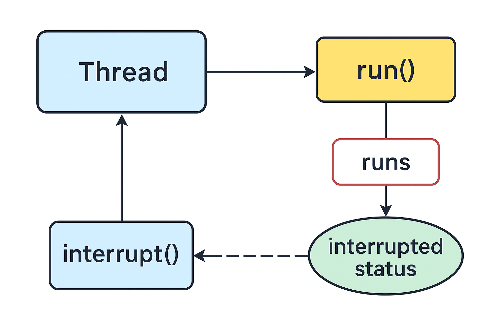

# Thread Interruption

```
Author: Ter-Petrosyan Hakob
```

---

A thread stops running when its `run` method finishes. This can happen in a few ways:

- The method executes a `return` statement.
- The method reaches its last statement.
- An exception occurs and is not handled in the method.

In early versions of Java, there was a `stop` method that could force a thread to end. But this method was unsafe and can now 
`throw` an `UnsupportedOperationException` instead of stopping the thread.

## How to Stop a Thread Safely

You cannot force a thread to stop immediately. Instead, you can request that it stops using the `interrupt` method.

When you call `interrupt` on a thread, the thread’s interrupted status is set. Think of this as a flag that says, “Someone wants me to stop.” Each thread can check this flag and decide how to respond.

To check if a thread has been interrupted, you can use:

```java
while (!Thread.currentThread().isInterrupted() && moreWorkToDo) {
    doWork();
}
```

Here, the loop continues only if the thread has not been interrupted and there is still work to do.

## What Happens If the Thread is Waiting

Sometimes a thread is blocked—for example, it is sleeping or waiting for a task. In this case, it cannot check the interrupted flag. That’s where `InterruptedException` comes in.

If you call `interrupt` on a blocked thread, the thread will `throw` an `InterruptedException` and stop waiting. For example:

```java
Runnable task = () -> {
    try {
        while (moreWorkToDo) {
            doWork();
            Thread.sleep(1000); // simulate work delay
        }
    } catch (InterruptedException e) {
        System.out.println("Thread was interrupted while sleeping.");
    } finally {
        cleanupResources();
    }
};
```

Here, if the thread is interrupted during sleep, the exception is thrown, the thread handles it, and the `finally` block ensures any cleanup happens

## Checking the Interrupted Status vs Handling InterruptedException

There are two ways to deal with interruption:

1. Check the flag using `isInterrupted()`.
2. Catch the `InterruptedException` when calling interruptible methods like `sleep`, `wait`, or `join`.

If your loop uses `sleep` after every iteration, you do not need to check `isInterrupted()` because the `sleep` method will automatically throw `InterruptedException` if the thread is interrupted.

```java
Runnable task = () -> {
    try {
        while (moreWorkToDo) {
            doWork();
            Thread.sleep(500); // pause after work
        }
    } catch (InterruptedException e) {
        System.out.println("Interrupted during sleep, stopping task.");
    } finally {
        cleanupResources();
    }
};
```

`interrupted()` **vs** `isInterrupted()`

Java has two similar methods:

- `interrupted()` – checks if the current thread is interrupted and clears the flag.
- `isInterrupted()` – checks if any thread is interrupted but does not clear the flag.

**Example:**

```java
if (Thread.currentThread().isInterrupted()) {
    System.out.println("Thread has been interrupted, but the flag is still true.");
}
```

## Do Not Ignore InterruptedException

Sometimes, developers ignore the `InterruptedException` in small tasks:

```java
void smallTask() {
    try {
        Thread.sleep(1000);
    } catch (InterruptedException e) {
        // nothing here -- BAD!
    }
}
```

This is **bad practice**. If the thread is sleeping, it cannot stop because the exception is ignored.

There are two correct ways to handle it:

1. Let the Exception Propagate
    ```java
    void smallTask() throws InterruptedException {
        Thread.sleep(1000);
    }
    ```
    The caller can catch it and handle the interruption properly.

2. Restore the Interrupted Status
    ```java
    void smallTask() {
        try {
            Thread.sleep(1000);
        } catch (InterruptedException e) {
            Thread.currentThread().interrupt(); // restore the flag
        }
    }
    ```
    This way, the caller can check if the thread was interrupted.


## New Example: Downloading Files

Imagine a thread downloading multiple files. You want it to stop if the user cancels the operation:

```java
Runnable downloadTask = () -> {
    try {
        for (int i = 0; i < files.size(); i++) {
            if (Thread.currentThread().isInterrupted()) {
                System.out.println("Download cancelled.");
                break;
            }
            downloadFile(files.get(i));
            Thread.sleep(200); // simulate network delay
        }
    } catch (InterruptedException e) {
        System.out.println("Download interrupted.");
    } finally {
        closeConnections();
    }
};
```

Here, the thread can either check the flag or rely on `InterruptedException` during sleep. This ensures safe and predictable termination.

<p align="center">
    
</p>

--- 

- `java.lang.Thread` 
    - `void interrupt()` Sends a request to stop a thread. The thread's interrupted status becomes `true`. 
        If the thread is waiting or blocked, it throws an `InterruptedException`.
    - `static boolean interrupted()` Checks if the current thread (the one running this code) has been interrupted. This is a static method. It also resets the interrupted status of the current thread to `false`.
    - `boolean isInterrupted()` Checks if a thread has been interrupted. Unlike the static `interrupted()` method, it does not change the thread's interrupted status.
    - `static Thread currentThread()` Returns the Thread object for the thread that is running now.

---

- [Home](./../../README.md)
- [Java Tutorials](./../tutorials.md)
- [Virtual Thread Part 2](./4_Virtual_Thread_Part2.md)
- [Daemon Threads and Thread Names and IDs](./6_Daemon_Threads_and_Thread_Names_and_IDs.md)