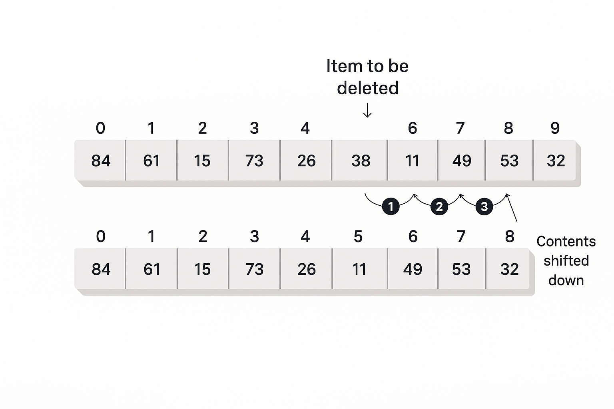

# Arrays

An array is the simplest data structure. The best way to picture it is as a row of numbered parking spaces or a set of connected mailboxes.

- Each "box" in the array can hold one piece of data.
- Each box has a number, called an `index`. In most programming languages, the `index` starts at `0`.

So, an array with `10` items has indexes from `0` to `9`. This index is the key to an array's greatest strength: speed of access. 
If you know you want the item at index `5`, you can go directly to it. It doesn't matter if the array has `10` items or `10` million; 
getting the item at index `5` takes the same, tiny amount of time.

But how do we add, find, and remove items? Let's look at the operations.

## Insertion: Adding a New Item

Let's say we have an array that can hold `50` items, but we've only added `10` so far. We use a separate counter variable to track that we have `10` items.

When we want to insert a new item (like the number **42**), we just add it to the next empty spot. In this case, that's index `10`. Then, we increase our counter to `11`.

This is super fast. It's one simple step. We call this an $$O(1)$$ operation, which is a computer science term for "constant time," or "always fast."

## Search: Finding an Item

This is where arrays are not so great.

Imagine your array is a shopping list with `50` items, and you want to find "Milk." The array isn't sorted, so "Milk" could be anywhere. You have to start at index `0` ("Bread?") and check every single item.

- **Best Case:** "Milk" is at index `0`. You find it in `1` step.
- **Worst Case:** "Milk" is at index `49` (the last spot). You have to check all `50` items.
- **Average Case:** You'll have to check about half the items (`25` steps).

This is called a linear search. The time it takes to find something grows in a line with the number of items. 
If you have $N$ items, it takes an average of $N/2$ steps.

## Deletion: Removing an Item

Deletion is the most work. It's a two-part process:

1. **Find the Item:** First, you have to search for the item you want to delete (like "Milk"). As we just saw, this is slow (average $N/2$ steps).
2. **Delete and Shift:** Let's say you find "Milk" at index `4`. You can't just leave an empty "hole" in the array. If you did, it would break your 
    simple insert method and confuse other parts of your code. We need to keep all our items together.

To fill the hole at index `4`, you must copy the item from index `5` and move it into index `4`. Then you copy the item from index `6` into index `5`, 
and so on. You must shift every item that came after the deleted item one spot to the left.    

<p align="center">
    
</p>

This shifting process is also very slow. If you delete the very first item (index `0`), you have to move every other item in the array. 
This takes an average of $N/2$ moves.

So, the total time for a deletion is the slow search (average $N/2$ steps) plus the slow shift (average $N/2$ moves). In total, it's about $N$ steps.

## What About Duplicate Items?

When you build a data structure, you must decide: Are duplicates allowed?

- **No Duplicates:** Think of a list of Student ID numbers. Each student must have a unique ID. If you try to add an ID that's already on the list, the program should stop you.
- **Duplicates Allowed:** Now, think of a list of quiz scores for that class. It's very likely that many students will get the same score (like 85%). Here, duplicates are fine.

Allowing duplicates changes how our operations work.

### Searching with Duplicates

This depends on your question. Using our "quiz scores" example:
- "**Find someone who got 85**." This is fast. You just search until you find the first match and then stop. (Average $N/2$ steps).
- "**Find everyone who got 85**." This is slow. You must check the entire array, from the first item to the last, even after you find a match. (Always $N$ steps).

### Insertion with Duplicates

- **Duplicates Allowed (Quiz Scores):** Insertion is still fast. You just add the new score (like 85) to the end. It's one step
- **No Duplicates (Student IDs):** Insertion suddenly becomes very slow. Before you can add a new Student ID, you must 
    first search the entire array ($N$ steps) to make sure it doesn't already exist

### Deletion with Duplicates

This also gets more complicated.    
- **Delete one item:** If your rule is "delete the first student who got 85," the speed is the same as before: find ($N/2$) + shift ($N/2$).
- **Delete all items:** If your rule is "delete all students who got 85," you have to search the whole array ($N$ steps) and perform multiple, complex shifts. This is very slow.

## Summary of Array Speed (Big O Notation)

Here is a simple table. In computer science, we often don't worry about the difference between $N$ (checking all items) and $N/2$ (checking half). We just call them both O(N), which means the time grows in a line with the number of items. Adding to the end is called $O(1)$, or "constant time" (always fast).

|Operation	|No Duplicates (e.g., Student IDs)	|Duplicates OK (e.g., Quiz Scores)|
|:----------|:----------------------------------|:--------------------------------|
|Search (Find one)|Slow - $O(N)$ (avg. $N/2$)|Slow - $O(N)$ (avg. $N/2$)|
|Search (Find all)|(Not possible)|Slow - $O(N)$ (always $N$)|
|Insertion|Slow - $O(N)$ (must search first)|Slow - $O(N)$ (always $N$)|
|Deletion (Delete one)|Slow - $O(N)$ (find + shift)|Slow - $O(N)$ (find + shift)|

## Arrays in Java

In Java, arrays are objects. This has some important rules:

1. **You must use** `new`**:** You can't just use an array. You must first create it in memory with the `new` keyword.
    ```java
    int[] myScores; // This is just an empty reference (like a label)
    myScores = new int[50]; // This creates the 50 "boxes" in memory
    ```
2. **Size is Fixed:** Once you create the array, you cannot change its size. Your `myScores` array will always have `50` spaces. 
    If you need `51`, you must create a brand new, bigger array and copy all the old data over.
3. **Default Values:** When you create an `int` or `long` array, Java fills it with `0`s. If you create an array of Objects (like `String[]`), it's 
    filled with a special value: `null`. If you try to use an item that is still `null` (like `myStringArray[0].toLowerCase()`), your program 
    will crash with a `NullPointerException`.

### Example Java Class

The `delete()` method searches for the element whose key value was passed to it as
an argument and, when it finds that element, shifts all the elements in higher index
cells down one cell, thus writing over the deleted value; it then decrements `itemCount` .

```java
/**
 * A simple class to work with an array.
 * It doesn't allow duplicates.
 */
public class HighArray {
    private long[] array;     // This is the reference to the array
    private int itemCount;    // This counts how many items we have added

    /**
     * Constructor to create the array
     * @param max The biggest size the array can be
     */
    public HighArray(int max) {
        this.array = new long[max]; // Create the array in memory
        this.itemCount = 0;           // Start with 0 items
    }

    /**
     * Finds a specific item in the array (linear search)
     * @param searchKey The value to find
     * @return true if found, false if not
     */
    public boolean find(long searchKey) {
        int j;
        for (j = 0; j < itemCount; ++j) { // Loop from 0 to the number of items
            if (array[j] == searchKey) {  // Found it?
                break; // Stop the loop
            }
        }
        
        // If 'j' equals itemCount, the loop finished without finding a match.
        return j != itemCount; 
    }

    /**
     * Adds a new item to the end of the array
     * @param value The number to add
     */
    public void insert(long value) {
        this.array[itemCount] = value; // Put the value in the next empty spot
        itemCount++;                   // Increase the count
    }

    /**
     * Finds and deletes an item from the array
     * @param value The number to delete
     * @return true if deleted, false if not found
     */
    public boolean delete(long value) {
        int j;
        for (j = 0; j < itemCount; ++j) { // 1. Find the item
            if (array[j] == value) {
                break; // Stop the loop when we find it
            }
        }

        if (j == itemCount) {
            return false; // Didn't find it
        } else {
            // 2. Shift all items after it
            // This loop copies the item from [k+1] into [k]
            for (int k = j; k < itemCount - 1; k++) { 
                array[k] = array[k + 1];
            }

            itemCount--; // We now have one less item
            return true;
        }
    }

    /**
     * Prints all the items currently in the array
     */
    public void display() {
        // This loop only goes up to itemCount, so we don't print empty 0s
        for (int j = 0; j < itemCount; j++) {
            System.out.print(array[j] + " ");
        }
        System.out.println(""); // Add a new line at the end
    }
}
```


---

- [Home](./../../../README.md)
- [Java Tutorials](./../../tutorials.md)
- [Introduction](./1_Introduction.md)