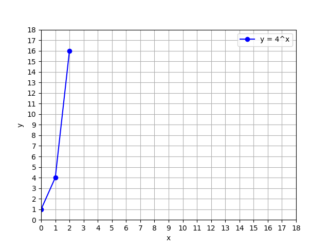
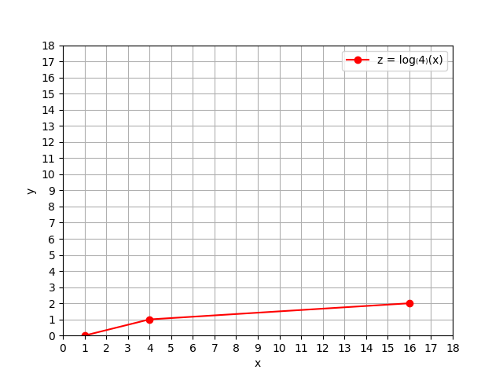
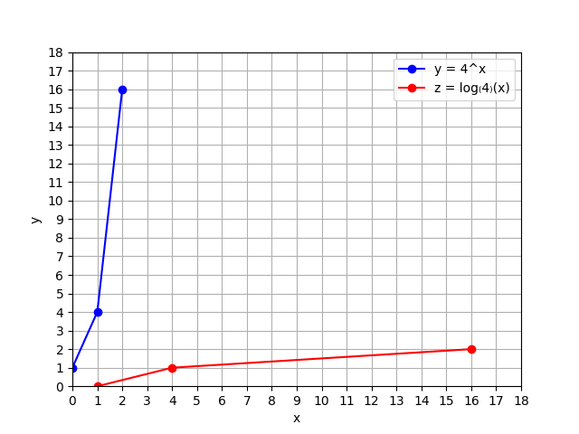

# Exponential VS Logarithms

The 3 points plotted below are on the graph of $$y=b^x$$ for $$b=4$$.

$$

  \begin{array}{c|c}
    x & y = b^x \\
    \hline
    0 & 1       \\
    1 & 4       \\
    2 & 16      \\
  \end{array}

$$

<p align="center">
    
</p>


Based only on these 3 points, we plot the 3 corresponding points that must be on the graph of $$y=\log_{b}(x)$$.

$$

\begin{array}{c|c}
            x & y=\log_b(x) \\
            \hline
            1 &     \log_b(1)=0     \\
            4 &     \log_b(4)=1     \\
            16 &    \log_b(16)=2    \\
\end{array}

$$

<p align="center">
    
</p>

And the whole reason is to give you this appreciation that these are inverse functions of each other.

**The Python code**

```python
import matplotlib.pyplot as plt
import sympy as sp

def create_plot(from_tick, to_tick):
    # Create an empty plot
    plt.figure()

    # Set the x and y-axis limits
    plt.xlim(from_tick, to_tick)
    plt.ylim(from_tick, to_tick)

    # Define ticks for both axes
    ticks = list(range(from_tick, to_tick + 1))  # Include toTick in ticks

    # Set the x and y-axis ticks
    plt.xticks(ticks)
    plt.yticks(ticks)


def f_exponential(b, x):
    # Define y = b**x and plot it at x = 0,1,2
    y = b ** x
    x_vals = [0, 1, 2]
    y_vals = [float(y.subs(x, val)) for val in x_vals]
    plt.plot(
        x_vals,
        y_vals,
        marker='o',  # straight quotes, no extra spaces
        linestyle='-',
        color='b',
        label=f'y = {b}^x'
    )


def f_logarithms(b):
    # Define z = log base b of x
    y = sp.log(x, b)
    x_values = [1, 4, 16]
    y_values = [y.subs(x, val) for val in x_values]
    y_values = [float(val) for val in y_values]
    plt.plot(
        x_values,
        y_values,
        marker='o',
        linestyle='-',
        color='r',
        label=f'z = log₍{b}₎(x)'
    )


def show_plot():
    plt.xlabel('x')
    plt.ylabel('y')
    plt.grid(True)
    plt.legend()
    plt.show()


# --- Main code ---
b = 4
x = sp.symbols('x')

create_plot(0, 18)

# actually draw the curve
f_exponential(b, x)

f_logarithms(b)
# then label and display
show_plot()

```

<p align="center">
    
</p>

---

- [Home](./../../../README.md)
- [Math Tutorials](./../../tutorials.md)
- [Intro to Logarithms](./1_Intro_to_Logarithms.md)