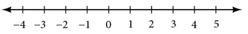
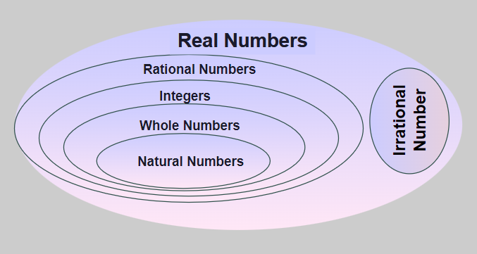

# Real Numbers

```info
Author      Ter-Petrosyan Hakob
```

---

In this section, we will explore sets of numbers, calculations with different kinds of numbers, and the use of numbers in expressions.

## Classifying a Real Number

The numbers we use for counting things are called **natural numbers**. These are: `1, 2, 3, 4, 5,` and so on. We write them like this:

$${1,2,3,\dots}$$

The **"…"** means the numbers go on forever. That’s why we say natural numbers continue to infinity. 
Natural numbers are also called counting numbers. We use them when we count people on a team, coins in a jar, 
or trees in a forest.

The set of **whole numbers** is the set of natural numbers plus zero: 

$${0, 1,2,3,\dots}$$

The set of **integers** adds the opposites of the natural numbers to the set of whole numbers:

$${\dots,-3,-2,-1,0,1,2,3,\dots}$$

> NOTE: Positive integers are the same as natural numbers, and natural numbers are a **subset** of the larger group called integers.

The set of **rational numbers** is written as 

$$\left\{ \frac{m}{n} \,\middle|\, m \text{ and } n \text{ are integers and } n \ne 0 \right\}$$ 

Rational numbers are fractions made of two integers—one on top (the numerator) and one on the bottom (the denominator). But the denominator can never be 0.

Every natural number, whole number, and integer is also a rational number, because you can write it as a fraction with 1 in the denominator. For example, 5 can be written as $$\frac{5}{1}$$.


Since rational numbers are fractions, we can also write them as decimals. Every rational number can be written as either:

- a terminating decimal: $$\frac{15}{8}=1.875$$.
- a repeating decimal: $$\frac{4}{11} = 0.363636\ldots = \overline{0.36}$$.


A long time ago, people discovered that **not all numbers are rational**.

For example, an artist drawing a perfect circle might have noticed that the distance around the circle doesn’t divide evenly by the distance across it (the diameter). Or a carpenter measuring a triangle might have found that the longest side doesn’t match any simple fraction—it’s a number that can’t be written exactly.

These kinds of numbers are called **irrational numbers** because they cannot be written as a fraction of two integers.

A number is irrational if it cannot be written as a fraction like $$\frac{m}{n}$$ where **m** and **n** are integers and $$n \neq 0$$. 
Irrational numbers have decimal parts that go on forever without repeating.

Some common examples of irrational numbers are:

- $$ \pi $$ the ratio of a circle’s circumference to its diameter
- $$ \sqrt{2} $$, the length of the diagonal in a square with sides of 1 unit

Any number you choose is either a rational number or an irrational number—it can’t be both. Together, these two groups form the 
complete set of **real numbers**.

Just like we did with integers, we can divide the set of real numbers into three groups:

- Negative real numbers
- Zero
- Positive real numbers

Each group can include fractions, decimals, and irrational numbers, depending on their sign (positive or negative). 
Zero is special—it's neither positive nor negative.

We can picture real numbers on a horizontal number line: 

<p align="center">
    
</p>

## Understanding Number Sets and Their Subsets

We started with the natural numbers and gradually built larger sets of numbers by including more types, like integers, rational numbers, and real numbers.

Each new set includes the previous one, which means they are all subsets of a bigger set.
This subset relationship becomes easier to understand when shown in a diagram.

<p align="center">
    
</p>

Symbol Key for Number Sets
- **N**: the set of natural numbers → $${1,2,3,\dots}$$.
- **𝑊**: the set of whole numbers → $${0,1,2,3,\dots}$$.
- **Z**: the set of integers → $${\dots,-3,-2,-1,0,1,2,3,\dots}$$.
- **Q**: the set of rational numbers → numbers that can be written as a fraction: $$\frac{m}{n}$$, where $$n \neq 0$$.
- **Q′**: the set of irrational numbers → numbers that cannot be written as a fraction (e.g.,$$ \pi $$, $$ \sqrt{2} $$).
- **R**: the set of real numbers → all points on the number line (i.e. every rational and every irrational number)

---

## Using the Order of Operations

Squaring a number means multiplying it by itself. For example:

$$4^2 = 4 \times 4 = 16$$

You can also raise any number to other powers. When we write $$a^n$$, it means you multiply **a** by itself **n** times:

$$
a^n = a \times a \times \dots \times a \quad(\text{n times})
$$


## Reading Powers and the Order of Operations

When you see $$a^n$$, you say `“a to the n.”`  
- **a** is the **base**.  
- **n** is the **exponent**.

To work out an expression correctly, follow these steps (the **order of operations**):

1. **Grouping symbols**  
   - Simplify whatever is inside parentheses `()`, brackets `[]`, or braces `{}` first.  
   - Treat fraction lines, square‐root signs (radicals), and absolute‐value bars `| |` like grouping symbols too.

2. **Exponents and roots**  
   - Calculate any powers (like $$4^2$$) or roots (like $$\sqrt{9}$$) next.

3. **Multiplication and division** (left to right)  
   - Move across the expression, doing each × or ÷ in order.

4. **Addition and subtraction** (left to right)  
   - Finally, do each + or – in order.

---

### Example

Evaluate:  $$24 + 6 \times \frac{2}{3} - 4^2$$.

1. **Exponents first**  
   $$
   4^2 = 16
   \quad\Longrightarrow\quad
   24 + 6 \times \tfrac{2}{3} - 16
   $$

2. **Multiplication next**  
   $$
   6 \times \tfrac{2}{3} = 4
   \quad\Longrightarrow\quad
   24 + 4 - 16
   $$

3. **Addition and subtraction**  
   $$
   24 + 4 = 28
   \quad\text{then}\quad
   28 - 16 = 12
   $$

Sometimes you repeat these steps, for example if you have a root inside parentheses. Always start with the innermost grouping symbols to get the same answer every time.

---

#### Quick Reminder

- **P**: Parentheses  
- **E**: Exponents  
- **M & D**: Multiplication and Division (left → right)  
- **A & S**: Addition and Subtraction (left → right)  

## Properties of Real Numbers

Real numbers follow simple rules that help us work with expressions. Here are the key properties for any numbers **a**, **b**, and **c**:


- **Commutative Property** (you can swap the order)  
    - `Addition:` $$a+b=b+a$$. Swapping the addends does not change the sum.
    - `Multiplication:` $$a \times b=b \times a$$. Swapping the factors does not change the product.
- **Associative Property:**  (you can change the grouping)  
    - `Addition:` $$a+(b+c)=(a+b)+c$$.  You can group the addends in any way. 
    - `Multiplication:` $$a\times(b\times c)=(a\times b)\times c$$. You can group the factors in any way.
- **Distributive Property:**  (you can spread multiplication over addition) $$a \times (b+c)=a \times b + a \times c$$. 
    To multiply a sum by **a**, multiply each part by **a** and then add the results.
- **Identity Property** (there are “do-nothing” numbers) 
    - `Addition:` There exists a unique real number called the additive identity, **0**, such that, for any real number **a** $$a+0=a$$.
    - `Multiplication:` There exists a unique real number called the multiplicative identity, **1**, such that, for any real $$a\times1=a$$.     
- **Inverse Property**
    - `Addition:` Every real number **a** has an additive inverse, or opposite, denoted **–a**, such that $$a+(-a)=0$$.
    - `Multiplication:` Every nonzero real number **a** has a multiplicative inverse, or reciprocal, denoted $$\frac{1}{a}$$ such that $$a \times \left( \frac{1}{a}\right)=1$$.

---

- [Home](./../../../README.md)
- [Math Tutorials](./../../tutorials.md)
- [Exponents](./2_Exponents.md)