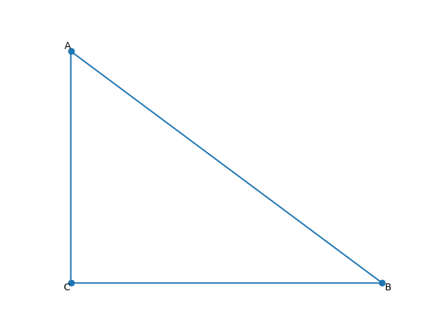

# The Pythagorean Theorem

The **Pythagorean Theorem** is one of the most famous results in mathematics. 
It relates the three sides of a right-angled triangle. In this post, we will:

1. State the theorem
2. Illustrate it with diagrams
3. Prove it step by step
4. Explore a simple example and applications

## Statement of the Theorem

In any right-angled triangle, the square of the length of the hypotenuse (the side opposite the right angle) equals the sum of the squares of the other two sides. If we name the legs $a$ and $b$, and the hypotenuse $c$ then:

$$

a^2+b^2=c^2

$$

## Diagram and Setup

Consider triangle  $\bigtriangleup ABC$ with right angle at $C$:

    

---

- [Home](./../../../README.md)
- [Math Tutorials](./../../tutorials.md)