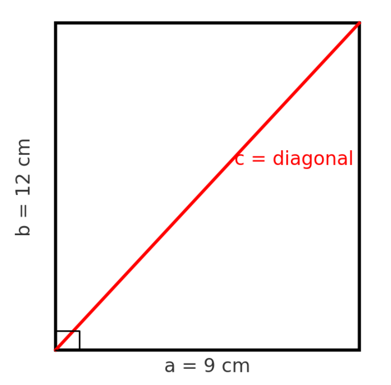

# The Pythagorean Theorem

The Pythagorean theorem is one of the most famous results in mathematics. It describes a special
relationship between the sides of a right triangle - a triangle that has one angle of exactly $$90$$ degrees (a right angle).

**The theorem says:**

$$
a^2 + b^2 = c^2
$$

**Where:**

- $$a$$ and $$b$$ are the legs (the shorter sides meeting at the right angle).
- $$c$$ is the hypotenuse (the longest side, opposite the right angle).

**In words:** The square built on the hypotenuse is equal in area to the sum of the squares built on the other two sides.

A rectangle can help us see the theorem in action. If we draw a diagonal in a rectangle, it divides the
rectangle into two right triangles.

    

A rectangle is $$9$$ cm wide and $$12$$ cm tall. Find its diagonal:

$$
c = \sqrt{9^2 + 12^2} = \sqrt{81 + 144} = \sqrt{225} = 15
$$

This is used in real life for:
- Measuring TV and monitor sizes
- Construction work
- Finding distances on maps

---

- [Home](./../../README.md)
- [Math Tutorials](./../tutorials.md)