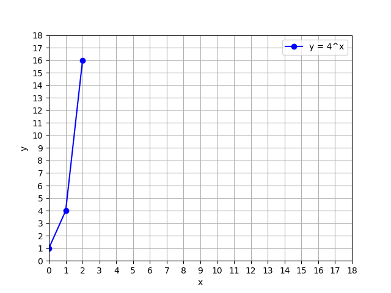

# Relationship between exponential and logarithms

The 3 points plotted below are on the graph of $$y=b^x$$ for $$b=4$$.

$$

  \begin{array}{c|c}
    x & y = b^x \\
    \hline
    0 & 1       \\
    1 & 4       \\
    2 & 16      \\
  \end{array}

$$

<p align="center">
    
</p>


Based only on these 3 points, we plot the 3 corresponding points that must be on the graph of $$y=\log_{b}(x)$$.

$$

\begin{array}{c|c}
            x & y=\log_b(x) \\
            \hline
            1 &     \log_b(1)=0     \\
            4 &     \log_b(4)=1     \\
            16 &    \log_b(16)=2    \\
\end{array}

$$

**The Python code**

```python

```