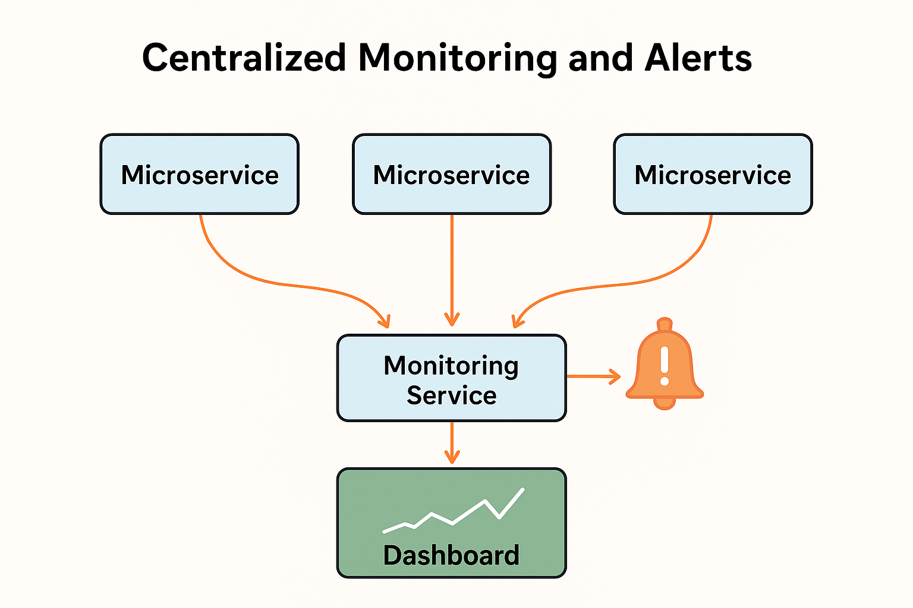

# Centralized Monitoring and Alert

In a system made up of many microservices, it can be difficult to check the health of each service individually. 
Centralized monitoring and alerts provide a single place to monitor all services and receive warnings when something goes wrong. 
This makes it easier to understand the overall condition of the system and respond quickly to problems.

## The Problem

When response times become very slow, or hardware resources like CPU and memory are heavily used, it can be hard 
to find the exact cause. For example, imagine a web application where one microservice is using too much memory, 
slowing down the entire system. Without centralized monitoring, it would be challenging to identify which microservice is causing the problem.

## The Solution

To solve this, we can add a monitoring service to the system. This service collects information about each microservice, 
such as CPU usage, memory usage, response times, and error rates. It can then provide tools to analyze this data and detect problems early.

For instance, if the order-processing microservice in an e-commerce app suddenly starts taking longer to respond, 
the monitoring service can alert the development team immediately.

    

## Requirements for a Monitoring Solution

A good monitoring system should:

- Collect metrics from all servers, including ones that start or stop automatically (autoscaling servers).
- Detect new microservice instances as they are created and start monitoring them automatically.
- Provide APIs and dashboards to query and visualize metrics easily.
- Trigger alerts when a metric, like CPU usage or response time, goes above a set limit.

## Integration with Other Patterns

Centralized monitoring works best when combined with other microservice design patterns:

- **Circuit Breaker:** Stops requests to a failing service to prevent system-wide problems.
- **Control Loop:** Automatically adjusts system parameters based on performance metrics.
- **Distributed Tracing:** Follows a request as it passes through multiple services, helping identify bottlenecks.

## Tools and Examples

Popular tools for centralized monitoring include Prometheus, Grafana, and Nagios. For example:

- Prometheus collects metrics from each microservice.
- Grafana creates dashboards that visualize the collected data.
- Nagios can be set to send alerts via email or messaging apps if something goes wrong.

Imagine a social media app where thousands of users are uploading photos at the same time. 
A monitoring system can show which service is slowing down (e.g., the image-processing service) 
and send an alert so the team can fix it before users notice problems.

## Conclusion

Centralized monitoring and alerts are essential for any system built with microservices. They provide a clear, automated way to monitor system health, quickly detect issues, and respond before small problems turn into major outages. Using the right tools and integrating them with other patterns ensures a stable and reliable system.

---

- [Home](./../../README.md)
- [Microservices](./../tutorials.md)
- [Control Loop](./9_Control_Loop.md)