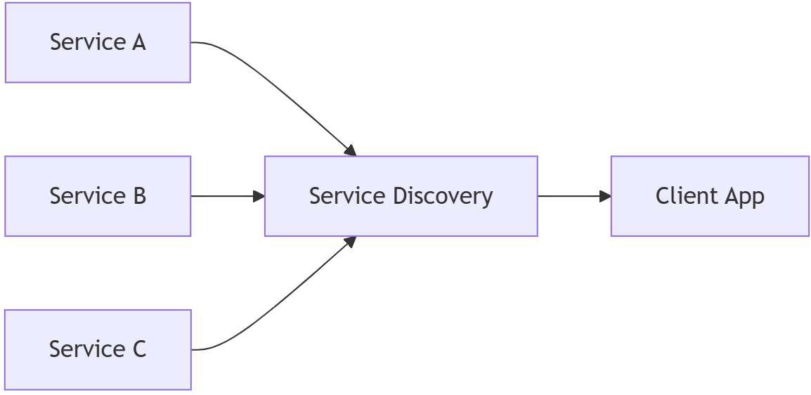

# Service Discovery

When you have many microservices, one big question arises:

**How do clients find a microservice and its available instances?**

## The Problem

Microservices often run in containers, and each container may get a dynamic IP address when it starts. This makes it tricky for clients to know where to send requests.

For example, imagine you have a User Service that exposes an HTTP API. Every time it restarts, it may get a new IP like `10.0.1.15` or `10.0.1.20`. How will the client know the correct address?

Without a solution, requests may fail or go to the wrong instance.

## The Solution

We introduce a Service Discovery Service — a special component that keeps track of all available microservices and their current addresses.

With service discovery:

- Microservices register themselves when they start.
- Microservices unregister when they stop or fail.
- Clients can use a logical name (like UserService) instead of IP addresses.
- Requests are automatically load-balanced across multiple instances.
- Unhealthy instances are detected and excluded from requests.

    

