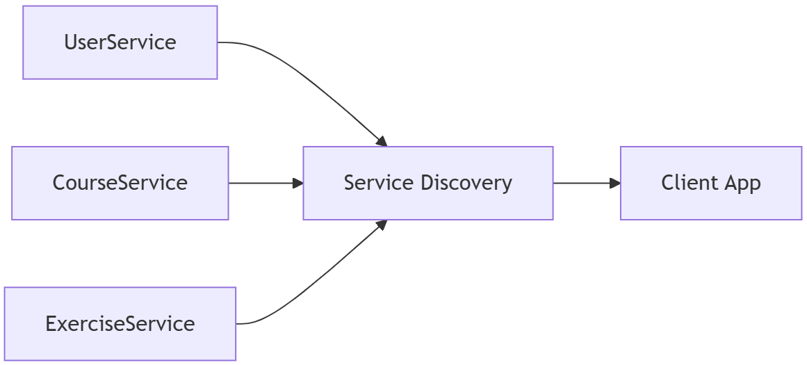

# Service Discovery

When you have many microservices, one big question arises:

**How do clients find a microservice and its available instances?**

## The Problem

Microservices often run in containers, and each container may get a dynamic IP address when it starts. This makes it tricky for clients to know where to send requests.

For example, imagine you have a User Service that exposes an HTTP API. Every time it restarts, it may get a new IP like `10.0.1.15` or `10.0.1.20`. How will the client know the correct address?

Without a solution, requests may fail or go to the wrong instance.

## The Solution

We introduce a Service Discovery Service — a special component that keeps track of all available microservices and their current addresses.

With service discovery:

- Microservices register themselves when they start.
- Microservices unregister when they stop or fail.
- Clients can use a logical name (like UserService) instead of IP addresses.
- Requests are automatically load-balanced across multiple instances.
- Unhealthy instances are detected and excluded from requests.

    

- Each service registers with the Service Discovery.
- The client app doesn’t need to know IPs. It just asks for UserService, ExerciseService or CourseService.
- Requests are load-balanced among multiple instances.
- If an instance fails, it is automatically ignored.

## Implementation Approaches

There are two main strategies:

1. Client-Side Routing
    - The client itself queries the service discovery service to find the right instance.
    - The client decides which instance to call.
    - **Example:** A web app calls the ExerciseService. The client asks the service registry: “Which IP is available?” and sends the request there.
2. Server-Side Routing
    - The service discovery infrastructure includes a reverse proxy.
    - Clients always send requests to the proxy, which forwards them to the correct instance.
    - **Example:** A mobile app requests NotificationService. The proxy automatically picks a healthy instance and routes the request.

## Key Points to Remember

- Service discovery solves the dynamic IP problem in microservices.
- It enables scaling: multiple instances can run, and clients are routed to them automatically.
- You can implement it with client-side or server-side routing, depending on your architecture.
- Popular tools include Netflix Eureka, Consul, and Kubernetes services.   

---

- [Home](./../../README.md)
- [Microservices](./../tutorials.md)
- [Edge server](./2_edge_server.md)