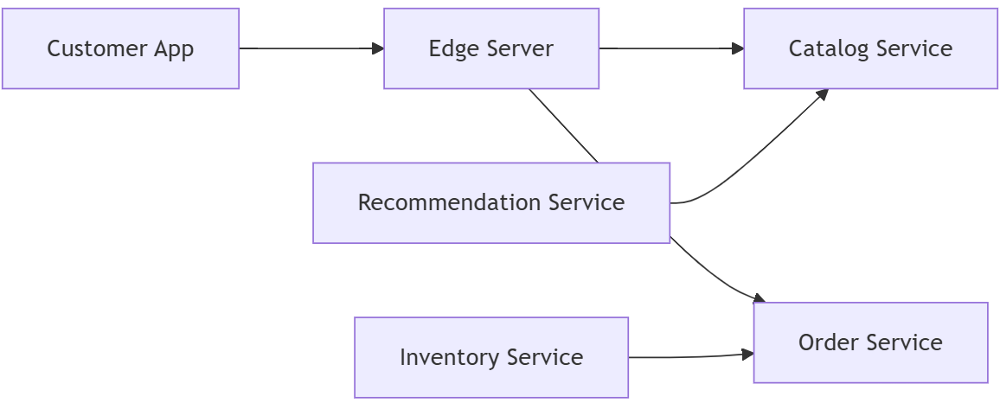
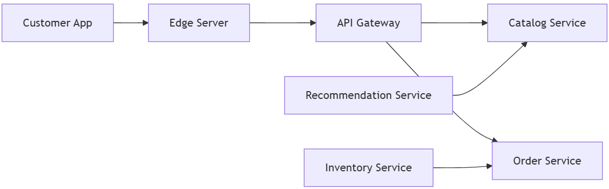

# Edge server

When building a system with many microservices, sometimes you want to let external clients access only certain services 
(like a mobile app or web front-end), while keeping other services private inside your system. You also want to protect your 
services from malicious users who might try to abuse them. This is where the Edge Server pattern comes in.

## The Problem

- Some microservices need to be exposed to the outside world.
- Other microservices should remain internal only.
- Exposed services need protection against malicious requests (e.g., hackers trying to access private data).

Without a proper solution, internal services could be accessed directly, which is risky, and managing security individually for each service is complex.

## The Solution

Add an Edge Server to your system. This acts as a gateway for all incoming requests:

- External clients always send requests to the Edge Server.
- The Edge Server decides which requests go to which service.
- It hides internal services from external access.
- It can integrate with Service Discovery to find available service instances and load-balance requests automatically.

Essentially, the Edge Server behaves like a reverse proxy with security features.

## Solution Requirements

- **Hide internal services:** Only allow external access to services meant to be public.
- **Protect exposed services:** Use authentication and authorization, such as:
    - OAuth 2.0
    - OpenID Connect (OIDC)
    - JWT tokens
    - API keys

- **Load balancing:** Forward requests to healthy instances automatically.
- **Centralized security:** No need to configure security for each microservice individually; the Edge Server handles it.

    

Explanation of the diagram:

- `Customer App` → always sends requests to the Edge Server.
- `Edge Server` → forwards requests only to public services like `Catalog` and `Order`.
- Internal services like `Inventory` (tracks stock) and `Recommendation` (suggests books) are not accessible directly from the client.
- All requests pass through the Edge Server, which handles authentication, authorization, and routing.

## Key Points

- The Edge Server acts as a security and traffic gateway.
- It simplifies security, routing, and load balancing for your microservices.
- By using an Edge Server, you protect internal microservices and control access centrally.

## Edge Server vs API Gateway

Although they are related, an Edge Server and an API Gateway are not exactly the same. Here’s the difference

1) API Gateway
    - **Definition:** A server that sits in front of microservices and routes client API requests to the right service.
    - **Main responsibilities:**
        - Request routing
        - Request aggregation (combine responses from multiple services)
        - Protocol translation (HTTP ↔ gRPC)
        - Authentication and authorization
    - **Example:** A mobile app calls `/getBookDetails`. The API Gateway forwards this request to Catalog Service and might also call Recommendation Service to combine results.
2. Edge Server
    - **Definition:** A server at the edge of the network, physically close to end-users.
    - **Main responsibilities:**
        - Reduce latency and improve speed
        - Cache frequently accessed content
        - Run computations near the user (edge computing)
        - Protect backend services from malicious traffic
    - **Example:** Netflix serves a popular show from an edge server near your city, instead of fetching it from the U.S. every time.

**Key Differences:**

| Feature                  | API Gateway                     | Edge Server                             |
| ------------------------ | ------------------------------- | --------------------------------------- |
| **Main goal**            | Route API calls, security       | Reduce latency, caching, edge computing |
| **Location**             | Close to microservices          | Close to end-users                      |
| **Handles**              | API requests, auth, aggregation | Content caching, local computation      |
| **Use in microservices** | Required in many architectures  | Optional for performance & bandwidth    |
| **Example**              | Kong, AWS API Gateway           | Cloudflare, Akamai Edge Servers         |

Here’s a diagram showing how they can work together:

    

**Explanation:**

- `Customer App` → sends requests to the `Edge Server` (closest server to the user).
- `Edge Server` → forwards requests to `API Gateway`, which handles routing, aggregation, and auth.
- `API Gateway` → routes requests to public microservices like `Catalog` and `Order`.
- Internal services → `Inventory` and `Recommendation` communicate internally, hidden from the client.

**Summary:**

- An API Gateway focuses on routing and security within your microservices system.
- An Edge Server focuses on performance, caching, and reducing latency for end-users.
- They can work together: the edge server brings content closer to the user, and the API gateway handles logic, routing, and security.

---

- [Home](./../../README.md)
- [Microservices](./../tutorials.md)
- [Service Discovery](./1_Service_Discovery.md)
- [Reactive Microservices](./3_Reactive_Microservices.md)