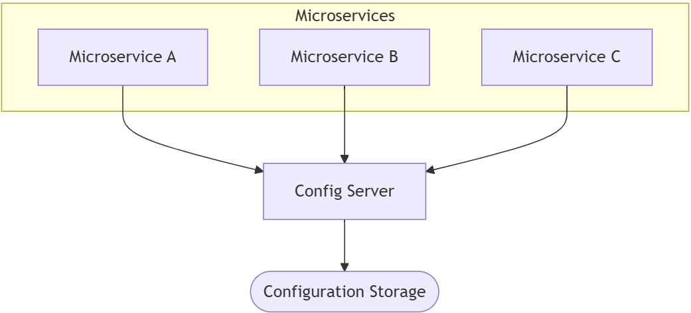

# Central configuration

In microservice systems, managing configuration can be tricky. Let’s explore the problem, the solution, and what you need to make it work.

## Problem

Traditionally, an application comes with its configuration. This could be environment variables or files with settings. 
In a small system, this is simple. But in a microservice architecture, with many microservices running in different places, problems appear:

- How can you see all the configuration settings for all microservices at once?
- How can you change a setting and make sure every microservice gets the update?

For example, imagine a shopping website with separate microservices for orders, payments, and notifications. Each microservice has its own settings for things like database connections, API keys, or message queues. If you want to update the payment service settings, you need a way to do it safely for all instances of that service.

## Solution

The solution is to use a central configuration server. This server stores all the settings for every microservice. Each microservice can ask the server for its settings when it starts, or even update them while running. This makes the system easier to manage and reduces mistakes.

Here’s a diagram showing how it works:

    

In this example, all services connect to the central configuration server, which keeps the main settings in a database.

## Solution Requirements

To use a central configuration system effectively, you need:

1. **One place for all settings** – store all microservices’ configuration in one server.
2. **Environment support** – different settings for development, testing, staging, and production environments.
3. **Safe updates** – when you change a setting, it should update all the related microservices automatically or notify them to reload.
4. **Easy access** – developers and system admins should be able to view and edit configurations without touching individual microservices.

For example, the notification service might need different email server settings in development and production. The central configuration server handles this automatically.

---

- [Home](./../../README.md)
- [Microservices](./../tutorials.md)
- [Reactive Microservices](./3_Reactive_Microservices.md)
- [Centralized Log Analysis](./5_Centralized_Log_Analysis.md)