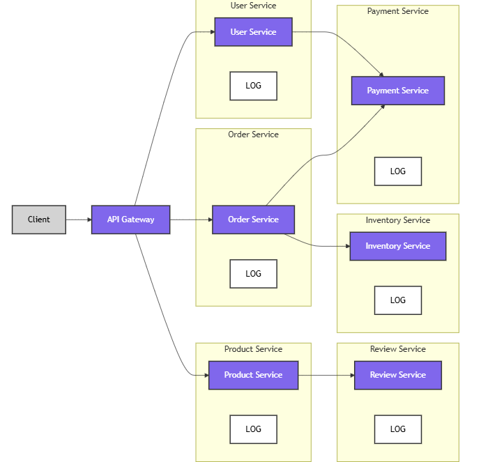

# Centralized Log Analysis

Centralized log analysis is a way to collect and study log messages from many microservices in one place. 
It solves some problems that happen when each microservice writes logs only on its own server.

## The Problem

Usually, an application writes log messages to files on the same server where it runs. In a system with many microservices, 
each running on different servers, this can cause problems:

- How can you see what is happening in the system when each microservice keeps its logs separate?
- How can you know if a microservice has a problem and is writing error messages?
- If users report a problem, how can you find which microservice caused it?

For example, imagine an online shop with these microservices:

- User Service – manages user accounts
- Order Service – handles customer orders
- Product Service – shows product information
- Payment Service – processes payments
- Inventory Service – tracks stock
- Review Service – manages product reviews

Each service writes logs on its own server. Finding a problem would be like searching for a needle in many haystacks.

Here is a simple diagram showing how services connect and where logs are stored:

    

---

- [Home](./../../README.md)
- [Microservices](./../tutorials.md)
- [Central configuration](./5_Centralized_Log_Analysis.md)