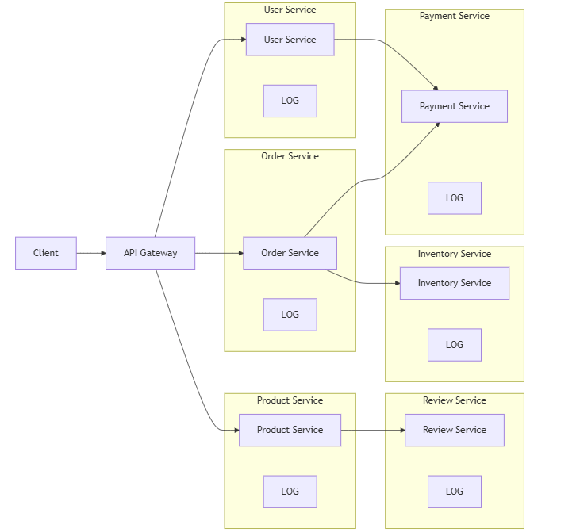

# Centralized Log Analysis

Centralized log analysis is a way to collect and study log messages from many microservices in one place. 
It solves some problems that happen when each microservice writes logs only on its own server.

## The Problem

Usually, an application writes log messages to files on the same server where it runs. In a system with many microservices, 
each running on different servers, this can cause problems:

- How can you see what is happening in the system when each microservice keeps its logs separate?
- How can you know if a microservice has a problem and is writing error messages?
- If users report a problem, how can you find which microservice caused it?

For example, imagine an online shop with these microservices:

- User Service – manages user accounts
- Order Service – handles customer orders
- Product Service – shows product information
- Payment Service – processes payments
- Inventory Service – tracks stock
- Review Service – manages product reviews

Each service writes logs on its own server. Finding a problem would be like searching for a needle in many haystacks.

Here is a simple diagram showing how services connect and where logs are stored:

    

## The Solution

The solution is to add a central log manager. This component collects all logs in one place and helps you analyze them. A good log manager can:
- Detect new microservices and collect logs automatically
- Store logs in a structured and searchable format in a central database
- Provide tools or APIs to search and study logs

For example, if a payment service fails, the central log manager can quickly show all error messages from this service, making it easier to find the problem.

    

## Solution Requirements

To make centralized logging work well, some rules are needed:

1. **Stream logs to standard output:** Each microservice should send logs to stdout instead of writing them to separate files. 
    This makes it easier for the log manager to find logs.
2. **Use correlation IDs:** Tag logs with a unique ID for each request. This helps track one user request across many services.
3. **Use a common log format:** All log messages should follow the same format. This makes it possible to store them in a database and search easily.

For example, a canonical log format could include:

- Timestamp (when the event happened)
- Service name (which microservice wrote the log)
- Severity (info, warning, error)
- Correlation ID (to track requests)
- Message (what happened)

With these rules, the central log manager can show all logs for one request, even if it touched multiple services.

---

- [Home](./../../README.md)
- [Microservices](./../tutorials.md)
- [Central configuration](./5_Centralized_Log_Analysis.md)
- [Distributed Tracing](./6_Distributed_Tracing.md)