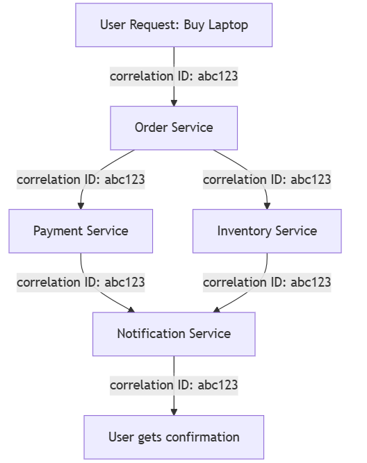

# Distributed Tracing

Distributed tracing helps us understand how requests and messages travel between microservices in a system. 
It is very useful when we need to find problems or delays in a system made of many microservices.

## Problem

In systems with many microservices, it can be hard to know what happens when a user makes a request. Some common problems are:

- **Finding the root cause of a failure:** Imagine users report an error when trying to buy a product. How do we know which microservice caused the error?
- **Tracking a specific entity:** Suppose a user has a question about order `#12345`. How can we find all log messages from all microservices involved in processing that order?
- **Identifying delays:** If a system is responding slowly, how can we find which microservice in the chain is causing the delay?

## Solution

To solve these problems, we use correlation IDs. A correlation ID is a unique identifier that links all requests and messages for one action or user request.

Here’s how it works:
1. When a new request comes in, the system generates a unique correlation ID.
2. Every microservice that processes this request includes the correlation ID in its logs.
3. If a microservice uses information about a specific business entity (like a customer ID or an order ID), we can also connect the correlation ID to that entity.

This way, we can:

- Find all log messages related to a specific request or entity.
- Measure how long each microservice takes to process the request, helping identify slow points in the system.

**Example:** A user wants to buy a laptop:

- The request enters the Order Service and gets correlation ID abc123.
- The Payment Service and Inventory Service also log the same correlation ID.
- If the user reports a problem, support can search logs using abc123 and see all steps in the request.
- If the payment took too long, timestamps in the logs will show which microservice caused the delay.

    

## Solution Requirements

To implement distributed tracing effectively, we need to:

- Assign correlation IDs to all incoming requests and new events. Usually, this is done in a request header.
- Propagate the correlation ID in every outgoing request or message from a microservice.
- Include the correlation ID in all logs in a standard format, so the central logging system can find and link related events.
- Record timestamps when requests, responses, or messages enter and leave each microservice. This helps analyze delays in the system.

---

- [Home](./../../README.md)
- [Microservices](./../tutorials.md)
- [Centralized Log Analysis](./5_Centralized_Log_Analysis.md)
- [Circuit Breaker](./7_Circuit_Breaker.md)