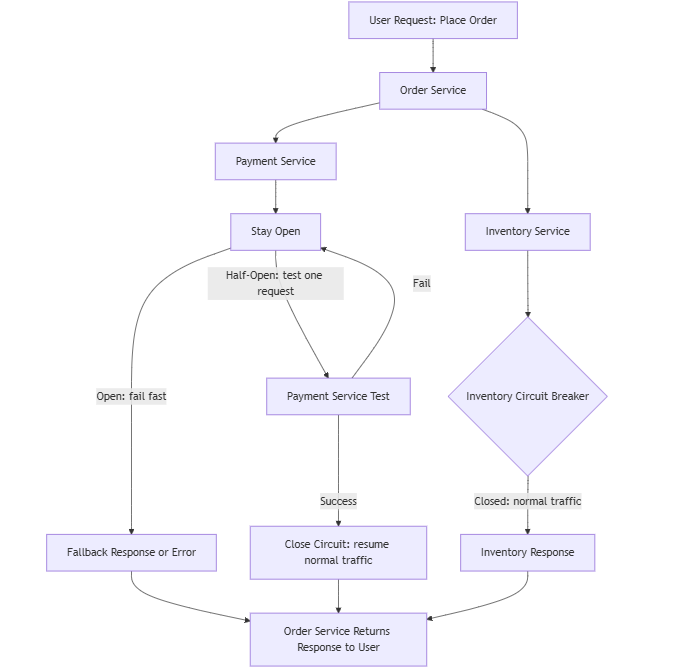

# Circuit Breaker

In modern software, systems often consist of many microservices that work together. While this approach is powerful, it also creates new challenges. 
One key problem is service failures spreading through the system. The circuit breaker pattern helps prevent this and makes systems more reliable and resilient.

Think of it like a safety switch: it stops failures from spreading and allows the system to recover automatically.

## Problem

In microservice architectures, services often communicate synchronously. This means:

- One service waits for another to respond before it continues.
- If a service becomes slow or fails, all services calling it can also stop working.
- This failure can spread like a chain reaction, affecting large parts of the system.

This problem is worse when services use blocking I/O:

- A thread waits for the request to finish.
- With many concurrent requests, slow services can drain all threads.
- This can cause the system to hang or crash.

**Example:** Imagine an online store system:

1. Order Service calls Payment Service and Inventory Service.
2. Payment Service becomes very slow. Threads in Order Service get stuck waiting.
3. This delay spreads to Notification Service or Shipping Service, creating a chain of failures.

Without protection, a single failing service can bring down the entire system.

## Solution

The circuit breaker prevents failures from spreading. It works like this:

- Monitors calls from one service to another.
- If it detects failures or long delays, it opens the circuit, stopping further requests to the failing service.
- When the circuit is open, the calling service fails fast, returning an error immediately or using fallback logic (like cached data or default responses).

**Example:**

- Order Service calls Payment Service. Payment Service fails.
- The circuit breaker opens. Order Service immediately returns: “Payment service is temporarily unavailable. Please try again later.”

This prevents delays or failures from spreading to other services.

## Solution Requirements

To implement circuit breakers properly, you should:

1. **Fail fast:** Open the circuit immediately when a service fails or responds slowly.
2. **Probe the service (half-open state):** Occasionally allow one or a few requests to check if the service has recovered.
3. **Close the circuit:** If the test request succeeds, the circuit closes and traffic resumes normally.
4. **This makes the system self-healing:** temporary failures won’t break the entire system, and recovered services can resume normal operations automatically.

## Half-Open State

The half-open state is how the circuit breaker tests a service that previously failed:

1. After a short period, the circuit breaker allows one or a few requests to go through.
2. If the service responds successfully, the circuit breaker closes, and normal traffic resumes.
3. If the service fails again, the circuit breaker stays open, continuing to fail fast.

**Example:**

- Payment Service fails → circuit breaker opens.
- After 10 seconds, the half-open state allows one test request.
- If it succeeds, the circuit closes → traffic resumes normally.
- If it fails, the circuit stays open → fail-fast responses continue.

This ensures the system recovers safely without exposing users to failing services.

## Circuit Breaker in Action

Here’s a diagram showing a system with multiple services and circuit breaker states (closed, open, half-open):

    

**Diagram Explanation:**

Order Service calls Pa  yment Service and Inventory Service.

1. Circuit breakers monitor each service.
2. Payment Service fails → circuit breaker opens → fast fail or fallback.
    - Payment Service half-open → tests one request → closes if successful.
    - Inventory Service is healthy → circuit breaker stays closed → normal traffic.
3. Order Service collects responses and returns the result to the user.

This visualization helps readers understand how circuit breakers protect microservices, handle failures, and self-heal.

## Real-World Tips for Using Circuit Breakers

1. **Set thresholds carefully:** Decide how many failures in a time window trigger the open state.
2. **Use fallback logic:** Provide users with meaningful fallback responses instead of generic errors.
3. **Combine with retries:** Only retry when it makes sense; don’t overload failing services.
4. **Monitor and alert:** Keep track of circuit breaker events to detect recurring problems.
5. **Test regularly:** Simulate failures to ensure the system behaves as expected.

## Summary

The circuit breaker pattern is essential for building resilient microservice systems. It:

- Prevents failures from spreading
- Supports fast-fail and fallback responses
- Allows testing and recovery using the half-open state
- Makes the system self-healing

Using circuit breakers, your system can survive temporary failures while continuing to serve users reliably.

| **State**     | **What Happens**                                                              | **Purpose**                                                                  | **Example**                                                                                                                                           |
| ------------- | ----------------------------------------------------------------------------- | ---------------------------------------------------------------------------- | ----------------------------------------------------------------------------------------------------------------------------------------------------- |
| **Closed**    | The circuit breaker **allows all requests** to go through normally.           | Everything is working fine, so the system functions normally.                | Payment Service is healthy → Order Service sends requests as usual.                                                                                   |
| **Open**      | The circuit breaker **blocks all requests** to the failing service.           | Prevents failures from spreading and stops the system from being overloaded. | Payment Service fails → Order Service immediately returns “Payment service unavailable” without waiting.                                              |
| **Half-Open** | The circuit breaker **allows a small number of test requests** to go through. | Checks if the service has recovered before closing the circuit.              | After a few seconds, Order Service sends one request to Payment Service. If it succeeds, normal traffic resumes; if it fails, the breaker stays open. |

---

- [Home](./../../README.md)
- [Microservices](./../tutorials.md)
- [Distributed Tracing](./6_Distributed_Tracing.md)
- [Outbox](./8_Outbox.md)