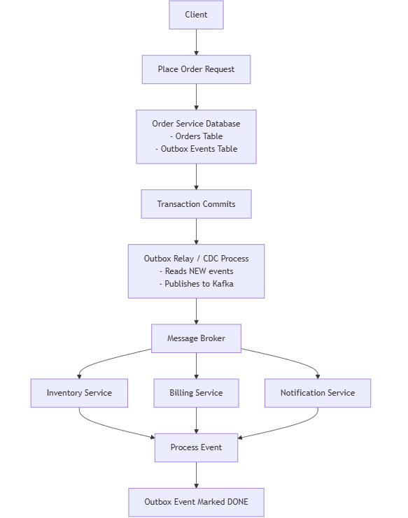

# Outbox

When building microservices, managing data consistency across services becomes a tricky problem. 
Imagine an `Order Service` that must notify other services—`Inventory`, `Billing`, and `Notifications`—whenever a new order is placed. 
How can we guarantee that messages are reliably sent without introducing complex distributed transactions?

This is where the `Outbox Pattern` comes in. It allows your service to persist internal state (like orders) 
and produce events for other services atomically, using just a single local transaction.

## How the Outbox Pattern Works

The core idea is simple:

1. Your service writes the order data into its database.
2. Alongside, it inserts an event into an `Outbox Events` table.
3. A separate process, often called an outbox relay, reads new events from this table and publishes them to a message broker like Kafka.
4. External services consume these messages and act accordingly.

This guarantees that either both the order and the event are persisted, or neither is—eliminating the risk of missing or duplicate messages.

## Architecture Overview

Here’s a high-level view of how an order request flows through a microservices architecture using the outbox pattern:

    

Flow explained:

- **Client**: Initiates a request to place an order.
- **Order Service Database:** Stores the order and writes an event into the outbox table in a single transaction.
- **Transaction Commits:** Ensures both order data and outbox message are safely persisted.
- **Outbox Relay / CDC Process**: Continuously reads new events from the outbox table and publishes them to Kafka.
- **Message Broker:** Distributes events to all interested services.
- **Inventory, Billing, Notification Services:** Consume the events and process them independently.
- **Outbox Event Marked DONE:** After successful publishing and processing, the event status is updated to prevent duplicates.

## Key Benefits of Using the Outbox Pattern

1. **Data Consistency:** By writing the order and the event in a single transaction, you avoid partial updates and missed messages.
2. **Decoupled Services:** Each service can process events asynchronously without blocking the Order Service.
3. **Replayability:** If a service goes down, events in the broker or in the outbox can be replayed safely.
4. **Reduced Complexity:** No distributed transactions or two-phase commits are required.

## Practical Considerations

- **Event Format:** Use JSON, Avro, or Protocol Buffers to structure your events. Include the aggregate data (e.g., the full order) for consumer convenience.
- **Housekeeping:** Clean up processed events to prevent the outbox table from growing indefinitely.
- **Idempotency:** Consumers should handle duplicate events gracefully, for example by tracking unique event IDs.
- **Log-Based Relay:** Using CDC (Change Data Capture) to read events from the database transaction log is often preferable to polling, ensuring ordering and reducing overhead.

## Conclusion

The outbox pattern is a simple yet powerful tool for reliable event-driven microservices. By combining atomic writes in your service database with a dedicated event relay, you ensure consistency, improve resilience, and reduce operational complexity.

For a simple order service, this pattern guarantees that Inventory, Billing, and Notification services always get the right information—without risking lost messages or inconsistent states.

Remember: in distributed systems, dual writes are dangerous. Always use transactional approaches like the outbox pattern to keep your microservices in sync.

The source code for this article is available [over on GitHub](https://github.com/hakobtp/spring-boot-outbox-design-pattern){:target="_blank" rel="noopener"}.

---

- [Home](./../../README.md)
- [Microservices](./../tutorials.md)
- [Circuit Breaker](./7_Circuit_Breaker.md)
- [Control Loop](./9_Control_Loop.md)