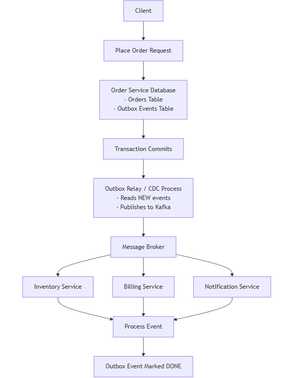

# Outbox

When building microservices, managing data consistency across services becomes a tricky problem. 
Imagine an `Order Service` that must notify other services—`Inventory`, `Billing`, and `Notifications`—whenever a new order is placed. 
How can we guarantee that messages are reliably sent without introducing complex distributed transactions?

This is where the `Outbox Pattern` comes in. It allows your service to persist internal state (like orders) 
and produce events for other services atomically, using just a single local transaction.

## How the Outbox Pattern Works

The core idea is simple:

1. Your service writes the order data into its database.
2. Alongside, it inserts an event into an `Outbox Events` table.
3. A separate process, often called an outbox relay, reads new events from this table and publishes them to a message broker like Kafka.
4. External services consume these messages and act accordingly.

This guarantees that either both the order and the event are persisted, or neither is—eliminating the risk of missing or duplicate messages.

## Architecture Overview

Here’s a high-level view of how an order request flows through a microservices architecture using the outbox pattern:

    

Flow explained:

**Client**: Initiates a request to place an order.
**Order Service Database:** Stores the order and writes an event into the outbox table in a single transaction.
**Transaction Commits:** Ensures both order data and outbox message are safely persisted.
**Outbox Relay / CDC Process**: Continuously reads new events from the outbox table and publishes them to Kafka.
**Message Broker:** Distributes events to all interested services.
**Inventory, Billing, Notification Services:** Consume the events and process them independently.
**Outbox Event Marked DONE:** After successful publishing and processing, the event status is updated to prevent duplicates.

---

- [Home](./../../README.md)
- [Microservices](./../tutorials.md)
- [Circuit Breaker](./7_Circuit_Breaker.md)