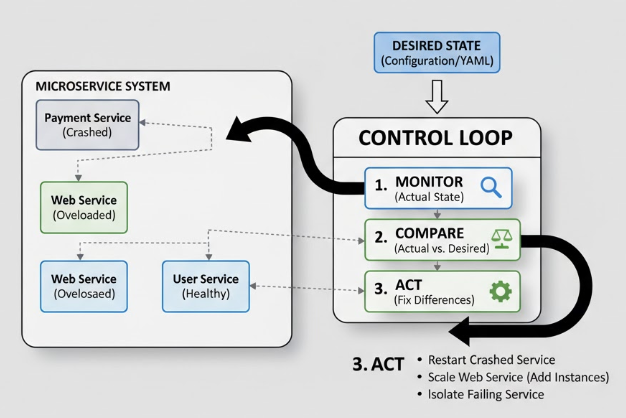

# Control Loop

When you run many microservices across several servers, it is hard to manually detect and fix problems. 
For example, a service might crash, stop responding, or run too slowly. Doing this manually for dozens or hundreds of services is nearly impossible.

## Solution

The control loop pattern solves this by adding a process that automatically monitors and corrects the system. 
The control loop watches the system continuously, compares the actual state (what is happening now) with the 
desired state (what should happen), and takes action to fix differences.

**For example:**

- If a payment service crashes, the control loop can restart it automatically.
- If a web service receives too many requests, the control loop can add more instances to handle the load.

In modern systems, container orchestration platforms like `Kubernetes` often implement control loops. They automatically 
ensure that services run as expected, scale with demand, and recover from failures.

    

The control loop will constantly observe the actual state of the system landscape, comparing it with
a desired state, as specified by the operators. If the two states differ, it will take action to make the 
actual state equal to the desired state.

---

- [Home](./../../README.md)
- [Microservices](./../tutorials.md)
- [Outbox](./8_Outbox.md)
- [Centralized Monitoring and Alert](./10_Centralized_Monitoring_and_Alerts.md)