# Exploring Our Education Microservices

In modern software development, applications are often built as microservices. This means that instead of having one large program, 
we divide it into smaller, independent services. Each service handles one specific type of information or task.

In our system, we have three main services — the `Course Service`, the `Chapter Service`, and the `Quiz Service` — plus a `Course Composite Service`, 
which combines information from the three main services to give a complete view of a course.

This structure allows developers to work on each service separately, makes the system easier to maintain, and helps the system scale better as more users join.

## What Each Microservice Does

We keep our services simple so the examples are easy to follow. Each service has its own information and manages it independently.

###  Course Service

The Course Service manages general information about courses. Think of it as the place where all basic course details are stored. 

For example:

- `Course ID`**:** a unique number for each course, like `101`
- `Title`**:** the name of the course, such as “`Introduction to Java`”
- `Description`**:** a short summary of the course
- `Difficulty Level`**:** easy, medium, or hard

## Chapter Service

The Chapter Service stores information about each chapter in a course. Each chapter belongs to one course. 

For example, in a Java course:

- `Course ID`**:** the course this chapter belongs to, e.g., `101`
- `Chapter ID`**:** a unique number for the chapter, e.g., `1`
- `Title`**:** the name of the chapter, like “`Variables and Data Types`”
- `Content`**:** text explaining the chapter, such as lessons or exercises

## Quiz Service

The Quiz Service manages quizzes and exercises that help students test their knowledge. Each quiz is linked to a chapter.  

For example:

- `Chapter ID`**:** the chapter this quiz belongs to
- `Quiz ID`**:** a unique identifier for the quiz
- `Question`**:** the quiz question
- `Answer Options`**:** possible answers
- `Correct Answer`**:** the right choice

## Course Composite Service

The Course Composite Service combines information from the three main services. It gives a full picture of a course. 

Including:

- Course information from the Course Service
- Chapters from the Chapter Service
- Quizzes from the Quiz Service

Example: 

When a student opens the Java course, the composite service shows the course details, all chapters like 
“`Variables and Data Types`” and “`Loops and Conditions`”, and quizzes for each chapter.

## How Microservices Work Together

Microservices run independently, but they often need to communicate. To make this easy, each service provides information through a network address, 
called `serviceAddress`. This allows services to send requests and receive responses from each other.

At first, we will use simple addresses on the same computer:

- **Course Composite Service:** 8000
- **Course Service:** 8001
- **Chapter Service:** 8002
- **Quiz Service:** 8003

Later, we can use advanced tools like `service discovery` or `Kubernetes` to manage the system in larger deployments.

## Diagram of the System

    

This diagram shows how the `Course Composite Service` communicates with the three main services to gather all information for a course.

## Why This Architecture Helps

- **Separation of Concerns:** Each service has one clear responsibility.
- **Easier Updates:** We can update the Quiz Service without affecting Chapters or Courses.
- **Better Scaling:** Services can run on separate servers if needed.
- **Simpler Testing:** Smaller services are easier to test and debug.

---

- [Home](./../../README.md)
- [Microservices](./../tutorials.md)
- [The Rise of Microservices](./1_The_Rise_of_Microservices.md)
- [Generating the Skeleton Projects](./3_Generating_the_Skeleton_Projects.md)