# Api and Util libraries

Now that we’ve created our microservice projects, the next step is to give them something useful to do — let’s build RESTful APIs for our core microservices.

Before we implement the APIs themselves, we’ll add two extra projects: `api` and `util`. These will contain code that’s shared between multiple services, helping us avoid duplication and keep the codebase consistent.

## Adding the api project

We’ll start by creating a new `Gradle` project named `api`.

This project will contain:
- Java interfaces that describe our RESTful API endpoints.
- Model classes that represent the data sent and received by these endpoints.
- Exception classes that describe possible errors the API can return.

By defining the API with interfaces rather than implementing them directly in controllers, we separate the API definition from its implementation. 
This makes the code easier to maintain and test, and it helps multiple teams or microservices use the same API contract.

There’s some debate among developers about whether all microservices should share a single API module.
If several services depend on the same shared code, it could lead to unwanted coupling — where changes in one place affect many others, slowing down development.

However, when all microservices belong to the same organization and are released together — like ours — having a shared API module makes sense.

It ensures all services follow the same data structure and communication rules, which is especially helpful in educational systems where consistency between services (like Course, Chapter, and Quiz) is important.

In domain-driven design terms, this means all our microservices live in the same bounded context — they share a common language and data model.

## Adding the util project

Next, we’ll create another Gradle project named `util`. This project will include utility classes that can be reused across different services.

For example, we can place shared components here such as:
- Error-handling utilities (for consistent error responses)
- Logging helpers
- Common validation logic
- Response formatters.

This way, we avoid repeating the same boilerplate code in every microservice.

> **About DevOps and versioning**
>
> In a real-world DevOps setup, each project — including `api` and `util` — would usually have its own build pipeline and versioning.
> Each microservice would then depend on specific versions of those libraries, giving teams the flexibility to upgrade at their own pace.
>
> But for simplicity in our educational setup, we’ll make both the `api` and `util` modules part of the same multi-project Gradle build.
> That allows us to build and deploy everything together with a single command, which makes experimenting and learning easier.

## System structure overview

    

- **API project** — defines common interfaces and data models for communication. Each microservice uses these to stay consistent with the same API contract.
- **Util project** — holds helper classes (for error handling, logging, and common responses). This keeps the core services lightweight and clean.
- **Core microservices** — Course, Chapter, and Quiz each manage one type of data. They work independently but follow the same API standards.
- **Course Composite service** — acts as a gateway that combines data from all three core services. For example, it can display a course with its chapters and related quizzes together.

---

- [Home](./../../README.md)
- [Microservices](./../tutorials.md)
- [Generating the Skeleton Projects](./3_Generating_the_Skeleton_Projects.md)
- [Creating the API Library](./5_Creating_the_API_Library.md)