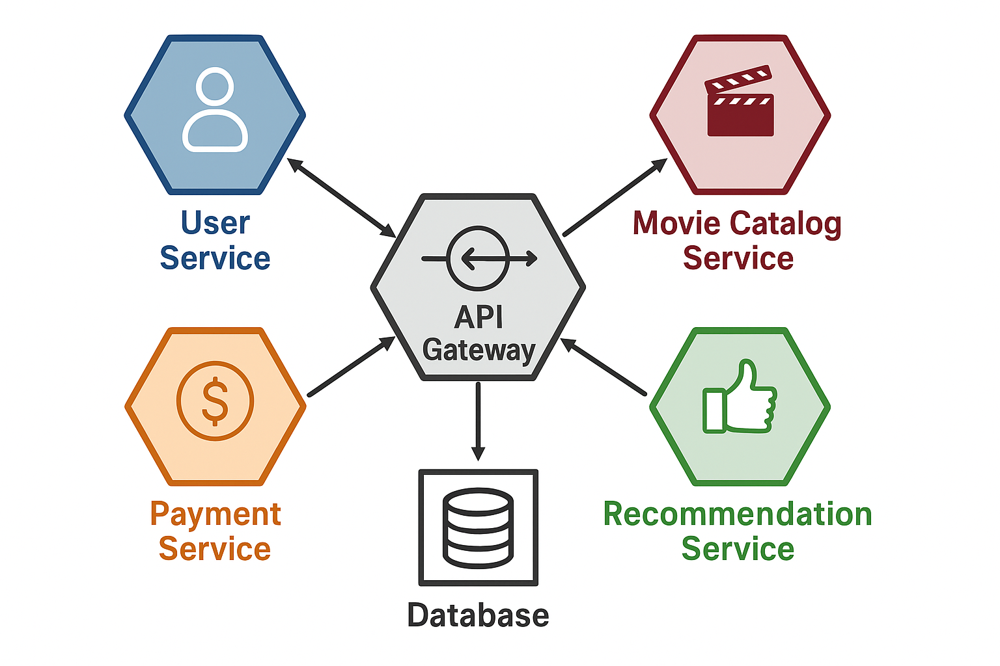

# Understanding Microservices

```info
Author      Ter-Petrosyan Hakob
```
---

Microservices are a way of building software systems where a large application is split into many small, independent parts called services. Each service has its own specific task, can be changed without affecting the others, and can be deployed or updated on its own.

For companies that want teams to work independently on different parts of a system—like one team working on user login and another on payments—microservices are very useful. They give developers more freedom and flexibility to adapt the system to user needs.

However, microservices also come with challenges. Because they are distributed systems (spread across many machines), they can be more complicated than a single, large program. Even experienced developers sometimes find the complexity of managing microservices tricky.

The way microservices are designed has evolved thanks to the experiences of developers worldwide and new technologies that make communication and deployment easier.

## What Makes a Microservice Special?

A microservice is a small program that does one job very well. It usually represents a part of a business domain. For example:

- One microservice might handle inventory for an online store.
- Another could manage orders.
- A third might take care of shipping.

Together, these services form the full system, like an online shop.

Microservices are a type of service-oriented architecture (**SOA**), but they are more specific. They focus on:

- **Independent deployability:** each service can be released without waiting for others.
- **Clear boundaries:** what a service does is separate from how it works internally.
- **Technology freedom:** each service can use the programming language or database that suits it best.

From the outside, a microservice is like a black box. Other programs can interact with it through defined network interfaces, such as REST APIs or message queues. But the internal details—like the programming language or database design—are hidden. This approach avoids having all services share the same database, which can create dependency problems.

This concept is called information hiding. It means showing only what is necessary to the outside world and keeping all other details private. For example, if the shipping microservice changes how it calculates delivery time internally, as long as the interface stays the same, other services won’t be affected.

Keeping internal details hidden allows:

- **Loose coupling:** services are less dependent on each other.
- **High cohesion:** each service focuses on a single responsibility.
- **Independent updates:** services can be improved or fixed without affecting the rest of the system.

A popular design approach that supports this is called the Hexagonal Architecture. Imagine the service as a hexagon. The core functionality is inside the hexagon, while the edges connect to other systems. This way, the core can stay the same even if new ways of interacting with it are added, like a web interface or a mobile app.


## Microservices vs SOA

SOA is a way of designing software where multiple services work together to perform tasks. Each service is separate, often running on its own server, and communicates with others over a network.

SOA was created to solve problems with large monolithic applications. In monoliths, everything is tightly connected, so changing one part can break others. SOA allows services to be reused across applications, making maintenance easier.

However, traditional SOA had problems:
- Some protocols like SOAP were heavy and slow.
- Guidance on how to split a system into services was often unclear.
- Vendors sometimes promoted SOA mainly to sell software products.

As a result, many SOA implementations were not fully independent. Teams still had to deploy everything together because of shared databases or poorly defined service boundaries.

Microservices are like a modern version of SOA. They apply lessons learned from real-world projects to make services truly independent. Think of microservices as a special approach to SOA, similar to how Scrum is a special approach to Agile development. They focus on practical ways to design, deploy, and maintain services independently.


## Real-World Example: Streaming Service

Let’s imagine a streaming platform like “StreamFlix.” Using microservices, the system could be split as follows:

- `User Service` – handles logins, profiles, and subscriptions.
- `Movie Catalog Service` – stores movie information and genres.
- `Recommendation Service` – suggests movies based on viewing history.
- `Payment Service` – processes payments and subscription upgrades.

<p align="center">
    
</p>

If the team wants to add a new feature, like a “watch with friends” option, they can update the User Service and Recommendation Service without touching the Payment Service. This independence makes the system easier to improve, scale, and maintain.


## Why Microservices Matter

Microservices provide flexibility, scalability, and autonomy for development teams. They are not perfect—they require careful planning and new skills—but when used wisely, they allow companies to build systems that can grow and change quickly without breaking.

---

- [Home](./../../README.md)
- [Microservices](./../tutorials.md)
- [Key Ideas Behind Microservices](./2_Key_Ideas_Behind_Microservices.md)
