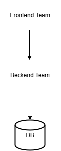

## Aligning Architecture and Team Organization

```info
Author      Ter-Petrosyan Hakob
```

---

Imagine SoundWave, an online store that sells digital music and physical albums. Currently, SoundWave uses a classic three-layer architecture: a web interface, a backend server handling business logic, and a database storing all the data. Each layer is managed by a separate team: the frontend team manages the website, the backend team manages the server, and the database team handles storage.

<p align="center">
    
</p>

Now, SoundWave wants to add a simple feature: letting users choose their favorite music genre. On paper, this seems easy—but in our current setup, it touches all three layers. The web interface must show the genre options, the backend must process changes, and the database must store the new information. Each team must update their part and deploy it in the correct order. Even a small change becomes complex and slow because work is spread across multiple teams.

### Why Three-Layer Architectures Are Common

This kind of architecture is not bad—it's just optimized for a different goal. Traditionally, IT teams are grouped by skill. For example:

- Database administrators work only with databases.
- Backend developers focus on server logic.
- Frontend developers handle user interfaces.

This setup leads naturally to three-layered systems, because each layer matches a team’s skills.

This idea reflects a famous principle called Conway’s Law:

> Organizations design systems that mirror their communication structures.

In other words, if your teams are separated by skill, your system will likely have separate layers.

### Changing the Game: Business-Focused Teams

Modern software development wants faster changes and smaller delays between idea and delivery. To achieve this, teams are now often cross-functional: each team has multiple skills and owns an entire part of the system.

Instead of splitting work by technology, we split work by business functionality. For SoundWave, that could mean a Customer Profile Team. This team would own everything needed to manage user profiles, including:

- The UI that lets users edit their profile
- The backend logic for storing profile changes
- The database or data layer that stores user information

With this setup, adding a favorite genre is much simpler. Only the Customer Profile Team is involved, and changes are localized.

## How Microservices Help

In a microservices architecture, each business area can have its own service. For example:

- A Customer Service handles user profiles, including favorite genres.
- A Catalog Service provides the list of music genres available.
- A Recommendation Service could use the favorite genre to suggest new albums.

Each service contains a small slice of the three traditional layers: UI, backend logic, and storage. The main focus is business functionality, not the type of technology. This makes the system easier to maintain and the teams easier to align with business goals.

### End-to-End Ownership

Even if a microservice does not provide the UI directly, the team responsible for that service should own the corresponding user-facing functionality. This approach is called a stream-aligned team, meaning the team can:

- Deliver value to users quickly
- Work independently without waiting for other teams
- Handle the full lifecycle of a feature

For SoundWave, the Customer Profile Team is stream-aligned: they can add favorite genres or other profile features without touching other teams’ code.

---

- [Home](./../../README.md)
- [Microservices](./../tutorials.md)
- [Key Ideas Behind Microservices](./2_Key_Ideas_Behind_Microservices.md)
- [The Monolith](./4_The_Monolith.md)