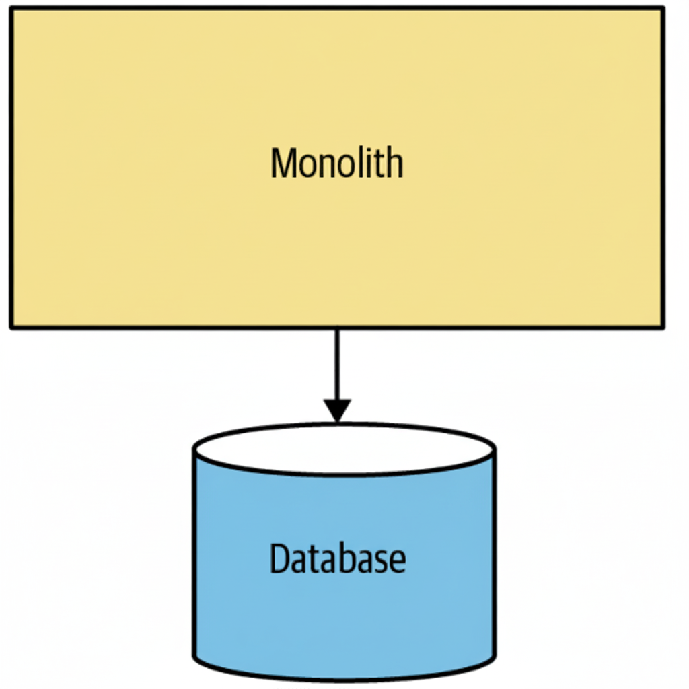

## The Monolith

```info
Author      Ter-Petrosyan Hakob
```

---

We often hear about microservices, but they are usually discussed as the opposite of monolithic architecture. 
To truly understand when microservices might be useful, we first need to understand what a monolith is and why it is sometimes the better choice.

When I say “monolith,” I’m talking about how software is deployed.
If all parts of a system must be deployed together — as one big unit — that system is a monolith.
There are different kinds of monolithic systems, but the most common types are:

- the single-process monolith,
- the modular monolith, and
- the distributed monolith.

## The Single-Process Monolith

The simplest form of monolithic software is when all the code runs in one single process.
You might run multiple copies of that process to handle more users or make the system more reliable, but all of them run the same code base.

For example, imagine a small e-commerce website that handles user accounts, products, and payments — all inside one application.
The same application talks to a single database and shows pages to web or mobile users.

<p align="center">
    
</p>

This setup is what most developers think of when they hear “monolith.”
However, in real life, many systems are more complex.
A company might have several large applications that are connected tightly — for instance, a sales system and a shipping system that depend on each other.

A `single-process` monolith can still make a lot of sense, especially for small or medium-sized organizations.
It is easier to develop, deploy, and test.
As the company grows, this monolith can also grow — but that can create new challenges, which leads us to the next variation: the modular monolith.

---

- [Home](./../../README.md)
- [Microservices](./../tutorials.md)
- [Aligning Architecture and Team Organization](./3_Aligning_Architecture_and_Team_Organization.md)