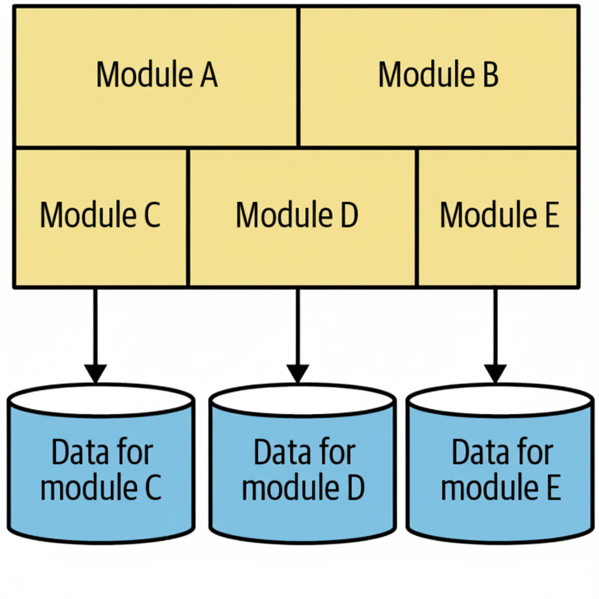

## The Monolith

```info
Author      Ter-Petrosyan Hakob
```

---

We often hear about microservices, but they are usually discussed as the opposite of monolithic architecture. 
To truly understand when microservices might be useful, we first need to understand what a monolith is and why it is sometimes the better choice.

When I say “monolith,” I’m talking about how software is deployed.
If all parts of a system must be deployed together — as one big unit — that system is a monolith.
There are different kinds of monolithic systems, but the most common types are:

- the single-process monolith,
- the modular monolith, and
- the distributed monolith.

## The Single-Process Monolith

The simplest form of monolithic software is when all the code runs in one single process.
You might run multiple copies of that process to handle more users or make the system more reliable, but all of them run the same code base.

For example, imagine a small e-commerce website that handles user accounts, products, and payments — all inside one application.
The same application talks to a single database and shows pages to web or mobile users.

<p align="center">
    
</p>

This setup is what most developers think of when they hear “monolith.”
However, in real life, many systems are more complex.
A company might have several large applications that are connected tightly — for instance, a sales system and a shipping system that depend on each other.

A `single-process` monolith can still make a lot of sense, especially for small or medium-sized organizations.
It is easier to develop, deploy, and test.
As the company grows, this monolith can also grow — but that can create new challenges, which leads us to the next variation: the modular monolith.

## The Modular Monolith

A modular monolith is still one single application, but it is organized into separate modules inside the same process.
Each module focuses on a different area of the system, such as user management, orders, billing, products, and shipping.
Teams can work on different modules separately, but when it’s time to deploy, all modules are still packaged and deployed together.

<p align="center">
    
</p>

This idea of dividing a system into smaller parts is not new.
It goes back to structured programming, when programmers learned that splitting code into smaller, focused modules makes it easier to understand and maintain.
Even today, many organizations don’t use this idea properly — they have big, tangled codebases instead of cleanly separated modules.

For many companies, a modular monolith is an excellent middle ground.
If the module boundaries are clear, teams can work in parallel and develop features faster.
At the same time, deployment and monitoring remain much simpler than in a microservices system.

For example, a large online learning platform could have modules for courses, students, and payments.
Each team focuses on one area, but everything still runs together as one application.

However, one difficulty with modular monoliths is that the database often stays shared.
Even if the code is divided, the data might still live in one big database.
If you later decide to split the monolith into separate services, this shared database can become a serious obstacle.

Some teams try to solve this by giving each module its own part of the database — like having separate tables or schemas for each module.
This can help make the system easier to split in the future, but it also adds complexity.

<p align="center">
    
</p>

## The Distributed Monolith

A distributed monolith is a system made of multiple services that look separate but must still be deployed together. 
This kind of system often appears when a company tries to move from a monolith to microservices but doesn’t fully separate the parts.

For instance, imagine a system with three services: users, orders, and payments.
If changing one service requires redeploying the others, or if one service cannot start without the others, 
then it’s a distributed monolith — not a real microservices system.

This type of architecture has the disadvantages of both worlds:

- It has the complexity of a distributed system (network issues, deployment order, service dependencies).
- It has the tight coupling of a monolith (everything depends on everything else).

Distributed monoliths usually appear when there is poor separation of responsibilities and weak module boundaries.
A small change in one service can easily break another.

## Monoliths and Delivery Contention

As more people work on the same large codebase, they start to get in each other’s way.
Two developers might want to change the same file.
Different teams might want to deploy at different times.
Sometimes, no one is sure who owns a certain part of the system.

These problems are called delivery contention — when development teams compete for control over the same system parts.

Research has shown that unclear ownership can reduce software quality.
However, using a microservice architecture doesn’t automatically fix this.
Even in a microservice setup, if ownership is unclear, you’ll face the same problem.

The main difference is that microservices make boundaries more explicit.
Each service can be owned by one team, which makes it easier to decide who is responsible for what and when something can be deployed.

## Advantages of Monoliths

Not all monoliths are bad.
In fact, single-process and modular monoliths can offer many benefits.

Their simple structure makes deployment, monitoring, and testing easier.
You don’t need complex communication between services, and debugging is more straightforward.
For many teams, this simplicity leads to faster development and fewer errors.

A monolith also makes code reuse easier.
In a distributed system, if you want to reuse logic, you need to decide whether to copy code, create a shared library, or build a new service.
In a monolith, you can usually just call a function or import a module.
Everything you need is already there.

Unfortunately, the word “monolith” has gained a bad reputation.
Many people automatically associate it with “legacy” or “outdated” systems.
But a monolith is not automatically a problem — it’s an architectural choice, and often a very reasonable default.

In fact, it’s smarter to start with a monolith and move to microservices only when you have a clear reason.
Starting with microservices too early can lead to unnecessary complexity and wasted effort.

## Key Takeaways

- A monolith is a single deployment unit — everything is deployed together.
- Single-process monoliths are simple and easy to manage.
- Modular monoliths add structure and team independence while staying simple.
- Distributed monoliths combine the weaknesses of both monoliths and microservices.
- Delivery contention happens when many teams share the same code.
- A monolithic architecture is not bad by default — it’s often the best starting point for most projects.

---

- [Home](./../../README.md)
- [Microservices](./../tutorials.md)
- [Aligning Architecture and Team Organization](./3_Aligning_Architecture_and_Team_Organization.md)
- [Why Microservices Are Useful](./5_Why_Microservices_Are_Useful.md)