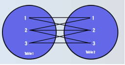

# Cross Join

```info
Author      Ter-Petrosyan Hakob
```

---

We can think of a join as a combination of rows from two or more tables.↳

For example, the following query returns all the combinations from the rows of the category table and the rows of the posts table:

```sql
select 
    c.id category_id, 
    c.name category_name,  
    g.id good_id, 
    g.name good_name, 
    g.price good_price 
from categories c, goods g;

category_id | category_name | good_id |    good_name    | good_price 
-------------+---------------+---------+-----------------+------------
           1 | Electronics   |       1 | Smartphone      |     699.00
           1 | Electronics   |       2 | Gaming Laptop   |    1200.00
           1 | Electronics   |       3 | Business Laptop |     800.00
           1 | Electronics   |       4 | Desktop PC      |     600.00
           1 | Electronics   |       5 | Refrigerator    |     500.00
           1 | Electronics   |       6 | Blender         |      80.00
           1 | Electronics   |       7 | Microwave       |     150.00
           2 | Computers     |       1 | Smartphone      |     699.00
           2 | Computers     |       2 | Gaming Laptop   |    1200.00
           2 | Computers     |       3 | Business Laptop |     800.00
           2 | Computers     |       4 | Desktop PC      |     600.00
           2 | Computers     |       5 | Refrigerator    |     500.00
           2 | Computers     |       6 | Blender         |      80.00
           2 | Computers     |       7 | Microwave       |     150.00
           3 | Laptops       |       1 | Smartphone      |     699.00
           3 | Laptops       |       2 | Gaming Laptop   |    1200.00
           3 | Laptops       |       3 | Business Laptop |     800.00
           3 | Laptops       |       4 | Desktop PC      |     600.00
           3 | Laptops       |       5 | Refrigerator    |     500.00
           3 | Laptops       |       6 | Blender         |      80.00
           3 | Laptops       |       7 | Microwave       |     150.00
           4 | Home          |       1 | Smartphone      |     699.00
           4 | Home          |       2 | Gaming Laptop   |    1200.00
           4 | Home          |       3 | Business Laptop |     800.00
           4 | Home          |       4 | Desktop PC      |     600.00
           4 | Home          |       5 | Refrigerator    |     500.00
           4 | Home          |       6 | Blender         |      80.00
           4 | Home          |       7 | Microwave       |     150.00
           5 | Kitchen       |       1 | Smartphone      |     699.00
           5 | Kitchen       |       2 | Gaming Laptop   |    1200.00
           5 | Kitchen       |       3 | Business Laptop |     800.00
           5 | Kitchen       |       4 | Desktop PC      |     600.00
           5 | Kitchen       |       5 | Refrigerator    |     500.00
           5 | Kitchen       |       6 | Blender         |      80.00
           5 | Kitchen       |       7 | Microwave       |     150.00
(35 rows)
```

This query makes a **Cartesian product** of the two tables. In other words, it pairs every row from `categories` with every row from `goods`.


<p align="center">
    
</p>


You can write the same query using the explicit **CROSS JOIN** syntax:

```sql
select 
    c.id category_id, 
    c.name category_name,  
    g.id good_id, 
    g.name good_name, 
    g.price good_price 
from categories c CROSS JOIN goods g;
```

## Disadvantages of a CROSS JOIN

1) Huge Result Sets
    - If table `A` has `m` rows and table `B` has `n` rows, a **CROSS JOIN** returns $$m \times n$$ rows.
    - Even small tables can produce millions of rows, which is often too many to handle.
2) Slow Performance
    - Generating every combination takes time.
    - Your database must read all rows from both tables and write all combinations, using lots of `CPU` and disk `I/O`.
3) High Memory and Storage Use
    - Temporary space may fill up if the result set is very large.
    - Queries can fail or slow down other operations on the server.    
4) Meaningless Data
    - Most combinations are not useful, since you usually want only related rows.
    - It can confuse readers of your code, as they might expect a join condition to filter rows.
5) Rarely Needed in Practice
    - **CROSS JOIN** is mostly used for special cases (like generating test data or calendars).
    - For real reports, **INNER** or **OUTER** joins are almost always more appropriate.    

Only use **CROSS JOIN** when you really need every possible match. Otherwise, choose a join that filters rows, 
such as **INNER JOIN** or **LEFT JOIN**, to keep your result set clear and efficient.

---

## 📌 Explore More

- 🏠 [Home](./../../README.md)
- 📚 [PostgreSql Tutorials](./../tutorials.md)
- 🔗 [Introduction to Joins](./1_Introduction_to_Joins.md)