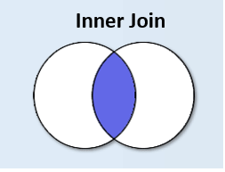

# Inner Join

```info
Author      Ter-Petrosyan Hakob
```

---

Suppose you start with all possible combinations of rows from the `categories` and `goods` tables 
(a [cross‑join](./2_cross_join.md){:target="_blank" rel="noopener"}). To filter that down to only matching category assignments 
(i.e. `categories.id = goods.category_id`), use an **INNER JOIN**.

<p align="center">
    
</p>


## Implicit Join (Comma Syntax)

To achieve this, we need to run the following code:

```sql
select
    c.id category_id,
    c.name category_name,
    g.id good_id,
    g.name good_name,
    g.price good_price
from categories c, goods g where c.id = g.category_id;

 category_id | category_name | good_id |    good_name    | good_price 
-------------+---------------+---------+-----------------+------------
           1 | Electronics   |       1 | Smartphone      |     699.00
           3 | Laptops       |       2 | Gaming Laptop   |    1200.00
           3 | Laptops       |       3 | Business Laptop |     800.00
           2 | Computers     |       4 | Desktop PC      |     600.00
           5 | Kitchen       |       5 | Refrigerator    |     500.00
           5 | Kitchen       |       6 | Blender         |      80.00
           5 | Kitchen       |       7 | Microwave       |     150.00
(7 rows)

```

## Explicit INNER JOIN

We can also write the same query using the explicit **JOIN** operation:

```sql

select
    c.id    category_id,
    c.name  category_name,
    g.id    good_id,
    g.name  good_name,
    g.price good_price
from categories c
         inner join goods g on c.id = g.category_id;

 category_id | category_name | good_id |    good_name    | good_price 
-------------+---------------+---------+-----------------+------------
           1 | Electronics   |       1 | Smartphone      |     699.00
           3 | Laptops       |       2 | Gaming Laptop   |    1200.00
           3 | Laptops       |       3 | Business Laptop |     800.00
           2 | Computers     |       4 | Desktop PC      |     600.00
           5 | Kitchen       |       5 | Refrigerator    |     500.00
           5 | Kitchen       |       6 | Blender         |      80.00
           5 | Kitchen       |       7 | Microwave       |     150.00
(7 rows)

```

This produces the same result but uses the `ANSI`‑standard **JOIN** syntax, which is generally clearer and preferred in modern `SQL`.


## Filtering a Specific Category


If we wanted to search for all `goods` that belong to the `Kitchen` category using the **INNER JOIN** condition, 
we would have to rewrite the query in this way:

```sql
select
    c.id    category_id,
    c.name  category_name,
    g.id    good_id,
    g.name  good_name,
    g.price good_price
from categories c
         inner join goods g on c.id = g.category_id
where c.name = 'Kitchen';

 category_id | category_name | good_id |  good_name   | good_price 
-------------+---------------+---------+--------------+------------
           5 | Kitchen       |       5 | Refrigerator |     500.00
           5 | Kitchen       |       6 | Blender      |      80.00
           5 | Kitchen       |       7 | Microwave    |     150.00
(3 rows)
```

### Why use JOIN over IN/EXISTS?

You can often express the same filtering logic with **IN** or **EXISTS**, but explicit **JOIN** is typically more readable and, 
in many database engines, can offer better performance by allowing the optimizer to plan more efficient execution paths.

---

- [Home](./../../README.md)
- [PostgreSql Tutorials](./../tutorials.md)
- [Introduction to Joins](./1_Introduction_to_Joins.md)
- [Cross Join](./2_cross_join.md)
- [Left Join](./4_Left_Join.md)
- [Right Join](./5_Right_Join.md)
- [Full Oouter Join](./6_Full_Oouter_Join.md)
- [Lateral Join](./7_Lateral_Join.md)
- [Self Join](./8_self_join.md)