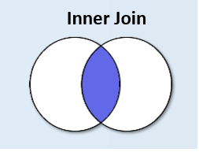

# 🔗 Inner Join

```info
Author      Ter-Petrosyan Hakob
```

---

Now suppose that starting with all the possible combinations that exist between the rows of the `categories` 
table and the rows of the `goods` table, we want to filter all the rows that have the same value as the `categories` field 
( categories.id = goods.category_id ). We want to have a result like the one described in the following diagram:

<p align="center">
    
</p>


---

## 📌 Explore More

- 🏠 [Home](./../../README.md)
- 📚 [PostgreSql Tutorials](./../tutorials.md)
- 🔗 [Cross Join](./2_cross_join.md)
- 🔗 