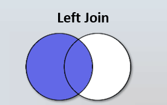

# Left Join

```info
Author      Ter-Petrosyan Hakob
```

---


A **LEFT JOIN** returns all rows from the left table and the matching rows from the right table. 
If there is no match, the result is **NULL** on the right side.

```sql
SELECT
    c.id        AS category_id,
    c.name      AS category_name,
    g.id        AS good_id,
    g.name      AS good_name
FROM categories AS c
LEFT JOIN goods AS g ON c.id = g.category_id;


  category_id| category_name | good_id |    good_name    
-------------+---------------+---------+-----------------
           1 | Electronics   |       1 | Smartphone
           3 | Laptops       |       2 | Gaming Laptop
           3 | Laptops       |       3 | Business Laptop
           2 | Computers     |       4 | Desktop PC
           5 | Kitchen       |       5 | Refrigerator
           5 | Kitchen       |       6 | Blender
           5 | Kitchen       |       7 | Microwave
           4 | Home          |  <null> | <null>
(8 rows)

```

This query returns all records of the `categories` table and returns the matched records from the `goods` table. 
As we can see, if the second table (the `goods` table, in this example) has no matches, the result is **NULL** .

This diagram gives us an idea of how a left join works:

<p align="center">
    
</p>


To list only the `categories` that have no corresponding `goods`, you can either use a subquery or filter on a **LEFT JOIN**:

**Using NOT IN:**

```sql
SELECT *
FROM categories AS c
WHERE c.id NOT IN (SELECT category_id FROM goods );

```

**Using NOT EXISTS:**

```sql
SELECT *
FROM categories AS c
WHERE NOT EXISTS (
  SELECT 1 FROM goods AS g WHERE g.category_id = c.id
);

```

**Using LEFT JOIN ... IS NULL:**

```sql
SELECT
    c.id        AS category_id,
    c.name      AS category_name
FROM categories AS c
LEFT JOIN goods AS g ON c.id = g.category_id
WHERE g.category_id IS NULL;

 category_id | category_name 
-------------+---------------
           4 | Home
(1 row)

```

> **Performance note:** In most SQL engines, explicit **JOIN** operations allow the optimizer to choose the best execution plan, often outperforming equivalent **IN** or **EXISTS** queries.

--- 

- [Home](./../../README.md)
- [PostgreSql Tutorials](./../tutorials.md)
- [Introduction to Joins](./1_Introduction_to_Joins.md)
- [Cross Join](./2_cross_join.md)
- [Inner Join](./3_Inner_Join.md)
- [Right Join](./5_Right_Join.md)
- [Full Oouter Join](./6_Full_Oouter_Join.md)
- [Lateral Join](./7_Lateral_Join.md)
- [Self Join](./8_self_join.md)
